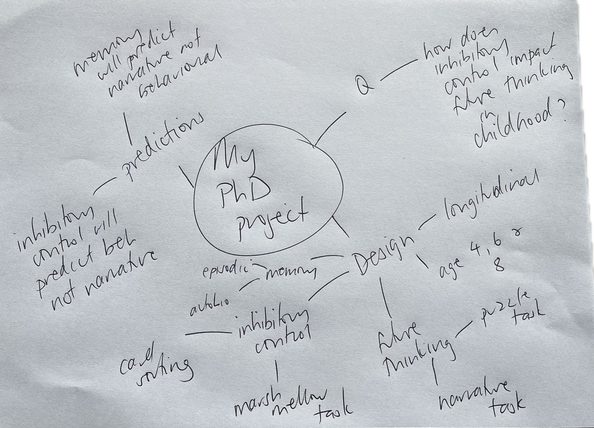

##  {.center}

### These slides are available at...

 

[www.jennyslides.netlify.app/ama-gd/](https://jennyslides.netlify.app/ama-gd/)

## the goal

 

> *"The purpose of the discussion is to interpret and describe the significance of your findings in light of what was already known about the research problem being investigated, and to explain any new understanding or fresh insights about the problem after you've taken the findings into consideration."*

 

::: aside
Source: [Organising Academic Research papers](https://library.sacredheart.edu/c.php?g=29803&p=185933)
:::

## why is it so hard?

::::: columns
::: {.column width="60%"}
You need to...

-   think critically, flexibly and creatively
-   communicate clearly, persuasively and with authority
-   work independently
:::

::: {.column width="40%"}

:::
:::::

## don't panic, there is a formula

Like introductions, general discussions are pretty formulaic.

 

Your marker will smile if you make the "moves" that they expect.

<iframe src="https://giphy.com/embed/3o7qDQ4kcSD1PLM3BK" width="480" height="270" frameBorder="0" class="giphy-embed" allowFullScreen>

</iframe>

<a href="https://giphy.com/gifs/nickatnite-dance-friends-chandler-3o7qDQ4kcSD1PLM3BK">via GIPHY</a>

## The 4 intro moves

::::: columns
::: {.column width="60%"}
1.  what is the problem? why is it important?
2.  what do we already know about the problem?
3.  what don't we know about the problem?
4.  how does this project fill that knowledge gap?
:::

::: {.column width="40%"}
<iframe src="https://giphy.com/embed/H0XBpCYcUjFcc" width="480" height="397" frameBorder="0" class="giphy-embed" allowFullScreen>

</iframe>

<a href="https://giphy.com/gifs/dance-macarena-H0XBpCYcUjFcc">via GIPHY</a>

:::
:::::

::: aside
adapted from John Swale [CARS (creating a research space) model](https://owl.purdue.edu/owl/general_writing/the_writing_process/organization_CARS_Model.html)
:::

## The 6 discussion moves {.smaller}

::::: columns
::: {.column width="60%"}
1.  what do we know about that problem now?
2.  how does that new knowledge relate to what we knew before?
3.  what can we say about theory and/or the real world that we couldn't before?
4.  what problems/limitations do we need to acknowledge?
5.  what do we still not know... what are the next steps?
6.  what is the take home message?
:::

::: {.column width="40%"}
<iframe src="https://giphy.com/embed/AEzIGP3TQcPKHnABfP" width="480" height="271" frameBorder="0" class="giphy-embed" allowFullScreen>

</iframe>

<a href="https://giphy.com/gifs/fallontonight-jimmy-fallon-tonight-show-macarena-AEzIGP3TQcPKHnABfP">via GIPHY</a>

:::
:::::

# Plan for today

1.  Mini-masterclass

-   work through each of the 6 moves, do a practical exercise for each
-   generate an outline for YOUR general discussion

2.  Ask any questions you have about discussion writing (or anything else research related)

# Move 1. what do we know about that problem now?

------------------------------------------------------------------------

## *Restate* your results

:::::: columns
:::: {.column width="60%"}
::: nonincremental
-   Your results are the trees
-   Your discussion is the forest

> be careful not to just repeat your results
:::
::::

::: {.column width="40%"}

Photo by <a href="https://unsplash.com/@filipz?utm_source=unsplash&utm_medium=referral&utm_content=creditCopyText">Filip Zrnzević</a> on <a href="https://unsplash.com/s/photos/forest?utm_source=unsplash&utm_medium=referral&utm_content=creditCopyText">Unsplash</a>
:::
::::::

::: notes
Less is more here. If your results are the trees of your thesis, the discussion is the forest. Your reader has just finished wading through your results, they are done with stats, trying to pull out the big picture, they want you to do the hard thinking for them... provide some light relief.
:::

------------------------------------------------------------------------

## what did you find?

::: panel-tabset
## exercise 1a

-   Pick the 3 most important findings (yes only 3).
-   Make a [spider diagram](https://sites.google.com/site/twblacklinemasters/using-a-spider-diagram-to-make-research-questions?authuser=0).

:::

---

## example

{width="1500"}

------------------------------------------------------------------------

## what did you find?

::: panel-tabset
## exercise 1b

-   Play with phrases from the [Manchester Academic Phrasebank](https://www.phrasebank.manchester.ac.uk/discussing-findings/)
-   write a short paragrpah that *restates* your findings

## phrases

:::

---

## example

The current study found that having children talk in detail about a past event improved their performance on the behavioural future thinking task. Children in the induction group were more likely to choose accurately for the future than were children in the control group. In contrast, the induction did not impact children's ability to talk specifically about a possible future event. There was no difference in the performance of children in the induction and control group on the narrative future thinking task. Of interest, among children who failed the behavioural future thinking task, only 30% did so due to memory failure, suggesting that other processes may contribute to task performance.

# Move 2. How does that relate to what we knew before?

------------------------------------------------------------------------

## *Relate* your results

-   how are your findings consistent (or not) with your hypotheses?
-   how are your findings consistent (or not) with the literature you talked about in your introduction?

::: callout-important
Lots of students just state that their findings are (or are not) consistent with their hypotheses and/or literature without explaining HOW. Your marker wants you to do the hard thinking for them. Don't forget to unpack the connections you are making.
:::

## *Explain* what we know now that we didn't know before.

-   Consistent? - great!
    -   Explain HOW your findings have advanced the field
-   Not consistent? - great!
    -   Explain WHY you think your study turned out that way

::: callout-warning
This is where discussion writing gets hard
:::

## Did you know that ...

... more than 80% of honours project don't "work"?

Most often, the best discussions come out of studies where not everything went to plan.

When your study didn't "work", you have much more scope to think critically, creatively, and flexibly.

<iframe src="https://giphy.com/embed/efxrDXet2TJILuGRwO" width="480" height="270" frameBorder="0" class="giphy-embed" allowFullScreen>

</iframe>

<a href="https://giphy.com/gifs/HannahWitton-creativity-possibility-endless-possibilities-efxrDXet2TJILuGRwO">via GIPHY</a>

## Why did my study not "work"?

Maybe the effect is real, I just wasn't able to detect it...

-   sample size
-   methodological errors
-   measurement issues

... aka my study didn't work because (in retrospect) it sucked.

::: callout-warning
These explanations apply to all research theses written in the world ever. Make sure to explain EXACTLY HOW that problem resulted in the PATTERN of data you got.
:::

------------------------------------------------------------------------

## Why did my study not "work"?

Maybe other researchers have missed something? Perhaps...

-   this psychological construct doesn't work like everyone says it does
-   this task doesn't measure what everyone says it does
-   other studies have failed to control for variables that impact performance
-   research using this task to answer different questions can help
-   the "other" theoretical perspective accounts for my findings better

------------------------------------------------------------------------

## Why did my study not "work"?

You need to go back to the literature (or sometimes back to your data) and find an explanation

::: callout-important
## important

This is where HD theses stand out from D theses. Your marker is looking for evidence that you can think critically, creatively, and flexibly and that you can communicate clearly, persuasively, and with authority.

You probably won't have enough information to know whether a given explanation really accounts for your effect and thats ok. Use the uncertainty as an opportunity to make *future research* suggestions. What study should be done to confirm your explanation?
:::

## Why did my study not "work"?

::: callout-important
## !!very important!!

You need to point to empirical work or alternative theories from the literature to support your explanations. Your "it is possible that..." explanations need to be grounded in science, not just your gut instinct.

:::

------------------------------------------------------------------------

## consistent or not?

::: panel-tabset
## exercise 2a

Take your spider diagram and add more legs.

-   For each finding, add a note relating to your hypotheses (H) and past literature (L).
-   Highlight consistencies one colour and inconsistencies another colour.

:::

---

## example

------------------------------------------------------------------------

## consistent or not?

::: panel-tabset
## exercises 2b

-   Add extra legs describing HOW your findings are (or aren't consistent)

:::

## example

------------------------------------------------------------------------

## but WHY?

::: panel-tabset
## exercise 2c

Pick one of your findings and make a new spider diagram.

Try out some deep big picture thinking.

It probably won't click right now... digging into the literature will lead you down different paths too.

:::

## example

# Move 3. what can we say about theory and/or real world that we couldn't before?

## Lets zoom out a bit...

What are the implications of your findings?

::: nonincremental
1.  theory
2.  real world
3.  both??
:::

::: callout-warning
Don't exaggerate. It is unlikely that your study will change clinical practice, government policy, or the theoretical direction of the field. Use cautious phrasing (see [Manchester phrasebank](https://www.phrasebank.manchester.ac.uk/using-cautious-language/)). Also you might not have enough information to know whether your findings really do have implications for a particular theory or real world thing... What *future research* would you do to confirm?
:::

---

::: panel-tabset

## exercise 3

Start a new spider diagram. Braindump some theory ideas on one side and real world ideas on the other

:::

---

## example

# Move 4. what problems/limitations do we need to acknowledge?

------------------------------------------------------------------------

## which limitations?

-   You don't need to talk about them all (esp those that apply to everyone).
    -   sample size or generalisability
    -   self-report
    -   methodological issues
-   Focus on limitations that are specific to YOUR PROJECT and may have had an impact on the PATTERN of data that you got.
- Use limitations to suggest future research

------------------------------------------------------------------------

## limitations

::: panel-tabset
## exercise 4

Make a new spider diagram and brain dump all the limitations that apply to your study on the page.

Circle those that are specific to your study and can explain a pattern of findings.

Put a square around others that might be worth mentioning.

:::

## example

# Move 5. what do we still not know... what are the next steps?

------------------------------------------------------------------------

## You can leave future research breadcrumbs...

-   Move 2 (relate)
-   Move 3 (real world/theory)
-   Move 4 (limitations)

Now your marker is looking for the next step in this **research program**. Imagine you are going to do a PhD in this area... what is the next question that researchers in this field should answer?

---

## what study would you do next?

::: panel-tabset
## exercise 5

Make a new spider diagram and label the centre "My PhD Project".

Fill the legs with...

-   what is the question?
-   how would you answer it?
-   what do you expect to find?

:::

---

## example

# Move 6. what is the take home message?

------------------------------------------------------------------------

## don't leave your reader hanging!

::::: columns
::: {.column width="60%"}
The concluding paragraph should leave the reader with a clear understanding of...

-   The goal of the project
-   What you did
-   What you found
-   What you think it means
:::

::: {.column width="40%"}
<iframe src="https://giphy.com/embed/1xo9AKS4eeBJENaRAn" width="480" height="270" frameBorder="0" class="giphy-embed" allowFullScreen>

</iframe>

<a href="https://giphy.com/gifs/evite-bow-present-1xo9AKS4eeBJENaRAn">via GIPHY</a>

:::
:::::

------------------------------------------------------------------------

## the last bit

::: panel-tabset
## exercise 6

Write your conclusion now :)

-   The purpose of this project was to...
-   To answer this question, we...
-   The results showed that...
-   Overall this research indicates that...

:::

## example

*The purpose of this project was to* test whether an episodic induction would improve preschoolers ability to imagine the future. *To answer this question, we* tested preschoolers on two episodic future thinking tasks, one that required them to make a decision with the future in mind, and one that required them to talk about a future event. Half of the children completed these tasks after undergoing an episodic induction procedure, in which they were asked to talk in detail about a past event. 

---

## example

*The results showed that* chidlren in the induction group performed better than controls on the behavioural task, but not on the narrative task. In addition, contrary to expectations, inhibitory control issues more frequently accounted for failure on the behavioural task than did memory issues. *Overall this research indicates that* during development future thinking capacity is impacted by the development of many cognitive processes in addition to memory. These results have important implications for our understanding of the cognitive episodic simulation hypothesis and the mechanisms underlying future thinking ability across the lifespan.

# Lets recap

------------------------------------------------------------------------

## The 6 discussion moves

1.  what do we know about that problem now?
2.  how does that new knowledge relate to what we knew before?
3.  what can we say about theory and/or the real world that we couldn't before?
4.  what problems/limitations do we need to acknowledge?
5.  what do we still not know... what are the next steps?
6.  what is the take home message?

## The 6 discussion moves

::: callout-tip
-   Moves 1 and 2 will take up MOST of your discussion.
-   Move 3 might only be a couple of paragraphs.
-   You can make Move 5 within Move 2, 3, and 4, as well as in its own section
-   Lots of students forget Move 6- don't leave your marker hanging!
:::

## MYTHS about general discussion writing

1.  You should not refer to literature in the general discussion that you didn't cover in the introduction

. . .

2.  You should describe ALL the flaws/limitations about your experiment

. . .

3.  When it comes to discussion writing, more is better

## Acknowledgements

Discussion writing resources I recommend...

1.  The Thesis Whisperer blog

-   lots of great advice about academic writing generally and discussion writing specifically
-   discussion posts from [2012](https://thesiswhisperer.com/2012/01/23/how-do-i-start-my-discussion-chapter/), [2016](https://thesiswhisperer.com/2016/04/20/the-difficult-discussion-chapter/), [2020](https://thesiswhisperer.com/2020/03/04/no-really-how-do-you-write-a-discussion-section/), [2021](https://thesiswhisperer.com/2021/05/05/how-to-make-your-dissertation-speak-to-experts/)

2.  The Manchester Academic Phrasebook

-   [Discussing findings](https://www.phrasebank.manchester.ac.uk/discussing-findings/)

## Before we do questions... a little metacognition

-   What is the most surprising thing you learned today?
-   What is one thing you thought you knew about GD writing that you now see differently?
-   What feels like the hardest part of GD writing for you right now?
-   What is the first thing you will do when you sit down to work on your GD after this session?
-   Which "move" have you been avoiding? What is one small thing you can do to make progress?

------------------------------------------------------------------------

## Ask me Anything...

 

**Questions from registration**

-   Is it sometimes better to frame hypotheses as ‘research questions’ in your thesis, so discussion of mixed findings later will be less unexpected for reader?

---

**Questions from registration**

-   If the robustness of some findings is unclear due to methodological issues (e.g. low internal consistency of subscale, uneven/small group sizes) but you've obtained moderate effect sizes, then how should you approach discussion of these findings (e.g. still try to argue these findings add to/extend literature and mention concerns in limitations, or be more cautious throughout discussion and emphasise replication is needed)?

------------------------------------------------------------------------

## Ask me Anything...

 

**Questions from registration**

Are there formula or template approaches for what a general discussion looks like? Tips for paragraph structure within them?

------------------------------------------------------------------------

## Ask me Anything...

 

**Questions from registration**

How do you normally advise students approach writing up a thesis vs. manuscript? Reflecting on the thesis writing process, I feel like it might have gone more smoothly if I had done the aims/research question, methods, and results first, and the intro/discussion last. Some researchers recommend taking this approach when drafting a manuscript. Can it also be used if writing a longer thesis in the future if also utilising secondary/archival data?

------------------------------------------------------------------------

## Ask me Anything ...

------------------------------------------------------------------------
