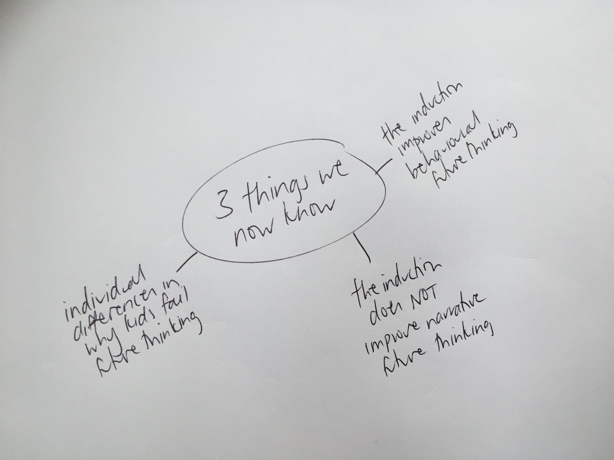
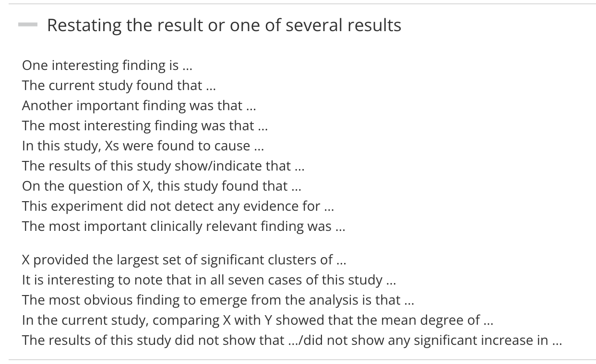
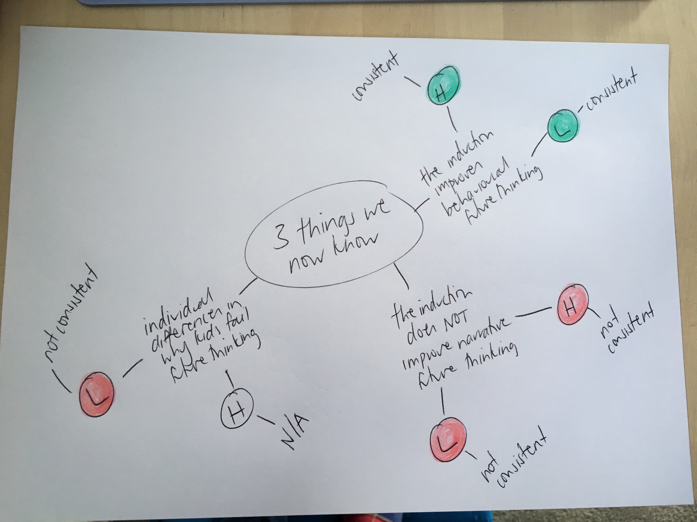
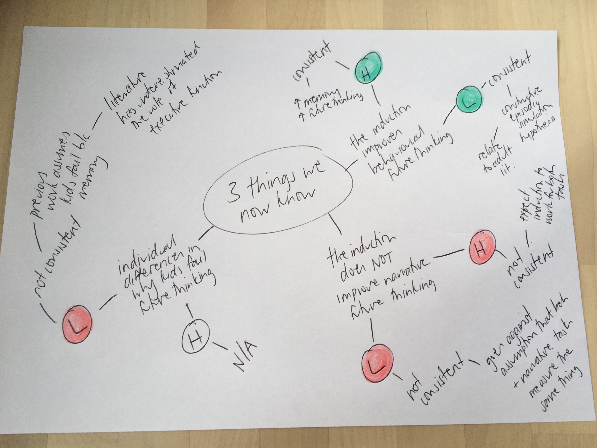
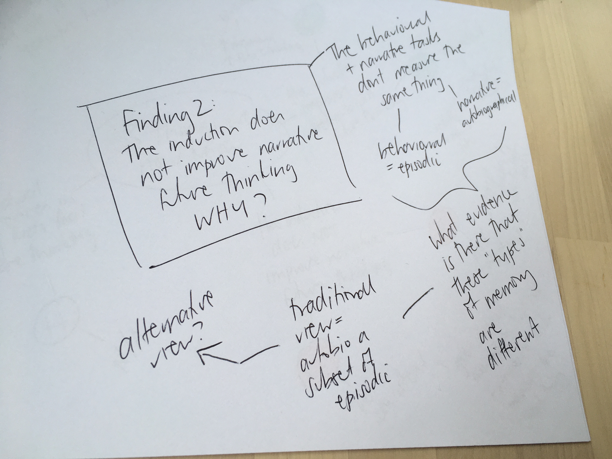

##  {.center}

### These slides are available at...

 

[www.jennyslides.netlify.app/ama-gd/](https://jennyslides.netlify.app/ama-gd/)

## Disclaimer

 

Most of the content in this workshop is my personal opinion (backed up with a little bit of research and a fair bit of experience)

 

If something I say contradicts what your supervisor has told you, go with their context-specific expertise.

## the goal

 

> *"The purpose of the discussion is to interpret and describe the significance of your findings in light of what was already known about the research problem being investigated, and to explain any new understanding or fresh insights about the problem after you've taken the findings into consideration."*

 

::: aside
Source: [Organising Academic Research papers](https://library.sacredheart.edu/c.php?g=29803&p=185933)
:::

## why is it so hard? 

::: columns
::: {.column width="60%"}

You need to...

- think critically, flexibly and creatively
- communicate clearly, persuasively and with authority
- work independently

:::

::: {.column width="40%"}

:::
:::

## don't panic, there is a formula

Like introductions, general discussions are pretty formulaic. 

 

Your marker will smile if you make the "moves" that they expect.

<iframe src="https://giphy.com/embed/3o7qDQ4kcSD1PLM3BK" width="480" height="270" frameBorder="0" class="giphy-embed" allowFullScreen></iframe>
<a href="https://giphy.com/gifs/nickatnite-dance-friends-chandler-3o7qDQ4kcSD1PLM3BK">via GIPHY</a>

## The 4 intro moves 

:::: {.columns}

::: {.column width="60%"}
1. what is the problem? why is it important?
2. what do we already know about the problem?
3. what don't we know about the problem?
4. how does this project fill that knowledge gap?
:::

::: {.column width="40%"}

<iframe src="https://giphy.com/embed/H0XBpCYcUjFcc" width="480" height="397" frameBorder="0" class="giphy-embed" allowFullScreen></iframe>
<a href="https://giphy.com/gifs/dance-macarena-H0XBpCYcUjFcc">via GIPHY</a>

:::

::::

::: aside
adapted from John Swale [CARS (creating a research space) model](https://owl.purdue.edu/owl/general_writing/the_writing_process/organization_CARS_Model.html)
:::

## The 6 discussion moves {.smaller}

:::: {.columns}

::: {.column width="60%"}
1. what do we know about that problem now?
2. how does that new knowledge relate to what we knew before?
3. what can we say about theory and/or the real world that we couldn't before?
4. what problems/limitations do we need to acknowledge?
5. what do we still not know... what are the next steps?
6. what is the take home message?
:::

::: {.column width="40%"}

<iframe src="https://giphy.com/embed/AEzIGP3TQcPKHnABfP" width="480" height="271" frameBorder="0" class="giphy-embed" allowFullScreen></iframe>
<a href="https://giphy.com/gifs/fallontonight-jimmy-fallon-tonight-show-macarena-AEzIGP3TQcPKHnABfP">via GIPHY</a>

:::

::::

# Plan for today

1. Mini-masterclass
- work through each of the 6 moves, do a practical exercise for each
- generate an outline for YOUR general discussion

2. Ask any questions you have about discussion writing (or anything else research related)

# Move 1. what do we know about that problem now?

---

## *Restate* your results 

:::: {.columns}
::: {.column width="60%"}
::: {.nonincremental}

- Your results are the trees
- Your discussion is the forest

> be careful not to just repeat your results

:::
:::

::: {.column width="40%"}

Photo by <a href="https://unsplash.com/@filipz?utm_source=unsplash&utm_medium=referral&utm_content=creditCopyText">Filip Zrnzević</a> on <a href="https://unsplash.com/s/photos/forest?utm_source=unsplash&utm_medium=referral&utm_content=creditCopyText">Unsplash</a>

:::
::::

::: {.notes}
Less is more here. If your results are the trees of your thesis, the discussion is the forest. Your reader has just finished wading through your results, they are done with stats, trying to pull out the big picture, they want you to do the hard thinking for them... provide some light relief. 
:::

---

::: panel-tabset

## exercise 1a

- Pick the 3 most important findings (yes only 3). 
- Make a [spider diagram](https://sites.google.com/site/twblacklinemasters/using-a-spider-diagram-to-make-research-questions?authuser=0).

## example

## exercise 1b

- Play with phrases from the [Manchester Academic Phrasebank](https://www.phrasebank.manchester.ac.uk/discussing-findings/) 
- write a short paragrpah that *restates* your findings

## example

INSERT PARAGRPAH HERE 
:::

---

# Move 2. How does that relate to what we knew before?

---

## *Relate* your results 

- **explain** how each of your findings is consistent (or not) with your hypotheses 
- **explain** how your results are (or are not) consistent with the literature you talked about in your introduction

::: {.callout-important}

Lots of students just state that their findings are (or are not) consistent with their hypotheses and/or literature without explaining HOW. Your marker wants you to do the hard thinking for them. Don't forget to unpack the connections you are making. 

:::

## Then, **explain** what we know now that we didn't know before.

- Consistent? - great! 
  * Explain HOW your findings have advanced the field 

- Not consistent? - great! 
  * Explain WHY you think your study turned out that way

::: {.callout-warning}

This is where discussion writing gets hard
:::

## Did you know that ... 

... more than 80% of honours project don't "work"? 

Most often, the best discussions come out of studies where not everything went to plan.

When your study didn't "work", you have much more scope to think critically, creatively, and flexibly. 

<iframe src="https://giphy.com/embed/efxrDXet2TJILuGRwO" width="480" height="270" frameBorder="0" class="giphy-embed" allowFullScreen></iframe>
<a href="https://giphy.com/gifs/HannahWitton-creativity-possibility-endless-possibilities-efxrDXet2TJILuGRwO">via GIPHY</a>

## Why did my study not "work"? 

Maybe the effect is real, I just wasn't able to detect it...

- sample size 
- methodological errors
- measurement issues

... aka my study didn't work because (in retrospect) it sucked.

::: {.callout-warning}

These explanations apply to all research theses written in the world ever... try to avoid relying on them. 
If you do need to, be specific. Make sure to explain EXACTLY HOW that problem resulted in the PATTERN of data you got

:::

## What is the alternative? {.smaller}

Maybe other researchers in the field have missed something ...

- perhaps this psychological construct doesn't work like everyone says it does
- perhaps this task doesn't measure what everyone says it does
- perhaps other studies have failed to control for variables that impact performance
- perhaps research using this task to answer different questions can help
- perhaps the "other" theoretical perspective accounts for my findings better 

... I need to go back to the literature (or sometimes back to my data) and find an explanation

::: {.callout-important}

This is where HD theses stand out from D theses. Your marker is looking for evidence that you can think critically, creatively, and flexibly and that you can communicate clearly, persuasively, and with authority.

You probably won't have enough information to know whether a given explanation really accounts for your effect and thats ok. Use the uncertainty as an opportunity to make *future research* suggestions. What study should be done to confirm your explanation?

:::

## !!very important!!

You need to point to empirical work or alternative theories from the literature to support you alternative explanations. Your "it is possible that..." explanations need to be grounded in science, not just your gut instinct. 

---

## Exercise 2a - consistent or not

Take your spider diagram and add more legs. 

- For each finding, add a note relating to your hypotheses (H) and past literature (L). 
- Highlight consistencies one colour and inconsistencies another colour. 

---

- Add extra legs describing HOW your findings are (or aren't consistent)

---

Take your spider diagram and add more legs. 

- For each finding, add a note relating to your hypotheses (H) and past literature (L). 
- Highlight consistencies one colour and inconsistencies another colour. 

- Add extra legs describing HOW your findings are (or aren't consistent)

## Exercise 2b- big picture

Pick one of your findings and make a new spider diagram. 

Try out some big picture thinking. 

It probably won't click right now... digging into the literature will lead you down different paths too. 

## Move 3. what can we say about theory and/or real world that we couldn't before?{.smaller}

Zoom out a bit... what are the implications of your findings?

::: {.nonincremental}
1. theory 
2. real world
3. both?? 
:::

::: {.callout-warning}

Don't exaggerate. It is unlikely that your study will change clinical practice, government policy, or the theoretical direction of the field. Use cautious phrasing (see [Manchester phrasebank](https://www.phrasebank.manchester.ac.uk/using-cautious-language/)). Also you might not have enough information to know whether your findings really do have implications for a particular theory or real world thing... What *future research* would you do to confirm? 

:::

## Move 4. what problems/limitations do we need to acknowledge?{.smaller}

Honours research projects have lots of limitations. 

- You don't need to talk about them all (esp those that apply to everyone). 

- Only talk about those that are specific to YOUR PROJECT and have clearly had an impact on the PATTERN of data that you got. 

::: {.callout-tip}

Don't leave limitations hanging, use them to make suggestions for *future research*. 

:::

## Move 5. what do we still not know... what are the next steps?{.smaller}

At this point you might have already embedded ideas for future research in ...

- Move 2  (relate)
- Move 3 (real world/theory)
- Move 4 (limitations)

Now your marker is looking for the next step in this **research program**. Imagine you are going to do a PhD in this area... what is the next question that researchers in this field should answer?

::: {.callout-important}

Avoid future research suggestions that apply to all research theses in the world ever and think big. What is the next big question? How would you conduct that study? 

:::

## Move 6. what is the take home message?

:::: {.columns}
::: {.column width="60%"}
In summary...

- The goal of this project was to...
- This is what we did...
- This is what we found...
- This is what I think it means...

:::
::: {.column width="40%"}
<iframe src="https://giphy.com/embed/1xo9AKS4eeBJENaRAn" width="480" height="270" frameBorder="0" class="giphy-embed" allowFullScreen></iframe>
<a href="https://giphy.com/gifs/evite-bow-present-1xo9AKS4eeBJENaRAn">via GIPHY</a>

:::
::::

## Lets recap: The 6 discussion moves {.smaller}

:::: {.columns}

::: {.column width="60%"}
1. what do we know about that problem now?
2. how does that new knowledge relate to what we knew before?
3. what can we say about theory and/or the real world that we couldn't before?
4. what problems/limitations do we need to acknowledge?
5. what do we still not know... what are the next steps?
6. what is the take home message?
:::

::: {.column width="40%"}

<iframe src="https://giphy.com/embed/AEzIGP3TQcPKHnABfP" width="480" height="271" frameBorder="0" class="giphy-embed" allowFullScreen></iframe>
<a href="https://giphy.com/gifs/fallontonight-jimmy-fallon-tonight-show-macarena-AEzIGP3TQcPKHnABfP">via GIPHY</a>

:::

::: {.callout-tip}

- Moves 1 and 2 will take up MOST of your discussion. Move 3 might only be a couple of paragraphs. 
- You can make Move 5 within Move 2, 3, and 4, as well as in its own section 
- Lots of students forget Move 6- don't leave your marker hanging!

:::

::::

## MYTHS about the art of general discussion writing that are NOT TRUE

1. You should not refer to literature in the general discussion that you didn't cover in the introduction

. . .

2. You should describe ALL the flaws/limitations about your experiment

. . .

3. When it comes to discussion writing, more is better

## Acknowledgements

Other discussion writing resources I recommend...

#### The Thesis Whisperer blog

Lots of great advice about academic writing generally and discussion writing specifically

- discussion posts from [2012](https://thesiswhisperer.com/2012/01/23/how-do-i-start-my-discussion-chapter/), [2016](https://thesiswhisperer.com/2016/04/20/the-difficult-discussion-chapter/), [2020](https://thesiswhisperer.com/2020/03/04/no-really-how-do-you-write-a-discussion-section/), [2021](https://thesiswhisperer.com/2021/05/05/how-to-make-your-dissertation-speak-to-experts/)

#### The Manchester Academic Phrasebook

- [Discussing findings](https://www.phrasebank.manchester.ac.uk/discussing-findings/)

