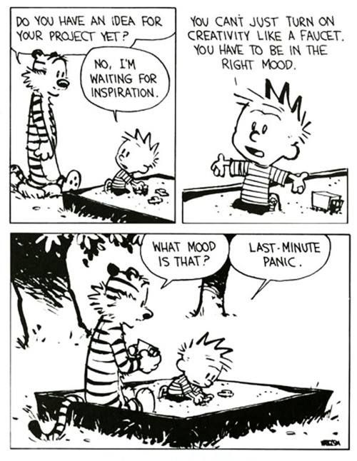
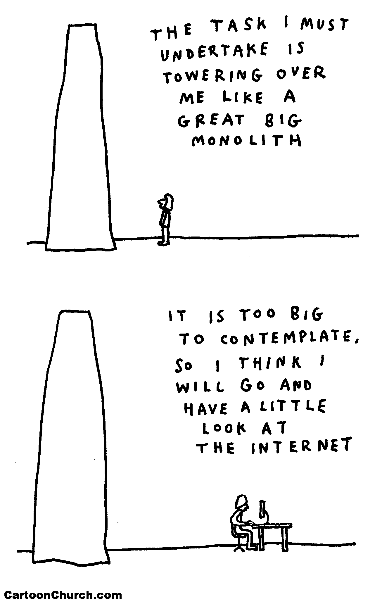
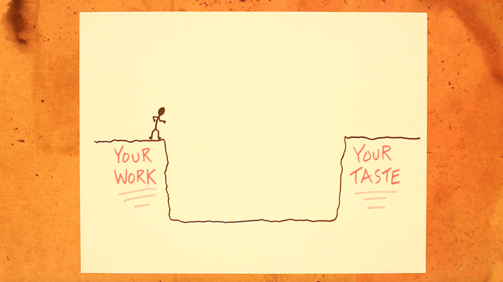
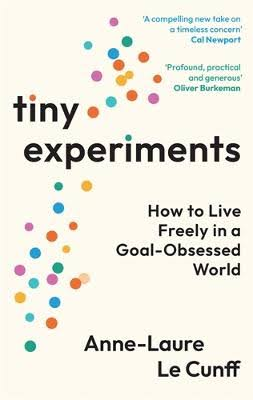
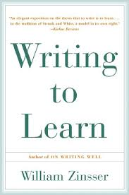
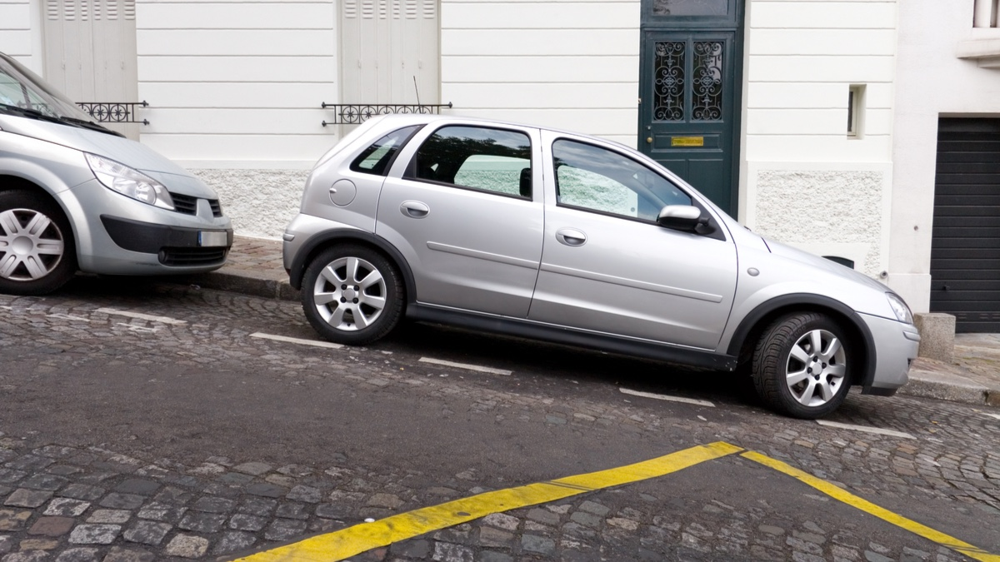
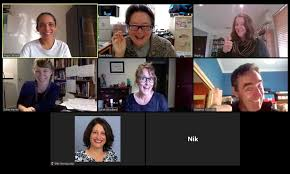

these slides live online

 

<https://jennyslides.netlify.app/how-to-write/>

## about me

{fig-align="center"}

------------------------------------------------------------------------

{fig-align="center"}

 

<https://calendly.com/jennyrichmond/30min>

# what makes writing hard?

##  {.center}

::::: columns
::: {.column width="50%"}
### you are waiting for inspiration
:::

::: {.column width="50%"}
{width="450px"}
:::
:::::

##  {.center}

::::: columns
::: {.column width="50%"}
{width="380px"}
:::

::: {.column width="50%"}
### the task feels too big... you don't know where to start
:::
:::::

##  {.center}

::::: columns
::: {.column width="50%"}
### everything you write sounds bad
:::

::: {.column width="50%"}
{width="900px"}
:::
:::::

------------------------------------------------------------------------

### the words just won't come out

{width="1200px"}

## unproductive writing-related thoughts

-   I need a clear day (or week)
-   I need to read more before I can write
-   I write best when I feel inspired
-   I need a tidy desk before I can really be productive
-   I will do a big push once this work thing is done
-   I only have 20 min, that is not enough time to bother

## You need a writing system

 

A writing system is a set of habits and conditions that help you get started and keep going on your writing.

 

Academic writing advice is often too prescriptive.

 

There is no right way to write.

 

## You need a writing system that works for you.

::::: columns
::: {.column width="60%"}

To design a system, you need to experiment with ...

-   *when* and *where* you will write
-   *how* you will put the words on the page
-   *what* will keep you coming back

:::

::: {.column width="40%"}

{width="300px"}

:::

:::::

# when and where will you write

------------------------------------------------------------------------

## schedule & setting

-   When does your brain work best?
-   Where do you have the least interruptions?
-   How often can you find pockets of time in the week?
-   Where do you like to write?
-   What is the shortest amount of time you need to write?

*EXERCISE 1: Pick a font colour, lets spend 5 min writing about the answers to these questions*

[Shared document link](https://docs.google.com/document/d/1CrWUZCCDQI_o_MDgQDKMFbC9wdGQNUVUt9-bsahLI-Y/edit?usp=sharing)

## run a experiment

Template: I will *\[do something\]* for *\[some period of time\]*

-   I will put 4 x 30 min writing slots in my calendar for 4 weeks
-   I will write for 20 min while I drink my coffee for 7 days

::::: columns
::: {.column width="60%"}

-   I will read at a cafe for 2 hours on Saturday for 3 weeks

Collect some data:

-   how many words on the page?
-   how did you feel about the process?

:::

::: {.column width="40%"}

{width="300px"}

:::

:::::

# how will you write

------------------------------------------------------------------------

{width="900px"}

The gap can make writing very slow.

You rewrite every sentence as it goes on the page.

Not many sentences get written.

------------------------------------------------------------------------

::::: columns
::: {.column width="50%"}
{width="500px"}
:::

::: {.column width="50%"}
Your thesis is a big project and you want it to be good.

 

Sometimes perfectionism prevents us from making a start.
:::
:::::

------------------------------------------------------------------------

## 4 ideas to experiment with

1.  writing for momentum
2.  writing while reading
3.  writing vs. editing
4.  writing requires focus

------------------------------------------------------------------------

## writing for momentum

> I just can't get started

::::: columns
::: {.column width="60%"}
Kick start your writing session by writing about ...

-   how you are feeling about writing
-   what you are feeling stuck on
-   what you don't know and need to learn
:::

::: {.column width="40%"}
{width="350px"}
:::
:::::

## writing while reading

 

> I need to read more before I can write

 

What if reading was writing?

-   make your notes useful
    -   [Reading Matrix](https://docs.google.com/spreadsheets/d/1Rh3QWSw5cXLwUWioiUBkURTy9jo51TNtAC4g6i7v9TQ/edit?gid=0#gid=0)
    -   [Summary and Reaction](https://docs.google.com/document/d/1XLi1DrYP9QdGKYYJ3j0Mr905puc8ml_YycB2RXdtlD4/edit?usp=sharing)

------------------------------------------------------------------------

## writing is different from editing

 

> I write too slowly

::::: columns

::: {.column width="50%"}

:::

::: {.column width="50%"}

-   writing = putting ugly words on the page

-   editing = making those ugly words less ugly

-   write first, then revise

:::

:::::

------------------------------------------------------------------------

## writing requires focus

> I am easily distracted

::::: columns
::: {.column width="50%"}
{width="700px"}
:::

::: {.column width="50%"}
 

Set a timer and focus.

 

It doesn't have to be 25 min (start short and work up).

 

Take regular short breaks.
:::
:::::

------------------------------------------------------------------------

## run an experiment

Template: I will *\[do something\]* for *\[some period of time\]*

-   I will use a timer to write in short bursts for 7 days
-   I will spend 5 min writing to learn each day for 3 weeks

::::: columns
::: {.column width="60%"}

-   I will write 3 S&R responses each week for a month

Collect some data:

-   how many words on the page
-   how you feel about the process

:::

::: {.column width="40%"}

{width="300px"}

:::

:::::

# what will keep you coming back

## make it easy to start again

Park on the down hill

---

## stay curious, keep experimenting

{width="600px"}

---

## make it social

-   shut up and write
    -   get a group together
    -   write together in short bursts
    -   keep each other accountable
    
{fig-align="left"}

 
[SUAW sign up form](https://forms.gle/Ncnd3KNeaxMc29Dz7)

------------------------------------------------------------------------

## let's shut up and write a little

> *Exercise 2: Lets set a timer and write together; how many words can you generate?*

Options:

- throw some ugly thesis words on the page
- write about what is making writing hard right now
- write a summary/reaction about a paper you read
- write about the writing experiment you have planned

[Shared document link](https://docs.google.com/document/d/1CrWUZCCDQI_o_MDgQDKMFbC9wdGQNUVUt9-bsahLI-Y/edit?usp=sharing)
 

# how many words did you throw on the page?

## Take home message

- how to write a lot
  - you need create a writing system that works for you
  - experiment with the conditions that help you get started and keep going
  - thesis writing can be lonely, make it social

--------------------------------------------------------------

## recommended writing resources

-   Inger Mewburn
    -   [Thesis Whisperer Blog](https://thesiswhisperer.com/)
    -   [How to fix your academic writing trouble](https://www.goodreads.com/book/show/43530967)
-   Patricia Goodson
    -   [Becoming an academic writer: 50 Exercises for paced, productive, and powerful writing](https://www.goodreads.com/book/show/14554574-becoming-an-academic-writer)
-   Helen Sword
    -   [Stylish Academic Writing](https://www.goodreads.com/en/book/show/13540208-stylish-academic-writing)
    -   [Air & Light & Time & Space: How Successful Academics Write](https://www.goodreads.com/book/show/32336647-air-light-time-space)

------------------------------------------------------------------------

## upcoming events

Friday 1 hr workshops (FREE)

- Sept 4: How to polish your thesis (and get an HD)
- Sept 18: How to set up for research success

Small group coaching 2 hrs N = 5 ($49)

- Plotting for survey research
  - Sept 4, Sept 18, Oct 2
- Keep calm and write your general discussion
  - Sept 11, Sept 25
  
> Save your seat [https://www.revealresearch.org/events](https://www.revealresearch.org/events)

## Questions....

<iframe src="https://giphy.com/embed/xIJLgO6rizUJi" width="680" height="567" frameBorder="0" class="giphy-embed" allowFullScreen>

</iframe>

<https://calendly.com/jennyrichmond/30min>
