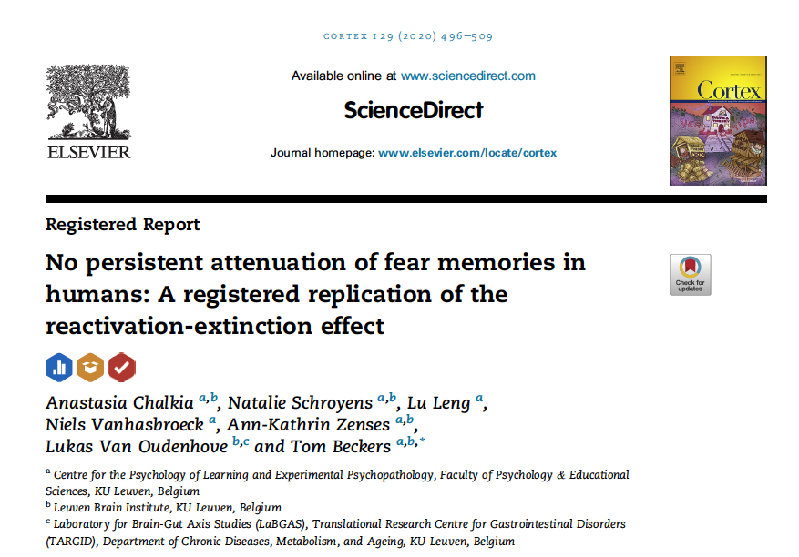
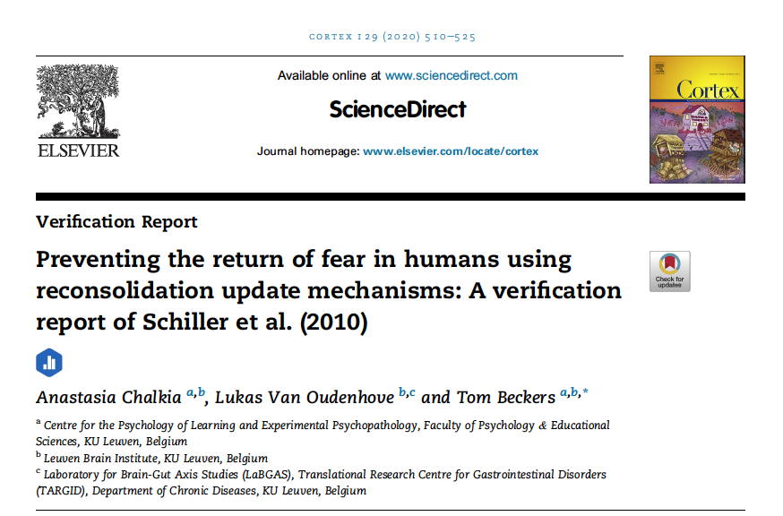
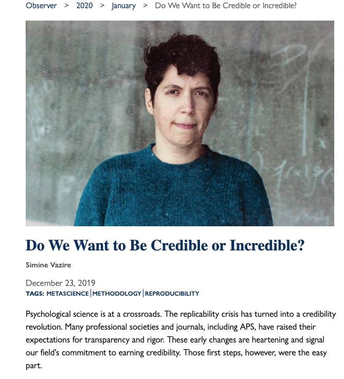
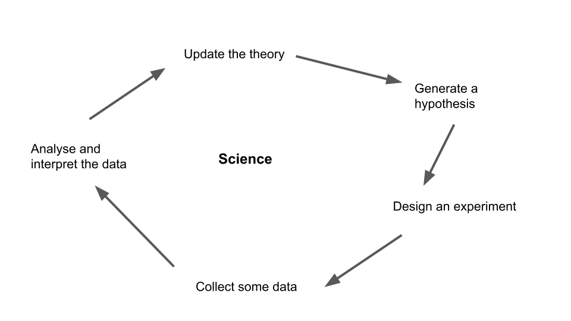
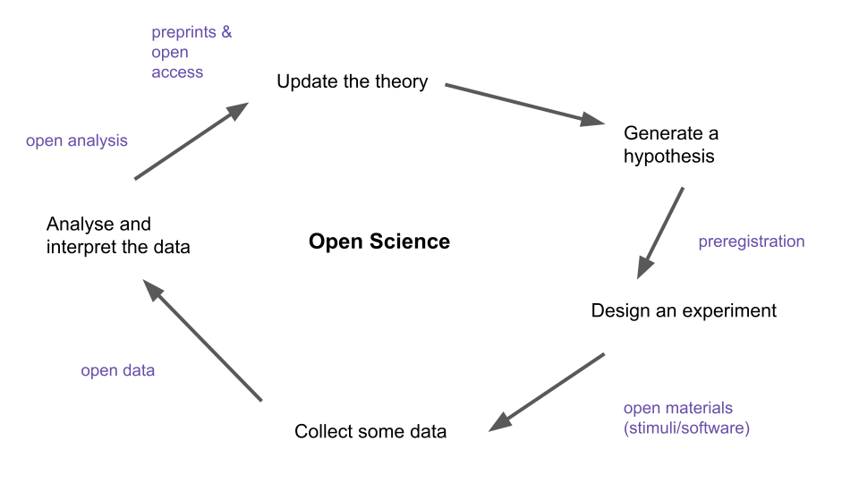
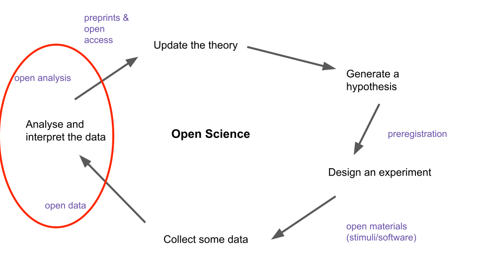

```{r setup, include=FALSE}
options(htmltools.dir.version = FALSE)
```

```{r xaringan-themer, include=FALSE, warning=FALSE}
library(xaringanthemer)
style_duo_accent(
  primary_color = "#1381B0",
  secondary_color = "#069dc9",
  inverse_header_color = "#0b0475"
)


```

class: center, middle

# Hello

---
class: center, middle

# outline

## what is the problem

--

## why should we care
--

## what is our plan 

---

background-image: url(img/begin.jpeg)
background-size: cover
class: center, bottom, inverse

---


class: inverse, center, middle

# The Replication Crisis

# What do you already know?

---

# Group discussion (10 min)

- what is the "crisis"? 
<br>
<br>
- what has caused it? 
<br>
<br>
- what does it mean for research to be "replicable"? 
<br>
<br>
- what does it mean for research to be "reproducible"? 
<br>
<br>
- are they they same thing?


---
class: inverse, center, middle


background-image: url(https://the-turing-way.netlify.app/_images/ReproducibleMatrix.jpg)
background-size: contain
class: center, bottom, inverse


---
class: inverse, middle, center

# Lets start with a story

---

# Meet Anastasia Chalkia PhD

.pull-left[


]

.pull-right[

- PhD student at Centre for the Psychology of Learning and Experimental Psychopathology (CLEP) at the University of Leuven
<br>
<br>
- working in Tom Beckers lab looking at the role of conditioning in psychopathology 
<br>
<br>
- decided, as part of her thesis, to try and replicate a VERY famous effect in learning/memory. 


]


---

class: inverse, center, middle


background-image: url(img/schiller.png)
background-size: contain
class: center, bottom, inverse

---

# The timeline


- Nov 2016 
  + submitted Registered Report at *Cortex*, plans direct replication of study originally published in *Nature* by [Schiller et al. (2010)](https://www.nature.com/articles/nature08637) 
--

- Feb 2017
  + In Principle Acceptance (IPA) awarded
  + starts data collection
--

- Mar 2017
  + something is wrong...
  + 75% of the first 35 participants have to be excluded (same criteria original study reported 8% excluded)
  + stop testing
  + request data from original authors 
  + wait...
  + wait some more...
  + wait 5 months in total
--

- Aug 2017
  + receive data from original authors
  + more detail emerges re actual exclusion criteria used
  
  
---

# The timeline cont.
  
> "exclusions from Experiment 1 reported
in the Nature paper (n = 6), related only to participants who
had completed all three days of testing, and that a much larger
number of unreported participants (around 50% of the total
enrolment) had been excluded based on “a judgment call after
day 1 or 2 data became available” (Schiller, personal communication,
13 Sep 2017)."

--


- Sept 2017
  + update registered report conditions with 11 conditional statements from original authors that "attempt" to describe the original exclusion criteria
  + data collection recommences 
--

- Sept 2019
  + analyse data and submit registered report N = 246
--

- April 2020
  + manuscript accepted 
  

---

# Registered report 




---

background-image: url(img/ReproducibleMatrix1.jpg)
background-size: contain
class: center, bottom, inverse

---


class: center, middle

## The effect is NOT replicable, but is it reproducible?


---

# *Cortex* new article type: Verification Report

> goal: to reward researchers doing the important work of confirming that research is reproducible

- works like a registered replication except the goal is to repeat the analysis reported in a paper and/or report additional analysis conducted on the original data

- Stage 1 
    + submit introduction and plan, leading to "in principle acceptance" (IPA)
- Stage 2 
    + submission of verification report following the analysis plan 


---


# Verification report 



---


# Verifying the Schiller et al. analysis

1. using the exclusion criteria reported in the Nature paper `r emo::ji("no")`
--

2. using the criteria from recent addendum (same as criteria used in the replication) `r emo::ji("no")`
--

3. using no exclusion criteria `r emo::ji("no")`
--

4. using the idiosyncratic/inconsistent rules that were actually used in the original study `r emo::ji("yes")`

---

class: center, middle, inverse


---

class: center, middle, inverse

<iframe src="https://giphy.com/embed/xUPOqptQG2hIrX3koE" width="480" height="358" frameBorder="0" class="giphy-embed" allowFullScreen></iframe><p><a href="https://giphy.com/gifs/gilmoregirls-netflix-gilmore-girls-xUPOqptQG2hIrX3koE">via GIPHY</a></p>


---


background-image: url(img/ReproducibleMatrix2.jpeg)
background-size: contain
class: center, bottom, inverse


---

# Why should we care about this case? 

This paper attracted enormous attention and more than 1200 citations
  + the researchers involved have received grants, promotions, faculty jobs as a result of its "impact"
  + BUT other researchers have spent time/money on conceptual replications (with varying degrees of success)
  + AND clinicians have applied the findings to treatment approaches for PTSD and other anxiety disorders
  
  

---

# Why is this a problem generally? 

[LINK](https://www.psychologicalscience.org/observer/do-we-want-to-be-credible-or-incredible)

.pull-right[


]

---

[LINK](https://online.ucpress.edu/collabra/article/3/1/1/112375/Quality-Uncertainty-Erodes-Trust-in-Science)


---

[LINK](https://psyarxiv.com/cfmzk)


---


class: center, middle

# I want my research to be reproducible...

# ... what do I do?

---

# The scientific process


> adapted from [Bergmann (2018)](https://docs.google.com/presentation/d/1bdICPzPOFs7V5aOZA2OdQgSAvgoB6WQweI21kVpk9Gg/edit#slide=id.p)

---

# how is open science different? 





> adapted from [Bergmann (2018)](https://docs.google.com/presentation/d/1bdICPzPOFs7V5aOZA2OdQgSAvgoB6WQweI21kVpk9Gg/edit#slide=id.p)

---

class: center, middle, inverse

### open science is about being transparent about what you are doing and why at every step of the process

---

### do I have to do all of that? 

no...you can think of open science as a ["buffet" of research practices (Bergmann, 2018)](https://docs.google.com/presentation/d/1bdICPzPOFs7V5aOZA2OdQgSAvgoB6WQweI21kVpk9Gg/edit#slide=id.p)




---


background-image: url(https://the-turing-way.netlify.app/_images/reproducibility.jpg)
background-size: cover
class: center, middle, inverse

---


# By the end of this course, you will...

1. be able to explain why it is important that scientists are transparent about their research practices
<br>
<br>
2. be able to use your understanding of structural, ethical and practical barriers to explain describe why some researchers share their data and others don’t
<br>
<br>
3. be able to describe the factors make research analyses more or less difficult to reproduce
<br>
<br>
4. be able to apply workflow practices to your own projects in a way that will make transparency and data sharing easy
<br>
<br>
5. know enough R to produce descriptive statistics and visualisations in your honours project (and/or job beyond uni)


---

# The Plan

#### Goal 1: get up to speed with R and R Markdown

1. online coding modules
  + Week 1 R-Markdown & getting data in
  + Week 2 Data visualisation
  + Week 3 Data wrangling
  + Week 4 Project workflow
  + Week 5 (or sooner) Installation
  
2. Coding lab (from Week 2 in MAT209)
  + Tuesday 1pm
  + Tuesday 4pm
  + Thursday 10am

Lab attendance in Weeks 2:5 and 7:10. 

---

# The Plan

#### Goal 2: APPLY your new R skills and produce a verification report 

(see [Jenny's roaches example](https://rpubs.com/jenrichmond/roaches))

1. Each group (within a lab) will be assigned a paper to reproduce.  

2. As a team, have a go at reproducing
  + plots
  + demographic descriptives
  + summary statistics (means/SDs)
  
3. As a team, learn about why even when data are open, reproducibility is difficult. 
  
---

# The Plan

#### Goal 3: practice presenting, giving feedback, and using feedback 

Friday workshops (Weeks 1, 2, 3, 5, and 10). 

- before you come, there will be something to read
- once you get here, you will discuss with others who read the same thing
- as a group, you will share what you learned with the class 

In workshops in Week 3 & 5, you will share drafts of pieces of your verification report with peers and give each other feedback.  

In Week 8, each group will present about what they have learned along the way (group presentations will happen in labs). 

---

# Workshop plans 

- Week 2 how hard can it be?
- Week 3 getting started on group work
- Week 5 why doesn't everyone do this?
- Week 8 group presentations
- Week 10 END OF TERM PARTY re learning new things

> topics are negotiable... we can change our mind as we go along

---

# Assessment

- 10% Learning Logs
  + Weeks 1:5 and 7:10 write response to forum prompt by Sunday 23:59pm
  + Jump back into the forum over the next few days and comment on posts from 2 peers (by WED 23:59pm)
  + 9 posts (0.5% each) + 18 comments (0.5% each)
  + BONUS 1% for on time completion. 
- 30% Group presentation (week 8)
- 10% Group work
  + self and peer assessed (we will talk more in Week 3)
- 50% Verification Report (week 10)

---

# Next steps

1. if you haven't already, make a start on the Coding module for this week 

2. ask questions

> There is a q&a forum on Moodle

3. write your first learning log, publish to RPubs and share in the Learning Log forum

4. come to workshop next Friday with a summary/reaction in hand (see workshop prep in Moodle)

5. Attend your lab meeting 

---

class: center, middle, inverse

# Questions? 


---


