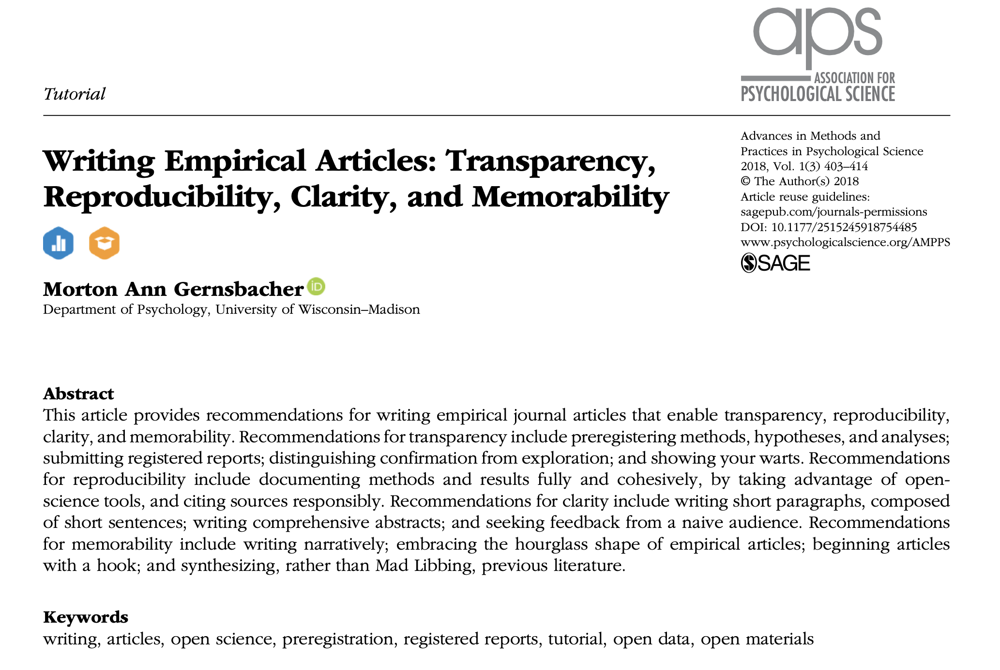
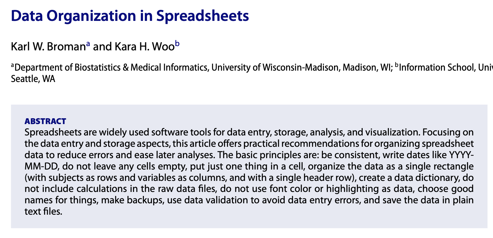
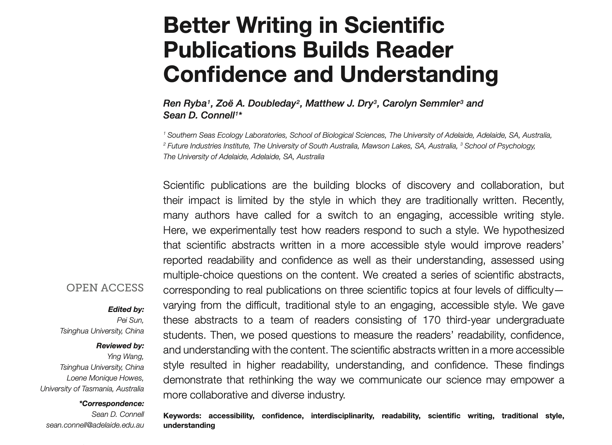
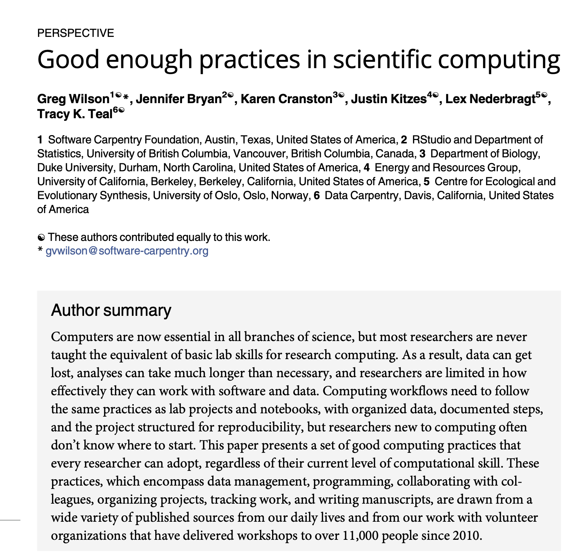

## Prof Morton Gernsbacher

-   University of Wisconsin–Madison
-   Research area: cognitive neuroscience
-   Recent pubs: neurodiversity, theory of mind
-   [Google Scholar](https://scholar.google.com/)
-   How to synthesise

::: aside
Gernsbacher, M. A. (2018). Writing empirical articles: Transparency, reproducibility, clarity, and memorability. *Advances in Methods and Practices in Psychological Science, 1*(3), 403–414. <https://doi.org/10.1177/2515245918754485>
:::

## Transparency

-   Pre-register your study
    -   Registered reports
-   Confirmatory vs. exploratory analysis
-   Show your warts — be honest about:
    -   exclusions
    -   pilot studies
    -   unpredicted findings

## Reproducibility

-   Document your research
-   Give away your protocol, materials, data, and analysis together on the [Open Science Framework](https://osf.io/)
-   Avoid citation errors
    -   Only cite papers you have read
    -   Include a DOI in your reference list

## Clarity

-   Write short sentences
-   Write short paragraphs
-   Get feedback from someone who knows nothing about your project

## Memorability

-   Tell a story
-   Use broad – narrow – broad structure
    -   (intro – method/results – discussion)
-   Hook your reader in
    -   How is your project relevant and important?
    -   Synthesise the literature (avoid MadLib)

------------------------------------------------------------------------

# upcoming lab meetings

------------------------------------------------------------------------

Broman, K. W., & Woo, K. H. (2018). Data organization in spreadsheets. *The American Statistician, 72*(1), 2–10. <https://doi.org/10.1080/00031305.2017.1375989>

------------------------------------------------------------------------

Ryba, R., Doubleday, Z. A., Dry, M. J., Semmler, C., & Connell, S. D. (2021). Better writing in scientific publications builds reader confidence and understanding. *Frontiers in Psychology, 12*, 714321. <https://doi.org/10.3389/fpsyg.2021.714321>

------------------------------------------------------------------------

{fig-align="center" width="3000"}

Wilson, G., Bryan, J., Cranston, K., Kitzes, J., Nederbragt, L., & Teal, T. K. (2017). Good enough practices in scientific computing. *PLOS Computational Biology, 13*(6), e1005510. <https://doi.org/10.1371/journal.pcbi.1005510>
