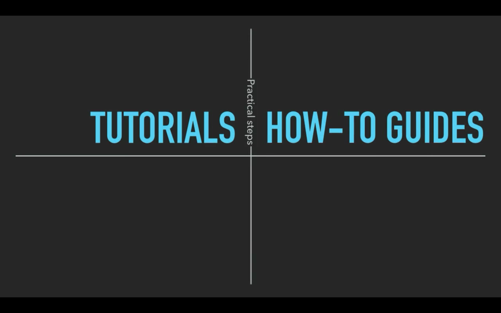
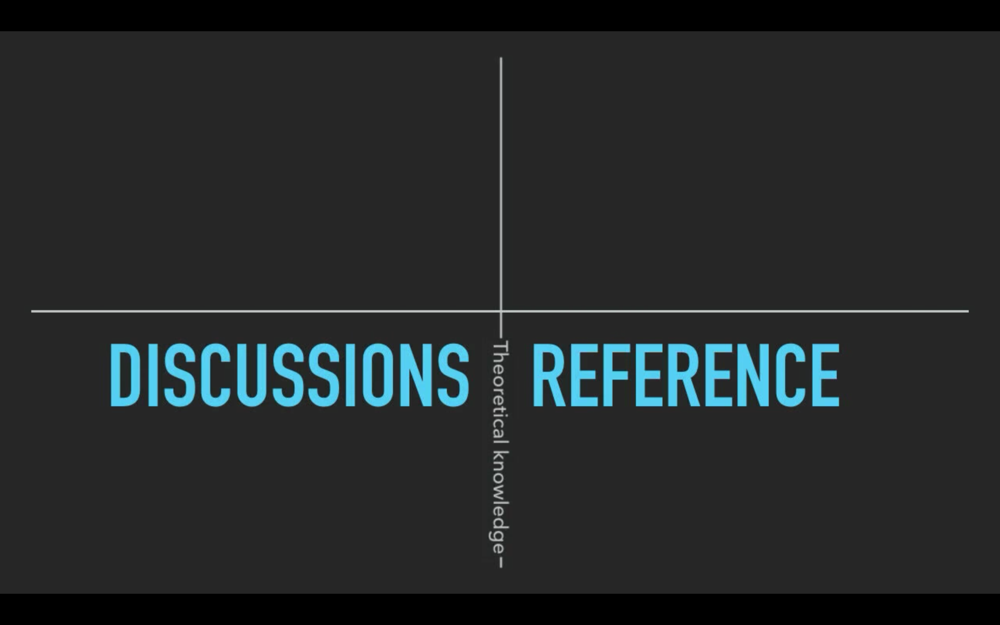
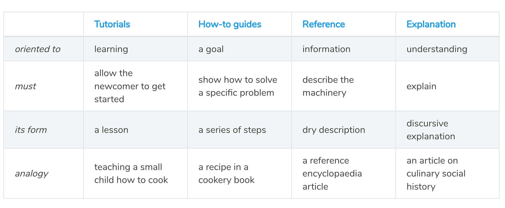
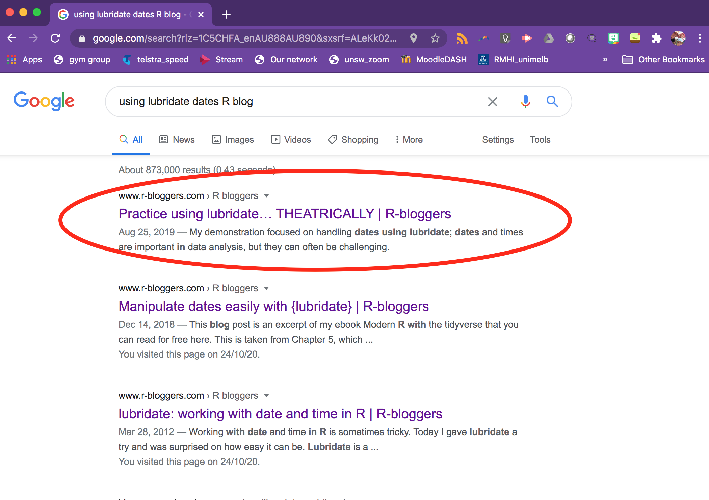
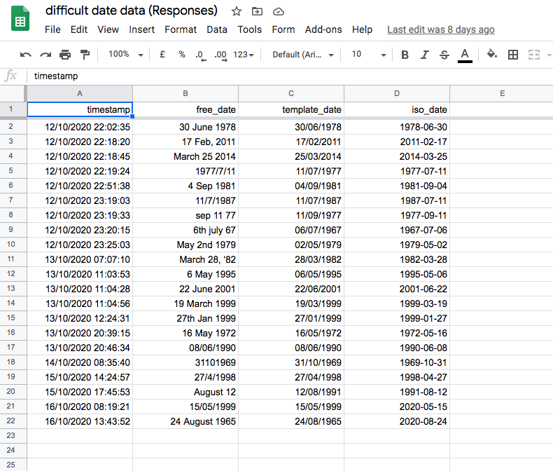

```{r setup, include=FALSE}
options(htmltools.dir.version = FALSE)
```

```{r xaringan-themer, include=FALSE, warning=FALSE}
library(tidyverse)
library(here)
library(lubridate)

library(xaringanthemer)
style_duo_accent(
  primary_color = "#562457",
  secondary_color = "#88398A",
  inverse_header_color = "#FFFFFF",
  text_font_size = "28px"
)
```

If you would like to code along when we get there, use this RStudio Cloud project. You will need to sign up with an email address. 


### [https://rstudio.cloud/project/1817769](https://rstudio.cloud/project/1817769)


---
class: inverse, center, middle

# The Plan

--

### an opinionated guide to learning new things in R

--

### 3 things I learned about lubridate

--

### how you can help others learn new things

---

class: inverse, center, middle

# an opinionated guide to learning new things in R


---

# learning new things in R

The best thing about open source software like R is that there are SO many learning resources. 


---

# learning new things in R

The ~~best~~ worst thing about open source software like R is that there are SO many learning resources. 

--

## Where to start??

--

<br>
<br>

[PyCon talk Daniele Procida: What nobody tells you about documentation](https://www.youtube.com/watch?v=t4vKPhjcMZg&t=478s)

---

class: middle, centre

```{r echo=FALSE, out.width= "900px"}

```

image credit: Daniela Procida

???

tutorial = learning oriented, lessons that take the reader by the hand through a series of steps to complete a project/exercise, show the beginner can achieve something meaningful

how to guide = problem oriented, guides that take the reader through the steps required to solve a common problem, recipes/directions to do something specific

reference = technical descriptions of the machinery and how to operate it

discussion = explanations that clarify and illuminate a particular topic, background, context, explain why things are the way they are. 


---

class: middle, centre

```{r echo=FALSE, out.width= "900px"}

```

image credit: Daniela Procida


---

class: middle, centre

```{r echo=FALSE, out.width= "900px"}

```

image credit: Daniela Procida


---

class: middle, centre

```{r echo=FALSE, out.width= "900px"}
knitr::include_graphics("img/studying.png")
```

image credit: Daniela Procida


---

class: middle, centre

```{r echo=FALSE, out.width= "900px"}

```

image credit: Daniela Procida


---

# in the context of R...

.pull-left[

### tutorials

- books
  + [R for Data Science](https://r4ds.had.co.nz/)
  + [Learning Statistics w R](https://learningstatisticswithr.com/)
- courses
  + [RYouWithMe](www.rladiessydney.org/RYouWithMe)
  + [Data Science in a Box](https://datasciencebox.org/)
- primers 
  + [RStudio Cloud](https://rstudio.cloud/learn/primers)

] 


.pull-right[

### how to guides

- blogs
  + [Rebecca Barter across](http://www.rebeccabarter.com/blog/2020-07-09-across/)
  + [Alison Hill blogdown](https://alison.rbind.io/post/2017-06-12-up-and-running-with-blogdown/)
  + [Suzan Baert dpylr](https://suzan.rbind.io/categories/tutorial/)
  + [Jen Richmond IDHTG](http://jenrichmond.rbind.io/post/idhtg-how-to-use-colour-palettes-with-ggplot/)
  

] 

---

# in the context of R...

.pull-left[

### discussion

- other publications
  + [Hadley Wickham: re tidyverse JOSS](https://joss.theoj.org/papers/10.21105/joss.01686)
  + [Hadley Wickham: re tidy data JSS](https://www.jstatsoft.org/article/view/v059i10)
  + [Jenny Byran:  re version control ](https://peerj.com/preprints/3159/)
  + [Kara Woo: re spreadsheets](https://www.tandfonline.com/doi/full/10.1080/00031305.2017.1375989)


] 

.pull-right[

### reference

- package documentation
  + CRAN docs
  + package vignette 
  + cheat sheets

] 


---
---

class: middle, centre

# my opinion 

beginners should skip tutorials and go straight to "how to" guides

```{r echo=FALSE, out.width= "900px"}

```

image credit: https://documentation.divio.com/introduction/


---

class: inverse center, middle 

# why?
# tutorials lack an interesting context/problem


---

# without context/problem...


<iframe src="https://giphy.com/embed/3o752onMtrE2FJJAru" width="480" height="480" frameBorder="0" class="giphy-embed" allowFullScreen></iframe><p><a href="https://giphy.com/gifs/cbc-funny-comedy-3o752onMtrE2FJJAru">via GIPHY</a></p>


---


.pull-right[

<iframe src="https://giphy.com/embed/3ohhwAUoWvd7BeEkqA" width="480" height="478" frameBorder="0" class="giphy-embed" allowFullScreen></iframe><p><a href="https://giphy.com/gifs/cbc-funny-comedy-3ohhwAUoWvd7BeEkqA">via GIPHY</a></p>

]
---

# how I learned lubridate 


# first google...

```{r echo=FALSE, out.width= "900px"}

```


---

#.... I hit GOLD

[Julia Silge blog](https://juliasilge.com/blog/lubridate-london-stage/)

- great data set (London theatre from 1600) 
- solves common date problems
  + how to make characters into dates
  + how to plot by year(), month(), wday()
  + how to work with time spans
  
---

# My learning plan

Find a cool dataset and copy Julia. 

SMH Sept 15, 2020: [Authorities remain concerned about low testing rates ahead of school holidays](https://www.smh.com.au/national/nsw/nsw-does-not-need-zero-cases-to-be-out-of-the-woods-20200915-p55vpx.html)


dataset = [COVID testing rates NSW](https://data.nsw.gov.au/data/dataset/nsw-covid-19-tests-by-age-range/resource/28730d42-675b-4573-ad71-8156313c73a1)

---


class: inverse, center, middle

# 3 things I learned about lubridate

--

### 1. plotting with date components

--

### 2. converting characters to dates

--

### 3. how to make R read your dates as dates


---


---

# 1. Plotting with dates

Use date components within ggplot to plot by...

.pull-left[

## year(), 

## month(), 

## day(), 

## wday()

] 


.pull-right[

#### tips 

label = TRUE 

week_start = getOption("lubridate.week.start", 1)

Link to RStudio Cloud for demo

] 


---


# 2. Converting characters to dates

If your dates are in a consistent format, you can use... 

.pull-left[

### ymd()

### mdy()

### dmy()

... to convert characters to dates

] 


.pull-right[

Link to RStudio Cloud for demo


] 


---


# 3. how to make R read your dates as dates


Why did the test data parse as date format and the Taylor/Beyonce data not?


---

```{r message=FALSE, warning=FALSE}
sales <- read_csv(here::here("data", "sales.csv"))

sales$released[[1]]
```

```{r message=FALSE, warning=FALSE}
tests <- read_csv(here::here("data", "totaltests.csv"))

tests$test_date[[1]]
```

# my hypothesis

Data that is in year-month-day format will always parse as dates?

---

# collecting data to test my hypothesis 


.pull-left[

Enter your birthday 3 times

- as you like
- using a calendar widget
- in year-month-day format (ISO 8601)


] 

.pull-right[

```{r echo=FALSE, out.width= "400px"}

```


] 


---


# Which dates does R think are dates?

### it depends....

---

#### using googlesheets4 package

- free date = list
- template date = date `r emo::ji("smile")`
- iso date = char

.pull-left[

#### from .xlsx

- free date = char
- template date = date `r emo::ji("smile")`
- iso date = char

] 

--

.pull-right[

#### from .csv

- free date = char
- template date = char
- iso date = date `r emo::ji("smile")`

] 


---


# what to do with dates in a million formats?

```{r message=FALSE, warning=FALSE}
diff_dates <- read_csv(here::here("data", "diffdatedata.csv")) %>%
  select(free_date)

head(diff_dates)

```

---

# breathe... there are only 3 formats

dmy()

ymd()

mdy()

And parse_date_time() is your friend...

---


```{r message=FALSE, warning=FALSE}
diff_dates <- diff_dates %>%
  mutate(free_date_parsed = parse_date_time(free_date, c("ymd", "mdy", "dmy")))

head(diff_dates, 8)
```


- parse_date_time() failed to parse when there was no year. 

- it made an error when the year was only 2 digits. 


---

# Take home message

Lubridate is full of functions that make working with dates in R easier

- Use date components in ggplot with...
  + day(), wday(), month(), year()
- Convert characters to dates with...
  + dmy(), mdy(), ymd()
- Whether R will recognise your dates depends on
  + what format they are in
  + AND where you are reading them from

BUT parse_date_time() does a pretty good job `r emo::ji("smile")` 

---


class: inverse, center, middle


# how you can help others learn new things

### Blog while you are learning

### You are in the best place to communicate to another beginner how to do something


---

# Read about my learning process

My blog = [www.jenrichmond.rbind.io](http://www.jenrichmond.rbind.io/)

1. [first google](http://jenrichmond.rbind.io/post/lubridate-month-wday/)

2. [wday() month()](http://jenrichmond.rbind.io/post/lubridate-month-wday/)

3. [converting characters](http://jenrichmond.rbind.io/post/converting-characters-to-dates/)

4. [parsing dates automatically](http://jenrichmond.rbind.io/post/parsing-dates-automatically/)

---

# Questions....

<iframe src="https://giphy.com/embed/xIJLgO6rizUJi" width="480" height="367" frameBorder="0" class="giphy-embed" allowFullScreen></iframe><p><a href="https://giphy.com/gifs/alice-in-wonderland-thank-you-xIJLgO6rizUJi">via GIPHY</a></p>

---