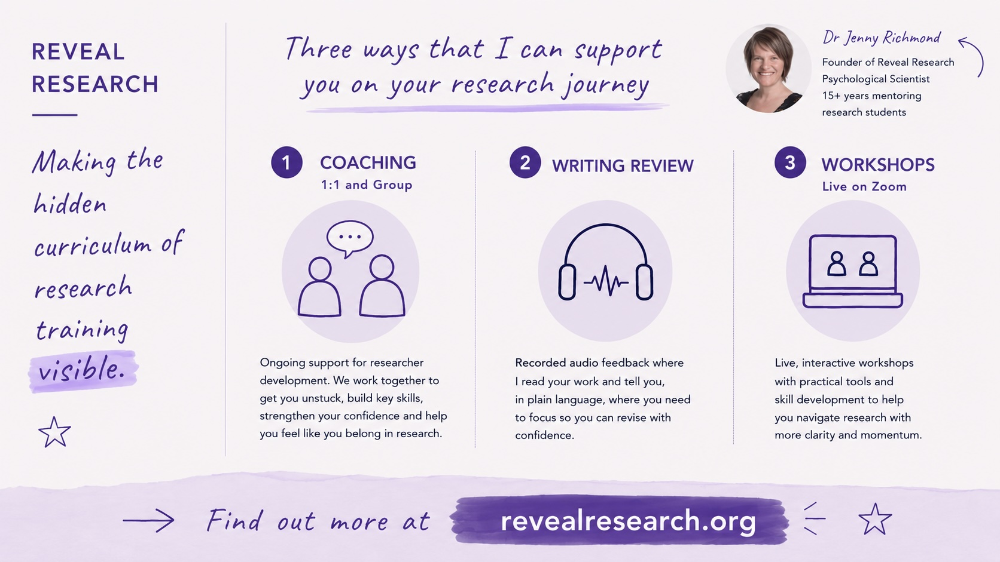
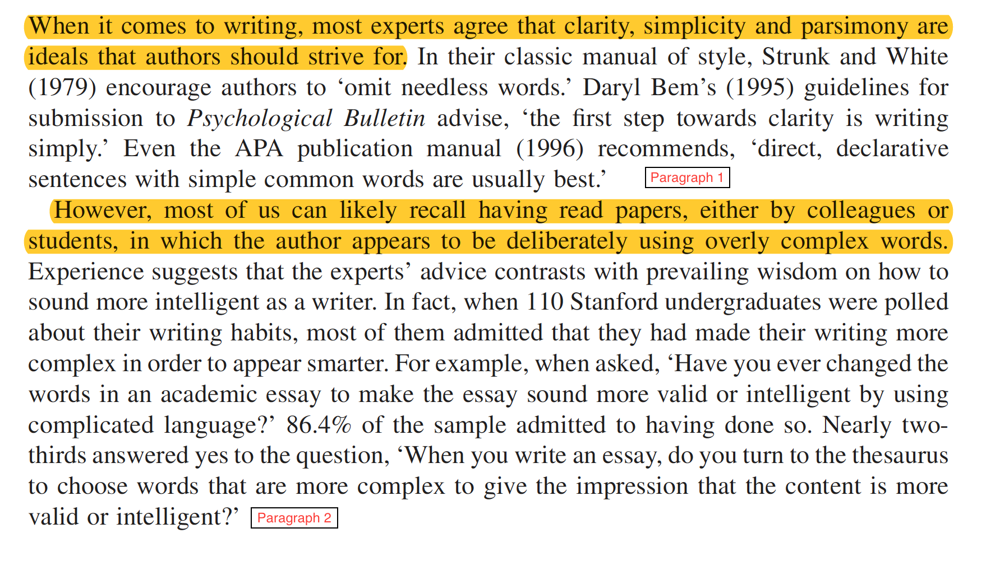
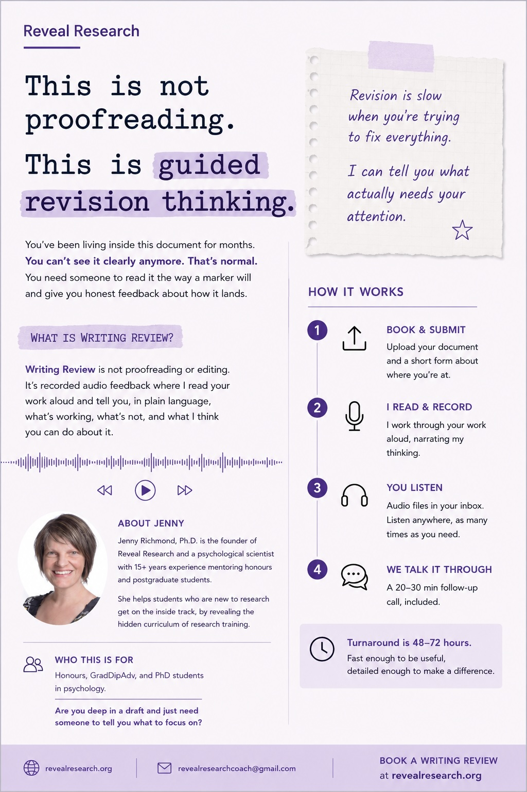

### These slides are available at...

<br>

[www.jennyslides.netlify.app/polish-hd/](https://jennyslides.netlify.app/polish-hd/)


## about me

{fig-align="center"}

---


{fig-align="center"}

<br>

[Book a discovery call](https://calendly.com/jennyrichmond/30min)


# how to polish your thesis (and get an HD)


## It is important to remember that your marker is... 

-   is smart and likes psychology
-   is NOT an expert in your field
-   has a large pile of theses on their desk
-   needs to mark and write a report for each thesis
-   only has a couple of weeks to finish the marking
-   has a lot of other things on their plate
-   is just a person

## Your goal is to make their job as painless as possible


------------------------------------------------------------------------

## You can polish your writing using these 6 tests

1.  The trying-to-sound-smart test
2.  The 25-word test
3.  The zombie test
4.  The "this" test
5.  The first-sentence test
6.  The what-not-who test

# Ready to put your reviewer 🎩 on?

# 1. The trying-to-sound-smart test

------------------------------------------------------------------------

## The trying-to-sound-smart test

::: panel-tabset
## Problem

{width="800"}

## Test

Pick a page of your intro, read it aloud and circle all the words that are MORE than 3 syllables long.

<br>

Then start at the top and highlight any jargon words that your mum wouldn't understand.

<br>

How many long/jargony words are on your page?

## Solution

Replace the long words short concrete alternatives.

<br>

Ask yourself whether the jargon is really necessary.

<br>

If it is, make sure its REALLY well defined.
:::


# 2. The 25-word test

## The 25-word test

::: panel-tabset
## Problem

```{=html}
<div style="width:320px; margin:0 auto;">
<blockquote class="instagram-media" data-instgrm-captioned data-instgrm-permalink="https://www.instagram.com/reel/DKkEUS6vaeE/?utm_source=ig_embed&amp;utm_campaign=loading" data-instgrm-version="14" style=" background:#FFF; border:0; border-radius:3px; box-shadow:0 0 1px 0 rgba(0,0,0,0.5),0 1px 10px 0 rgba(0,0,0,0.15); margin: 1px; max-width:320px; min-width:250px; padding:0; width:99.375%; width:-webkit-calc(100% - 2px); width:calc(100% - 2px);"><div style="padding:16px;"> <a href="https://www.instagram.com/reel/DKkEUS6vaeE/?utm_source=ig_embed&amp;utm_campaign=loading" style=" background:#FFFFFF; line-height:0; padding:0 0; text-align:center; text-decoration:none; width:100%;" target="_blank"> <div style=" display: flex; flex-direction: row; align-items: center;"> <div style="background-color: #F4F4F4; border-radius: 50%; flex-grow: 0; height: 40px; margin-right: 14px; width: 40px;"></div> <div style="display: flex; flex-direction: column; flex-grow: 1; justify-content: center;"> <div style=" background-color: #F4F4F4; border-radius: 4px; flex-grow: 0; height: 14px; margin-bottom: 6px; width: 100px;"></div> <div style=" background-color: #F4F4F4; border-radius: 4px; flex-grow: 0; height: 14px; width: 60px;"></div></div></div><div style="padding: 19% 0;"></div> <div style="display:block; height:50px; margin:0 auto 12px; width:50px;"><svg width="50px" height="50px" viewBox="0 0 60 60" version="1.1" xmlns="https://www.w3.org/2000/svg" xmlns:xlink="https://www.w3.org/1999/xlink"><g stroke="none" stroke-width="1" fill="none" fill-rule="evenodd"><g transform="translate(-511.000000, -20.000000)" fill="#000000"><g><path d="M556.869,30.41 C554.814,30.41 553.148,32.076 553.148,34.131 C553.148,36.186 554.814,37.852 556.869,37.852 C558.924,37.852 560.59,36.186 560.59,34.131 C560.59,32.076 558.924,30.41 556.869,30.41 M541,60.657 C535.114,60.657 530.342,55.887 530.342,50 C530.342,44.114 535.114,39.342 541,39.342 C546.887,39.342 551.658,44.114 551.658,50 C551.658,55.887 546.887,60.657 541,60.657 M541,33.886 C532.1,33.886 524.886,41.1 524.886,50 C524.886,58.899 532.1,66.113 541,66.113 C549.9,66.113 557.115,58.899 557.115,50 C557.115,41.1 549.9,33.886 541,33.886 M565.378,62.101 C565.244,65.022 564.756,66.606 564.346,67.663 C563.803,69.06 563.154,70.057 562.106,71.106 C561.058,72.155 560.06,72.803 558.662,73.347 C557.607,73.757 556.021,74.244 553.102,74.378 C549.944,74.521 548.997,74.552 541,74.552 C533.003,74.552 532.056,74.521 528.898,74.378 C525.979,74.244 524.393,73.757 523.338,73.347 C521.94,72.803 520.942,72.155 519.894,71.106 C518.846,70.057 518.197,69.06 517.654,67.663 C517.244,66.606 516.755,65.022 516.623,62.101 C516.479,58.943 516.448,57.996 516.448,50 C516.448,42.003 516.479,41.056 516.623,37.899 C516.755,34.978 517.244,33.391 517.654,32.338 C518.197,30.938 518.846,29.942 519.894,28.894 C520.942,27.846 521.94,27.196 523.338,26.654 C524.393,26.244 525.979,25.756 528.898,25.623 C532.057,25.479 533.004,25.448 541,25.448 C548.997,25.448 549.943,25.479 553.102,25.623 C556.021,25.756 557.607,26.244 558.662,26.654 C560.06,27.196 561.058,27.846 562.106,28.894 C563.154,29.942 563.803,30.938 564.346,32.338 C564.756,33.391 565.244,34.978 565.378,37.899 C565.522,41.056 565.552,42.003 565.552,50 C565.552,57.996 565.522,58.943 565.378,62.101 M570.82,37.631 C570.674,34.438 570.167,32.258 569.425,30.349 C568.659,28.377 567.633,26.702 565.965,25.035 C564.297,23.368 562.623,22.342 560.652,21.575 C558.743,20.834 556.562,20.326 553.369,20.18 C550.169,20.033 549.148,20 541,20 C532.853,20 531.831,20.033 528.631,20.18 C525.438,20.326 523.257,20.834 521.349,21.575 C519.376,22.342 517.703,23.368 516.035,25.035 C514.368,26.702 513.342,28.377 512.574,30.349 C511.834,32.258 511.326,34.438 511.181,37.631 C511.035,40.831 511,41.851 511,50 C511,58.147 511.035,59.17 511.181,62.369 C511.326,65.562 511.834,67.743 512.574,69.651 C513.342,71.625 514.368,73.296 516.035,74.965 C517.703,76.634 519.376,77.658 521.349,78.425 C523.257,79.167 525.438,79.673 528.631,79.82 C531.831,79.965 532.853,80.001 541,80.001 C549.148,80.001 550.169,79.965 553.369,79.82 C556.562,79.673 558.743,79.167 560.652,78.425 C562.623,77.658 564.297,76.634 565.965,74.965 C567.633,73.296 568.659,71.625 569.425,69.651 C570.167,67.743 570.674,65.562 570.82,62.369 C570.966,59.17 571,58.147 571,50 C571,41.851 570.966,40.831 570.82,37.631"></path></g></g></g></svg></div><div style="padding-top: 8px;"> <div style=" color:#3897f0; font-family:Arial,sans-serif; font-size:14px; font-style:normal; font-weight:550; line-height:18px;">View this post on Instagram</div></div><div style="padding: 12.5% 0;"></div> <div style="display: flex; flex-direction: row; margin-bottom: 14px; align-items: center;"><div> <div style="background-color: #F4F4F4; border-radius: 50%; height: 12.5px; width: 12.5px; transform: translateX(0px) translateY(7px);"></div> <div style="background-color: #F4F4F4; height: 12.5px; transform: rotate(-45deg) translateX(3px) translateY(1px); width: 12.5px; flex-grow: 0; margin-right: 14px; margin-left: 2px;"></div> <div style="background-color: #F4F4F4; border-radius: 50%; height: 12.5px; width: 12.5px; transform: translateX(9px) translateY(-18px);"></div></div><div style="margin-left: 8px;"> <div style=" background-color: #F4F4F4; border-radius: 50%; flex-grow: 0; height: 20px; width: 20px;"></div> <div style=" width: 0; height: 0; border-top: 2px solid transparent; border-left: 6px solid #f4f4f4; border-bottom: 2px solid transparent; transform: translateX(16px) translateY(-4px) rotate(30deg)"></div></div><div style="margin-left: auto;"> <div style=" width: 0px; border-top: 8px solid #F4F4F4; border-right: 8px solid transparent; transform: translateY(16px);"></div> <div style=" background-color: #F4F4F4; flex-grow: 0; height: 12px; width: 16px; transform: translateY(-4px);"></div> <div style=" width: 0; height: 0; border-top: 8px solid #F4F4F4; border-left: 8px solid transparent; transform: translateY(-4px) translateX(8px);"></div></div></div> <div style="display: flex; flex-direction: column; flex-grow: 1; justify-content: center; margin-bottom: 24px;"> <div style=" background-color: #F4F4F4; border-radius: 4px; flex-grow: 0; height: 14px; margin-bottom: 6px; width: 224px;"></div> <div style=" background-color: #F4F4F4; border-radius: 4px; flex-grow: 0; height: 14px; width: 144px;"></div></div></a><p style=" color:#c9c8cd; font-family:Arial,sans-serif; font-size:14px; line-height:17px; margin-bottom:0; margin-top:8px; overflow:hidden; padding:8px 0 7px; text-align:center; text-overflow:ellipsis; white-space:nowrap;"><a href="https://www.instagram.com/reel/DKkEUS6vaeE/?utm_source=ig_embed&amp;utm_campaign=loading" style=" color:#c9c8cd; font-family:Arial,sans-serif; font-size:14px; font-style:normal; font-weight:normal; line-height:17px; text-decoration:none;" target="_blank">A post shared by Julie Artz (@julieartz)</a></p></div></blockquote>
<script async src="//www.instagram.com/embed.js"></script>
</div>
```

## Test

1 : 5 : 25 rule.
Pick a page of your intro and count the words in each sentence.

<br>

How long is your longest sentence?

<br>

How many sentences do you have that are more than 25 words long?

## Solution

Edit out the "fuzz".
How many words can you delete from the long sentences and have them still make sense?

<br>

If your sentences are still too long (or contain multiple phrases), put in a full stop and split the sentence into two.
:::


# 3. The zombie test

## The zombie test

::: panel-tabset
## Problem

Passive voice and nominalisations

<iframe width="760" height="500" src="https://www.youtube.com/embed/dNlkHtMgcPQ?si=qVr8371QYfIREhw2" title="YouTube video player" frameborder="0" allow="accelerometer; autoplay; clipboard-write; encrypted-media; gyroscope; picture-in-picture; web-share" referrerpolicy="strict-origin-when-cross-origin" allowfullscreen>

</iframe>

## Test I

Pick a page of your intro, search (Ctrl-F) for and highlight the following passive voice red flags.

-   by
    -   *Informed consent was obtained by the research assistant*
-   was & were
    -   *A significant relationship was found...*
    -   *Participants were recruited...*

## Test II

Now search (Ctrl-F) for these suffixes to find nominalisations.

-   -tion, -ment, -ity
    -   *The implementation of the intervention involved the measurement of participant engagement throughout the duration of the investigation.*

## Solution I

Put a person doing the action back into each passive sentence.

-   *The research assistant obtained informed consent*
-   *The results showed that participants who had high scores on X measure also had high scores on Y measure*.
-   *We recruited participants...*

## Solution II

Turn the nouns you have created back into verbs and include the people doing the action in your sentences. 


-   assumption -> to assume
-   anonymity -> to anonymise
-   criticism -> to criticise
-   argument -> to argue

:::


# 4. The "this" test

## The "this" test

::: panel-tabset
## Problem

The curse of knowledge means that you know what "this" (or "they" or "these") refers to, but your reader has lost track. 

## Example

Adolescents who spent more time on social media reported lower mood, but teens who used it mainly to message close friends reported higher mood than those who mostly scrolled. Parental monitoring moderated the relationship between screen time and wellbeing. **This** has important implications for how we support young people online, and future research should investigate **this** more closely.

## Test

Put your cursor at the topic of your intro and Ctrl-F "this" (and then "they", "these"). 

<br>

How many did you find?


## Solution

Check that it is really clear what "this" refers to. 

<br>

You can help your reader by spelling it out explicitly. 


:::


# 5. The first-sentence test

## The first-sentence test

::: panel-tabset
## Problem

Your topic sentences are not doing their job.

## Test

Make a "topic sentence paragraph".

<br>

Copy and paste each of the first sentence of each paragraph into a new document.

<br>

Does it read like a summary of your argument?

## Example I

```{r echo=FALSE}

```

## Example II

```{r echo=FALSE}
knitr::include_graphics("p3-4.png")
```

------------------------------------------------------------------------

## Solution

Find the "weak link" topic sentences and look carefully at that paragraph.

Rewrite the topic sentence, making sure it gives away

-   always... the main point of the paragraph
-   sometimes... how that idea relates to what came before
:::

# 6. The what-not-who test

## The what-not-who test

::: panel-tabset
## Problem

There is too much emphasis on "who" did the research and not enough detail about "what" they did (as well as what they found)

## Example

So & So (2025) found that weather impacted mood in high school students.

vs.

High schoolers surveyed on rainy days had lower scores on the DASS than high schoolers surveyed on sunny days (So & So, 2025).

## Test

Pick a page of your intro and find all the sentences that start with a Name(Date) citation. 

<br>

How many of those are missing any mention of method?

## Solution

Your marker cannot see the CRITICAL ANALYSIS you are doing, if you don't write about method.

<br>

As you get down your funnel, check that for every study you write about, you are talking about what participants were asked to do AS WELL AS what they study found.
:::

------------------------------------------------------------------------

## Where does your writing fall down? 


1.  The trying-to-sound-smart test
2.  The 25-word test
3.  The zombie test
4.  The "this" test
5.  The first-sentence test
6.  The what-not-who test


**WARNING: the closer you are to your writing, the harder it is to see where it is not working**

------------------------------------------------------------------------

::::: columns
::: {.column width="40%"}
### Writing Review

- audio feedback
  - thesis chapters
  - assignment drafts
  - personal statements/resumes
- fast turnaround
- $100 / 1000 words
- [FAQs](https://docs.google.com/document/d/1RqOGPRnjNd3VqWx0reccfgHQZ80FkAjB3M27nwIh2zk/edit?tab=t.0#heading=h.fqsxo8ahm6vg)

[Book your slot](https://www.revealresearch.org/store/p/writing-review)
:::

::: {.column width="60%"}
{fig-align="right" width="500"}
:::
:::::


## Join me!

::: panel-tabset

# General Discussion
- Sept 11 & Sept 25
- 2 hours $49
- bring your results, leave with your GD outline


# Data viz
- Sept 18 & Oct 4
- 2 hours $49
- bring your data, leave with plots that will make your thesis stand out 


# Messy Middle
- Oct 9
- 2 hours $49
- bring your project mess, leave with a system that prevents last minute chaos

::: 

[Save your seat](https://www.revealresearch.org/events)


## Questions... 

<br>

<iframe src="https://giphy.com/embed/5XRB3Ay93FZw4" width="480" height="269" style="" frameBorder="0" class="giphy-embed" allowFullScreen></iframe><p><a href="https://giphy.com/gifs/5XRB3Ay93FZw4">via GIPHY</a></p>


These slides are available at...

[www.jennyslides.netlify.app/polish-hd/](https://jennyslides.netlify.app/polish-hdss/)


---

<iframe src="https://giphy.com/embed/BYoRqTmcgzHcL9TCy1" width="475" height="480" style="" frameBorder="0" class="giphy-embed" allowFullScreen></iframe><p><a href="https://giphy.com/gifs/thank-you-thanks-thumbs-up-BYoRqTmcgzHcL9TCy1">via GIPHY</a></p>


---

