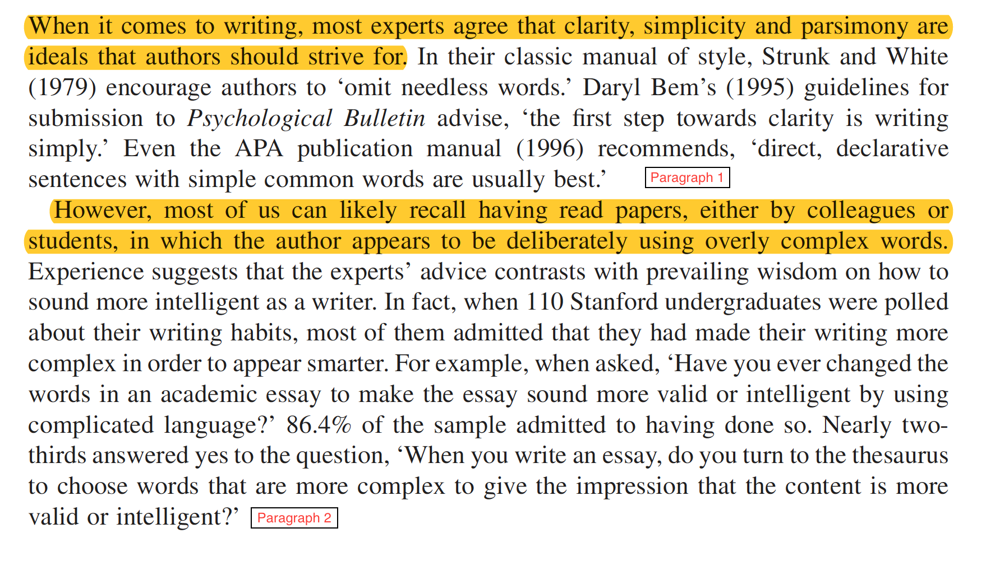
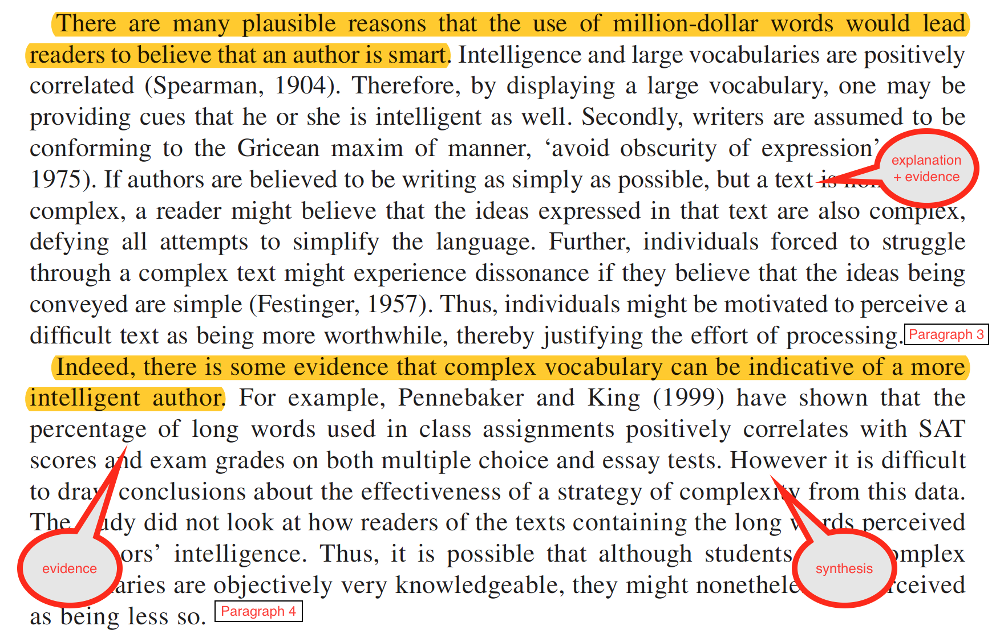

```{r setup, include=FALSE}
knitr::opts_chunk$set(echo = TRUE)
```

# tips for sounding smart without trying


- write for your mum 
  + someone who is smart and interested but not at all familiar with the topic
- choose simple words
  + 3 syllables max
- use short/simple sentences 
  + 25 words max
- use concrete examples
- avoid jargon and acronyms
- edit out the "fuzz"


```{r echo=FALSE, out.width="100%"}
knitr::include_graphics("img/edit.png")
```


---

*"All writers (will have to) edit their prose, but (the) great writers edit (it) viciously, always trying to eliminate (words which are) ‘fuzz’ – (excess) words (which are not adding anything of value). Zinsser compares (the process of editing out) ‘fuzz’ to fighting weeds – you will always be slightly behind (because they creep in when you aren't looking for them). Scan (through) your text (and look) for opportunities to (get rid of) words - (places) where two words (can become one), or three words (can become) two… (or where you can get rid of some words altogether?)"*


---


# Eliminate the fuzz

*"All writers edit their prose, but great writers edit viciously. The point of editing is to eliminate ‘fuzz’, or excess words which don't add value. Zinsser compares removing ‘fuzz’ to fighting weeds – you will always be slightly behind. Scan your text for opportunities to shed words - where can two words become one? or three words two?"*


---


template: wall
class: center, middle

# 2. Do you write "zombie" prose? 

Recommended reading: Billing, M. (2011). Writing social psychology: Fictional things and unpopulated texts. *British Journal of Social Psychology, 50*, 4-20.  [link](https://bpspsychub-onlinelibrary-wiley-com.wwwproxy1.library.unsw.edu.au/doi/full/10.1111/j.2044-8309.2010.02003.x)


---

# Zombie prose is full of ...

.pull-left[

- nominalisations or things (i.e.nouns) created from action (i.e. verbs) 
    + assumption ~ to assume
    + anonymity ~ to anonymise
    + criticism ~ to criticise
    + argument ~ to argue
    
] 

.pull-right[

[Helen Sword zombie nouns](https://www.youtube.com/watch?v=dNlkHtMgcPQ) 

<iframe width="560" height="315" src="https://www.youtube.com/embed/dNlkHtMgcPQ" frameborder="0" allow="accelerometer; autoplay; clipboard-write; encrypted-media; gyroscope; picture-in-picture" allowfullscreen></iframe>

] 


---

# Zombie prose is full of ... 

.pull-left[

- passive voice 

<br>

- The dog chased the man 
    + active: subject, verb, object
- The man was chased *BY* the dog
    + passive: object, verb, subject

<br>  
- search for "by" and "of", they are passive voice red flags


] 

  
.pull-right[

[Steven Pinker passive voice](https://www.youtube.com/watch?v=sS-Txm3R3v8)

<iframe width="560" height="315" src="https://www.youtube.com/embed/sS-Txm3R3v8" frameborder="0" allow="accelerometer; autoplay; clipboard-write; encrypted-media; gyroscope; picture-in-picture" allowfullscreen></iframe>

] 

---


# Dealing w zombie nouns and passive voice

- watch out for 
  + "by" "of"
  + "-tion" "-ment" "-ism" -"ity"
    + Participants completed the *assessment* by undergoing... (passive)
- use the zombie test 
  + The theory was tested ... *by zombies* (passive)

<br>

- solution: put the people doing the action back into the sentence 
  + We assessed participants using the ....
  + Researchers tested this theory...
  
---

# Test for passive voice with the zombie test

*Participants were recruited for a study entitled ‘Being Australian’ and completed the questionnaire in supervised groups of 10–12, and were compensated for their time with course credit. They were informed verbally and in writing that their anonymity was protected. Completed questionnaires were placed in an opaque drop box, and participants were debriefed and given the opportunity to request a summary of the results of the study (Barlow, Louis, & Hewstone, 2009, p. 394)*

credit [Billings (2011) "Writing social psychology: Fictional things and unpopulated texts](https://bpspsychub-onlinelibrary-wiley-com.wwwproxy1.library.unsw.edu.au/doi/full/10.1111/j.2044-8309.2010.02003.x)
---

*Participants were recruited **by zombies** for a study entitled ‘Being Australian’ and completed the questionnaire in supervised groups of 10–12, and were compensated **by zombies** for their time with course credit. They were informed verbally and in writing that their anonymity was protected **by zombies**. Completed questionnaires were placed in an opaque drop box **by zombies**, and participants were debriefed **by zombies** and given the opportunity to request a summary of the results of the study (Barlow, Louis, & Hewstone, 2009, p. 394)*

credit [Billings (2011) "Writing social psychology: Fictional things and unpopulated texts](https://bpspsychub-onlinelibrary-wiley-com.wwwproxy1.library.unsw.edu.au/doi/full/10.1111/j.2044-8309.2010.02003.x)


---

# DISCLAIMER 

- passive voice and zombie nouns are not always bad (particularly in your method) 

- but they can make your writing longer,  more unwieldy, and less disgestable to a naive reader (aka your marker) than it needs to be 

<iframe src="https://giphy.com/embed/N2quVSSRLwjN6" width="480" height="342" frameBorder="0" class="giphy-embed" allowFullScreen></iframe><p><a href="https://giphy.com/gifs/horror-zombie-zombies-N2quVSSRLwjN6">via GIPHY</a></p>

---

### Another example from [Billing (2011)] (https://bpspsychub-onlinelibrary-wiley-com.wwwproxy1.library.unsw.edu.au/doi/full/10.1111/j.2044-8309.2010.02003.x)

"Whereas intergroup anxiety is by now an establish mediator of intergroup contact and cross-group friendship, the present study also sought to explore cognitions of rejection as a cognitive mediator predicted by cross-group friendship, and predictive of intergroup anxiety, as well as a range of attitudes toward the outgroup"

--

"Specifically, we propose that people with cross-group friends cease to expect outgroup members to reject their attempts at contact ad friendship (Barlow et al, 2009, p391)"


- ummmm.... why didn't you just say that `r emo::ji("up")

---


---

## Practice zombie example 1

It is *measured by* placing EMG electrodes on the facial muscles of interest and measuring the electrical impulses *produced by* the muscles as they respond to emotion evoking stimuli. 

(29 words)

--

Researchers measure mimicry using facial EMG electrodes that detect the electrical impulses generated when participants view emotional stimuli. 

(`r emo::ji("down")` 18 words)


---

## Practice zombie example 2

A positive attitude towards the expressor may foster emotional mimicry and increase the *interpretation of* the emotional expressions as friendly. 

(20 words)


--

People who like each other are more likely to mimic and judge emotional expressions to be friendly. 

(`r emo::ji("down")` 17 words)


---

## Practice zombie example 3

Empathy facilitates the *formation of* strong social relationships *by* motivating helping behaviour. 

(12 words)

--

Empathy helps people build strong social relationships because it motivates them to help each other. 

(`r emo::ji("up")` 15 words)

---


Still not sure about passive voice/nominalisations??

Read [this paper](https://bpspsychub-onlinelibrary-wiley-com.wwwproxy1.library.unsw.edu.au/doi/full/10.1111/j.2044-8309.2010.02003.x)) by Billing (2011) - it is good and not just for social psychologists (I find that cognitive theses are the worst for this `r emo::ji("shrug")` `r emo::ji("smile")`)

---

template: wall
class: center, middle

# 3. Are your topic sentences 
# doing their job?


---

# what is the job of a topic sentence?

The first sentence of every paragraph should give away the take home message.

It should be a general statement summarising a particular part of the literature. 
  + It should describe what has been found ACROSS studies. 
  + It is usually NOT about a specific study
  + It should do more than just tell the reader that some research has been done. 

---

# example 1a - too specific

***A study conducted by Phillips and colleagues (2015) found that participants aged 65-86 performed significantly worse than younger groups on tasks assessing comprehension of sarcastic exchanges.*** Interestingly, there was no effect of age on the understanding of sincere exchanges (Phillips et al, 2015). Further, a meta-analysis across 23 theory of mind (TOM) studies showed that older adults performed worse on TOM tasks compared to younger groups (Henry, Phillips, Ruffman, & Bailey, 2013).

--

#### Problems
- "by" = passive
- emphasis on the study and who did it, rather than what they did and what they found 

---

# example 1b - too general

***Much research has investigated social cognition in older people.*** For example, Phillips and colleagues (2015) found that while participants aged 65-86 had no problem understanding sincere exchanges, they found it more difficult  to understand sarcastic exchanges than did young adults (Phillips et al, 2015). This result is consistent with a recent meta-analysis of theory of mind studies, which showed that older adults performed worse on TOM tasks compared to younger groups (Henry, Phillips, Ruffman, & Bailey, 2013). 

--

#### Problems
- doesn't say more than "research in X area has been done"


---

# example 1c - just right

***As we age, our ability to understand how other people are feeling and what other people are thinking declines.*** For example, Phillips and colleagues (2015) found that while participants aged 65-86 had no problem understanding sincere exchanges, they found it more difficult  to understand sarcastic exchanges than did young adults (Phillips et al, 2015). This result is consistent with a recent meta-analysis of theory of mind studies, which showed that older adults performed worse on TOM tasks compared to younger groups (Henry, Phillips, Ruffman, & Bailey, 2013). 

#### Strengths 

- general statement about a *pattern* of findings 
- sets the reader up to expect findings in a particular direction

---
class: center, middle

# Test your topic sentences 

Paste all the topic sentences in your intro into a paragraph.  
It should read like a summary of your argument/rationale. 


---

### Oppenheimer I
```{r echo=FALSE}

```

---

### Oppenheimer II
```{r echo=FALSE}
knitr::include_graphics("p3-4.png")
```

---

# all together now...oppenheimer (2005)

*When it comes to writing, most experts agree that clarity, simplicity and parsimony are ideals that authors should strive for. However, most of us can likely recall having read papers, either by colleagues or students, in which the author appears to be deliberately using overly complex words. There are many plausible reasons that the use of million-dollar words would lead readers to believe that an author is smart. Indeed, there is some evidence that complex vocabulary can be indicative of a more intelligent author.* 

---


template: wall
class: center, middle

# 4. Do your paragraphs function as units of argument?


---

# A good paragraph should...

- cover only ONE idea
- start with a topic sentence
- all other sentences should be
  + explanation
  + examples
  + AND/OR evidence to back up the topic sentence
- use the 1:5:25 rule
  + 1 idea, ~ 5 sentences, no more than 25 words/sentence
  

---

```{r echo=FALSE}
knitr::include_graphics("p1_2_p.png")
```

---
```{r echo=FALSE}

```

---

template: wall
class: center, middle

# 5. Are you holding your ~~reader's~~ marker's hand? 


---

# Your job as the ~~writer~~ student is to make it easy for your ~~reader~~ marker. 

- make the intro "moves" that your reader expects
    + what is the problem/question, why is it important
    + what do we know about the problem/question
    + what do we NOT know about the problem/question
    + how does your project fill that gap in what we don't know
- write a funnel, not a "curvy lady"


---

.pull-left[

funnel

]

.pull-right[

curvy lady

]


---

# Your job as the ~~writer~~ student is to make it easy for your ~~reader~~ marker. 

  + strong topic sentences + predictable paragraph structure
  + make the links between ideas really explicit
  + use signposting
  + avoid vagueness and potential for confusion 
    + the undefined "this"
    + [see the Thesis Whisperer re vagueness](https://thesiswhisperer.com/2017/06/28/8346/)

  
---

template: wall
class: center, middle

# 6. Does your writing synthesise or simply describe?

---

# Some student writing reads like a list of study descriptions

*So & So (2014) did a study that involved X and found that Y. In addition, Joe & Co (2016) have found that A relates to B. Also, Big Dude and colleagues (2019) ran a study showing that manipulating X results in changes in B.* 

Your marker is REALLY tired, they don't want to have to think hard. 
You can help them by doing the hard thinking for them.  

= synthesis

---

.pull-left[

## What is synthesis?

- extracting the patterns in the literature
- highlighting similarities/differences across studies
- unpacking HOW a study supports an argument, rather than just stating it does
- writing as if you are the expert with an opinion
  + [see Thesis Whisperer blog re opinionated verbs](https://thesiswhisperer.com/2017/09/27/academic-writing-is-a-painful-upper-middle-class-dinner-party/)
  
]


.pull-right[

```{r echo=FALSE}
knitr::include_graphics("img/verbs.png")
```


]


---

# More tips available here..

## [Jenny's (very opinionated) tips for academic writing google doc](https://docs.google.com/document/d/12G8KVqo4KV51Rdn4qY6QCO9Pi31D-aKr-2pHKlZzZws/edit)

---

BREAK - 10 min timer go


---


# Questions before we move to discussion....

<iframe src="https://giphy.com/embed/xIJLgO6rizUJi" width="480" height="367" frameBorder="0" class="giphy-embed" allowFullScreen></iframe><p><a href="https://giphy.com/gifs/alice-in-wonderland-thank-you-xIJLgO6rizUJi">via GIPHY</a></p>


---


template: wall 
class: center, middle

# why discussion is writing hard 

.pull-left[ 

```{r echo=FALSE, out.width= "250px"}
knitr::include_graphics("procrastination2.gif")
```

]

.pull-right[

<br>
<br>
<br>

## the task feels too big... you don't know where to start

]


---


## Your marker will smile if you make the "moves" that they expect

### 4 intro moves 

1. what is the problem? why is it important?

<br>

2. what do we know about it?

<br>

3. what don't we know about it?

<br>

4. how does this project fill that GAP?


---

### 6 discussion moves

1. what do we now know about that problem?
<br>
2. how does that relate to what we knew before?
<br>
3. what can we say about theory/real world that we couldn't before?
<br>
4. what problems/limitations do we need to acknowledge?
<br>
5. what do we still not know... what are the next steps?
<br>
6. what is the take home message?


---


class: inverse

# Move 1.  what do we NOW know about that problem? 

.pull-left[

Pick the 3 most important (yes only 3) findings from your thesis. 

[how to spider diagram](https://sites.google.com/site/twblacklinemasters/using-a-spider-diagram-to-make-research-questions?authuser=0)

]

.pull-right[


```{r echo=FALSE, out.width="75%"}
knitr::include_graphics("img/spider1.png")
```

]


---

class: inverse


# Move 2. how does that relate to what we knew before?

.pull-left[

How does each finding relate to your hypotheses/past literature?

Consistent? great! unpack **HOW** your findings advance the field

Not consistent? great! go back to the literature and explain **WHY** 


]

.pull-right[


```{r echo=FALSE, out.width="75%"}
knitr::include_graphics("img/spider1.png")
```

]


---

class: inverse, center

# Move 3. what can we say about theory and/or real world that we couldn't before?


---

class: inverse, center

# Move 4. what problems/limitations do we need to acknowledge?

--

# Move 5. what do we still not know... what are the next steps? 


---

class: inverse, center


# Move 6. what is the take home message?


---


### Other examples of 6 writing rules

.pull-left[

[George Orwell](https://www.mhpbooks.com/6-writing-rules-from-george-orwell/)

1. Never use a metaphor, simile, or other figure of speech which you are used to seeing in print.
2. Never use a long word where a short one will do.
3. If it is possible to cut a word out, always cut it out.
4. Never use the passive where you can use the active.
5. Never use a foreign phrase, a scientific word, or a jargon word if you can think of an everyday English equivalent.
6. Break any of these rules sooner than say anything outright barbarous.

.pull-right[

### Billing 2011 6 recommendations

```{r}
knitr::include_graphics("img/rec.JPG")
```

]


---

