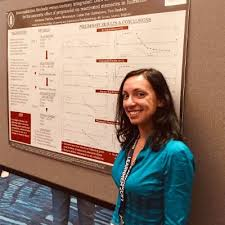
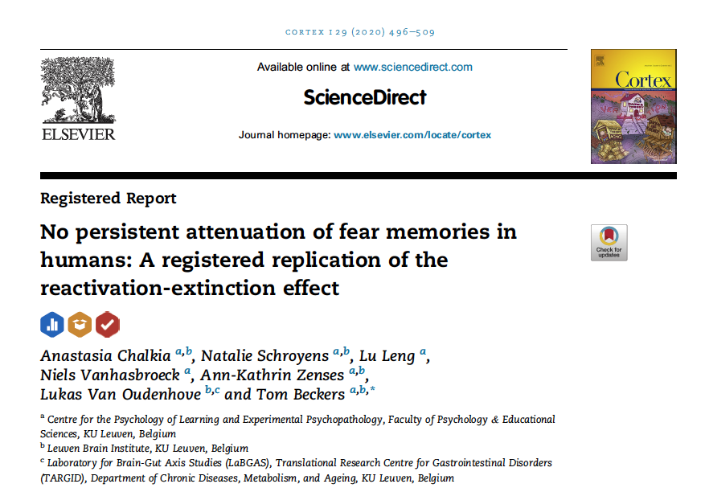
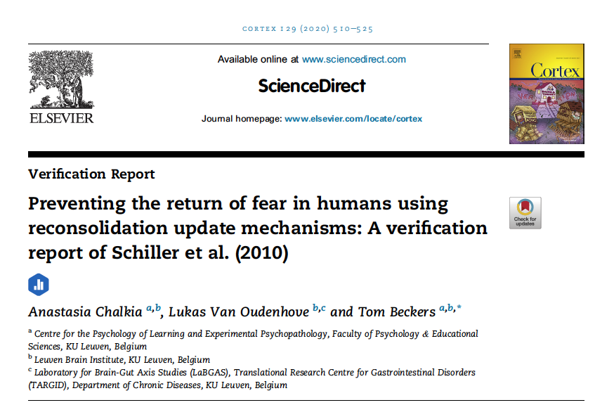
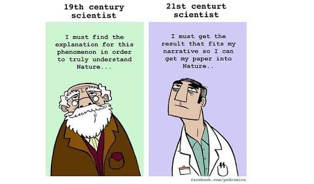
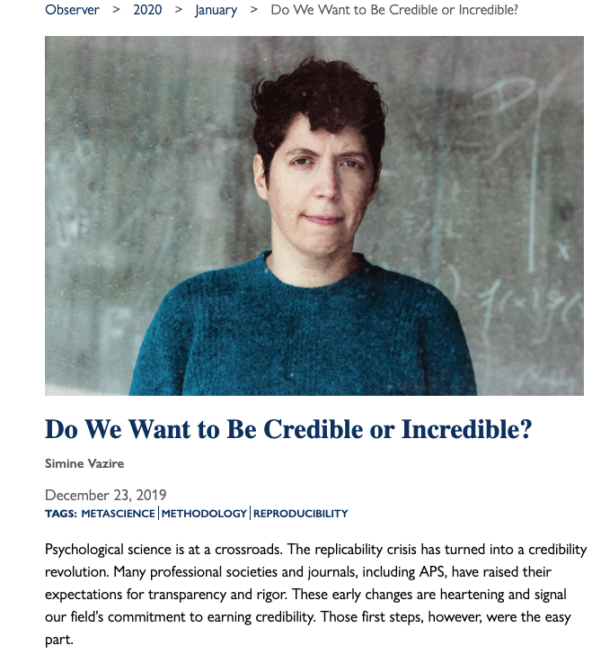
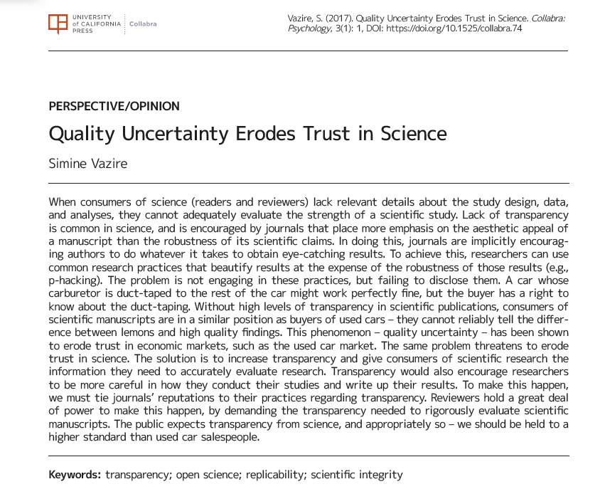
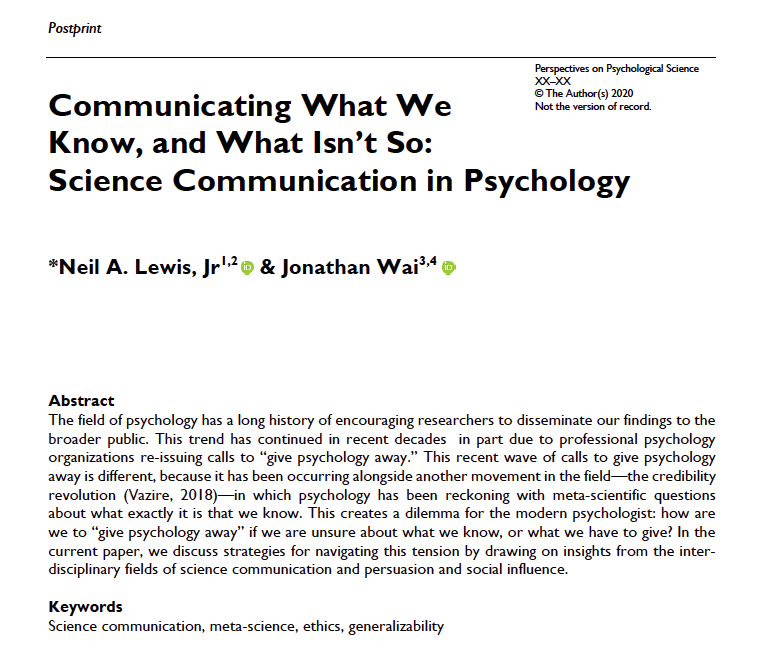
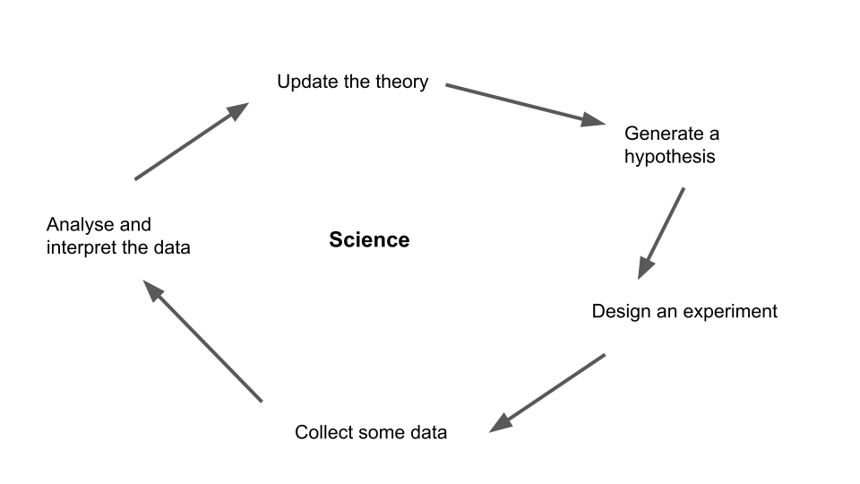
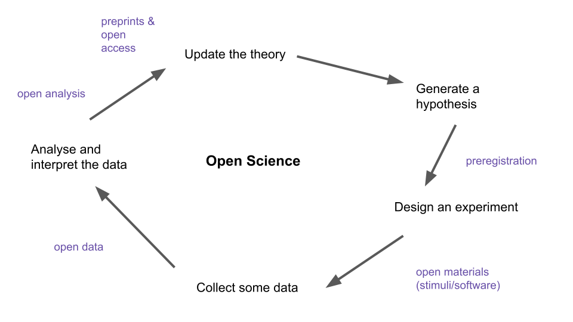
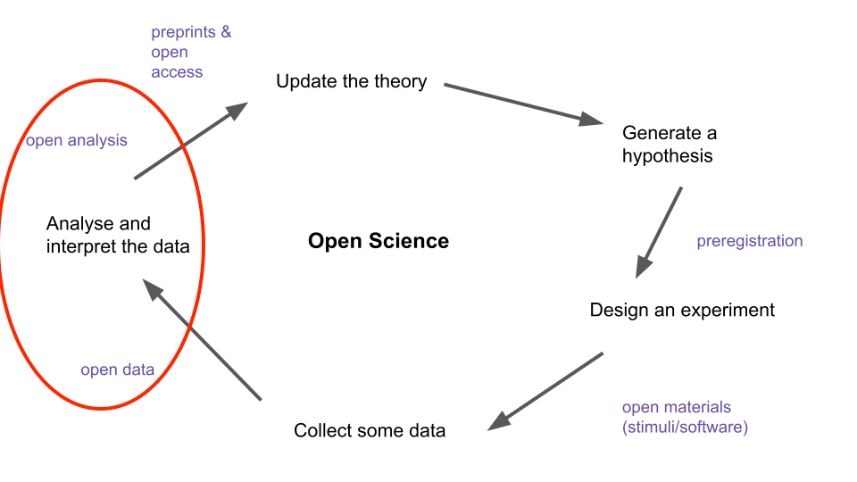

```{r setup, include=FALSE}
options(htmltools.dir.version = FALSE)
```

```{r xaringan-themer, include=FALSE, warning=FALSE}
library(xaringanthemer)
style_duo_accent(
  primary_color = "#1381B0",
  secondary_color = "#069dc9",
  inverse_header_color = "#3c474a"
)

library(countdown)

```
class: center, middle

# Hello

---
class: center, middle

# outline

## what is the problem

--

## why should we care
--

## what is our plan 

---

background-image: url(img/begin.jpeg)
background-size: cover
class: center, bottom, inverse

---


class: inverse, center, middle

# The Replication Crisis

# What do you already know?

---

# Group discussion (10 min)

- what is the "crisis"? 
<br>
<br>
- what has caused it? 
<br>
<br>
- what does it mean for research to be "replicable"? 
<br>
<br>
- what does it mean for research to be "reproducible"? 
<br>
<br>
- are they they same thing?


---
class: inverse, center, middle


background-image: url(https://the-turing-way.netlify.app/_images/ReproducibleMatrix.jpg)
background-size: contain
class: center, bottom, inverse


---
class: inverse, middle, center

# Lets start with a story

---

# Meet Anastasia Chalkia PhD

.pull-left[



]

.pull-right[

- PhD student at Centre for the Psychology of Learning and Experimental Psychopathology (CLEP) at the University of Leuven
<br>
<br>
- working in Tom Beckers lab looking at the role of conditioning in psychopathology 
<br>
<br>
- decided, as part of her thesis, to try and replicate a VERY famous effect in learning/memory. 


]


---

class: inverse, center, middle


background-image: url(img/schiller.png)
background-size: contain
class: center, bottom, inverse

---

# The timeline


- Nov 2016 
  + submitted Registered Report at *Cortex*, plans direct replication of study originally published in *Nature* by [Schiller et al. (2010)](https://www.nature.com/articles/nature08637) 
--

- Feb 2017
  + In Principle Acceptance (IPA) awarded
  + start data collection
--

- Mar 2017
  + something is wrong...
  + 75% of the first 35 participants have to be excluded (same criteria from the original study 8% excluded)
  + stop testing
  + request data from original authors 
  + wait...
  + wait some more...
  + wait 5 months in total
--

- Aug 2017
  + receive data from original authors
  + more detail emerges re actual exclusion criteria used
  
  
---

# The timeline cont.
  
> "exclusions from Experiment 1 reported
in the Nature paper (n = 6), related only to participants who
had completed all three days of testing, and that amuch larger
number of unreported participants (around 50% of the total
enrolment) had been excluded based on “a judgment call after
day 1 or 2 data became available” (Schiller, personal communication,
13 Sep 2017)."

--


- Sept 2017
  + udpate registered report conditions with 11 conditional statements from original authors that "try" to reproduce the exclusion criterion
  + data collection recommences 
--

- Sept 2019
  + registered report submitted N = 246
--

- April 2020
  + manuscript accepted 
  

---

# Registered report 




---

background-image: url(img/ReproducibleMatrix1.jpg)
background-size: contain
class: center, bottom, inverse

---


class: center, middle

## The effect is NOT replicable, but is it reproducible?


---

# *Cortex* new article type: Verification Report

> goal: to reward researchers doing the important work of confirming that research is reproducible

- works like a registered replication except the goal is to repeat the analysis reported in a paper and/or report additional analysis conducted on the original data
  + Stage 1 
    + submit introduction and plan, leading to "in principle acceptance" (IPA)
  + Stage 2 
    + submission of verification report following the analysis plan 


---


# Verification report 



---


# Verifying the Schiller et al. analysis

1. using the exclusion criteria reported in the Nature paper `r emo::ji("no")`
--

2. using the criteria from recent addendum (same as criteria used in the replication) `r emo::ji("no")`
--

3. using no exclusion criteria `r emo::ji("no")`
--

4. using the idiosyncratic/inconsistent rules that were actually used in the original study `r emo::ji("yes")`

---

class: center, middle, inverse





---

<iframe src="https://giphy.com/embed/xUPOqptQG2hIrX3koE" width="480" height="358" frameBorder="0" class="giphy-embed" allowFullScreen></iframe><p><a href="https://giphy.com/gifs/gilmoregirls-netflix-gilmore-girls-xUPOqptQG2hIrX3koE">via GIPHY</a></p>


---


background-image: url(img/ReproducibleMatrix2.jpeg)
background-size: contain
class: center, bottom, inverse


---

# Why should you care about this case? 

This paper attracted enormous attention and more than 1200 citations
  + the researchers involved have received grants, promotions, faculty jobs as a result of its "impact"
  + BUT other researchers have spent time/money on conceptual replications (with varying degrees of success)
  + AND clinicians have applied the findings to treatment approaches for PTSD and other anxiety disorders
  
  

---

# Why is this a problem generally? 

[APS observer link](https://www.psychologicalscience.org/observer/do-we-want-to-be-credible-or-incredible)

.pull-right[


]

---

[Quality uncertainty erodes trust in science link](https://online.ucpress.edu/collabra/article/3/1/1/112375/Quality-Uncertainty-Erodes-Trust-in-Science)



---

[What we know and what isn't so link](https://psyarxiv.com/cfmzk)


---


class: center, middle

# I want my research to be reproducible...

# ... what do I do?

---

# The scientific


> adapted from [Bergmann (2018)](https://docs.google.com/presentation/d/1bdICPzPOFs7V5aOZA2OdQgSAvgoB6WQweI21kVpk9Gg/edit#slide=id.p)

---

# how is open science different? 





> adapted from [Bergmann (2018)](https://docs.google.com/presentation/d/1bdICPzPOFs7V5aOZA2OdQgSAvgoB6WQweI21kVpk9Gg/edit#slide=id.p)

--

### open science is about being transperant about what you are doing and why at ever step of the process

---

# do have to do all of that? seems like a lot...


no...being an "open scientist" involves sampling from a ["buffet" of research practices](https://docs.google.com/presentation/d/1bdICPzPOFs7V5aOZA2OdQgSAvgoB6WQweI21kVpk9Gg/edit#slide=id.p)

---


background-image: url(https://the-turing-way.netlify.app/_images/reproducibility.jpg)
background-size: cover
class: center, middle, inverse

---


