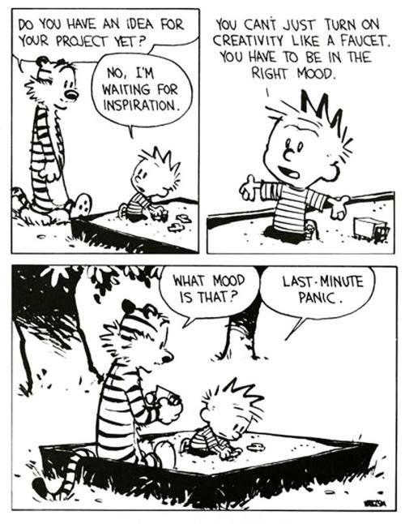
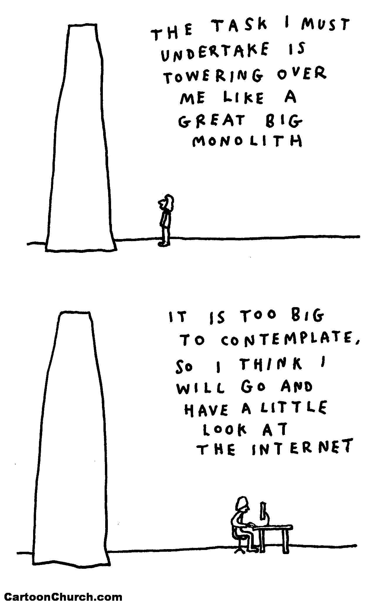
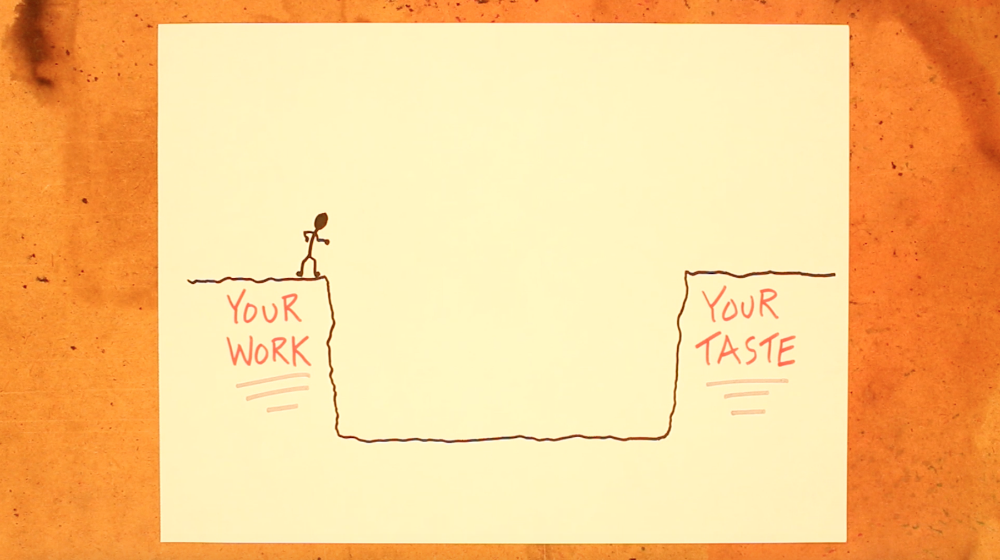
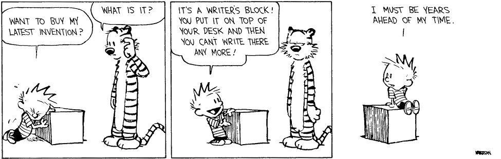
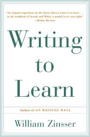
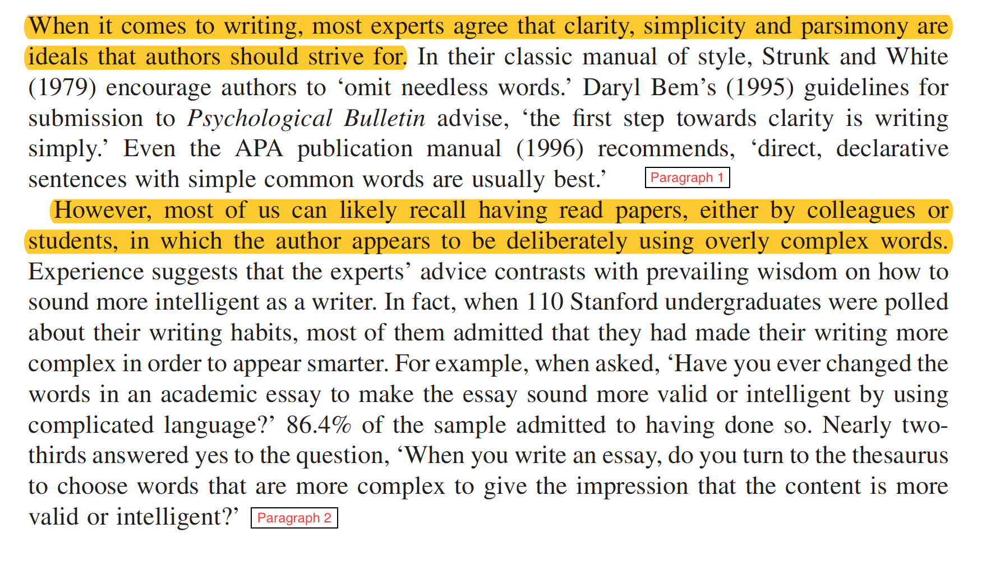
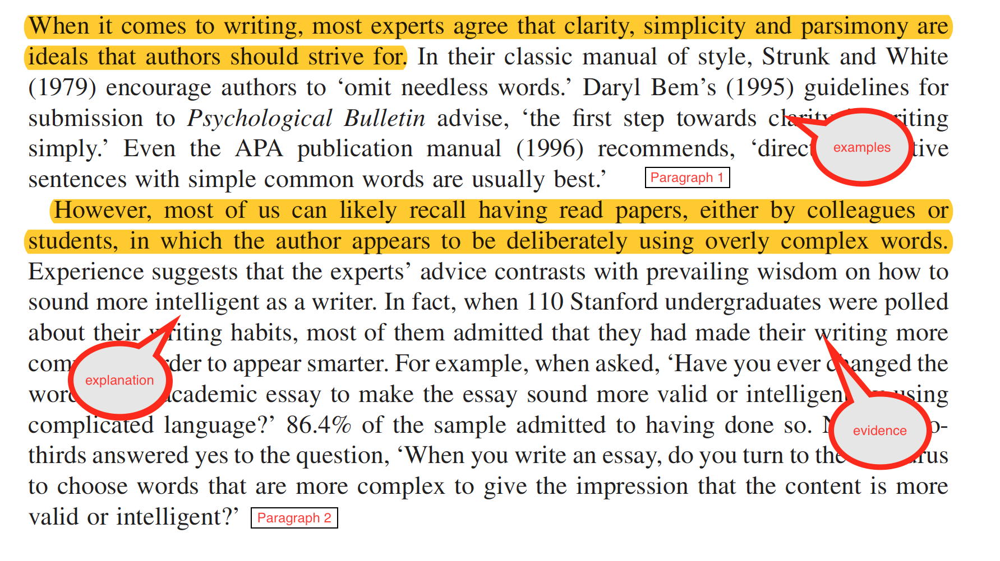
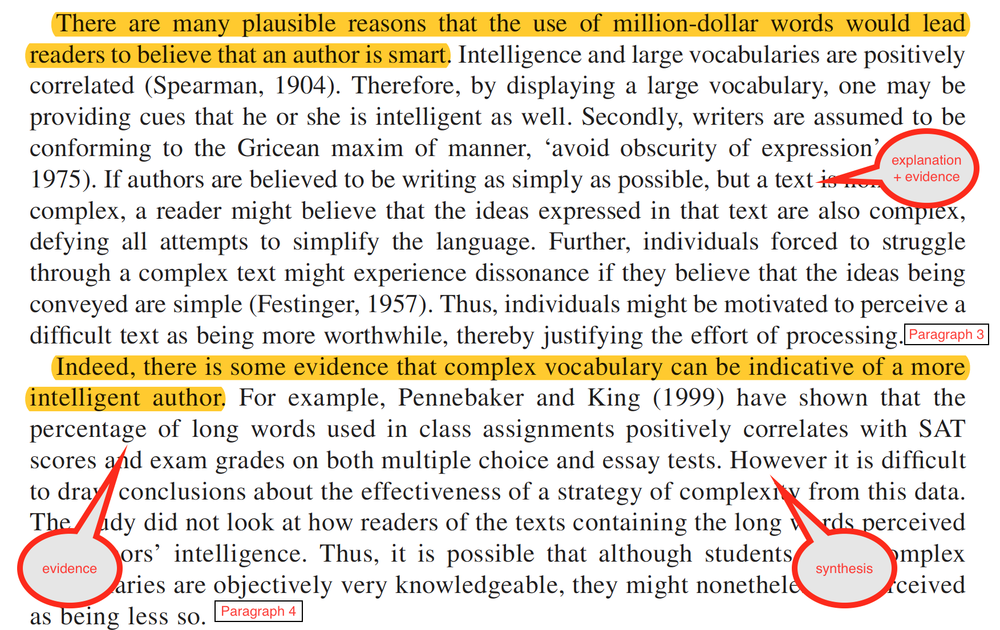
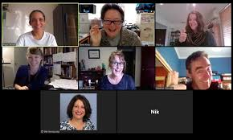

```{r xaringan-themer, include=FALSE, warning=FALSE}
library(xaringanthemer)
style_duo_accent(
  primary_color = "#035AA6", secondary_color = "#03A696",
  inverse_header_color = "#FFFFFF", 
  text_font_size = "30px"
)


```

```{r setup, include=FALSE}
options(htmltools.dir.version = FALSE)
episode_counter <- 0
knitr::opts_chunk$set(
  collapse = TRUE,   
  comment = "#>"
)
```

```{r packages, include=FALSE}
library(countdown)
library(ymlthis)
```


class: title-slide, center, middle

<span class="fa-stack fa-4x">
  <i class="fa fa-circle fa-stack-2x" style="color: #ffffffcc;"></i>
  <strong class="fa-stack-1x" style="color:#e7553c;">`r rmarkdown::metadata$session`</strong>
</span> 

# `r rmarkdown::metadata$title`

### `r rmarkdown::metadata$subtitle`

### `r rmarkdown::metadata$author` 

### `r rmarkdown::metadata$institution`


---

name: wall
class: center, middle
background-image: url(img/greywall.jpeg)
background-size: cover

---

template: wall 

class: centre, middle

These slides available at 

https://jenrichmond.github.io/slides/writing

--

# 3 things

--

## get started

--

## be your own best critic

--

## keep going

---

class: inverse, center, middle


# 1. get started

---

template: wall 
class: center, middle

# why is it hard to start writing?


---

# Exercise 1a

Jump into the [google doc](https://docs.google.com/document/d/1XpEK7eZc1D3hEM6sQJWCOW7ZshtVF9Xyr_oI8V2iivU/edit?usp=sharing), pick a font colour, write continuously about why you find it hard to get started on writing projects. Don't stop to edit, just get ideas down. 

```{r echo=FALSE}
countdown(minutes = 3, seconds = 00, font_size = "2em", top = TRUE)

``` 


---

class: left, middle

.pull-left[

<br>
<br>
<br>

## you are waiting for inspiration

]

.pull-right[

```{r echo=FALSE, out.width= "450px"}

```

]


---

.pull-left[


```{r echo=FALSE, out.width= "380px"}

```

]

.pull-right[

<br>
<br>
<br>

## the task feels too big... you don't know where to start

]

---


.pull-left[

<br>
<br>
<br>

## everything you write sounds bad


]

.pull-right[

<br>
<br>

```{r echo=FALSE, out.width= "900px"}

```

]

<br>
<br>
watch ira glass talk about [the gap](https://vimeo.com/85040589)
---

## or maybe the words just won't come out...

<br>


```{r echo=FALSE, out.width= "1200px"}

```


---
template: wall 
class: center, middle

# Writing is diagnostic 

### Write about what you know.

### Write about what you don’t know.

### Write to learn. 


---

# Exercise 1b

Lets do that again... this time about your next assignment. Start with....

“I don’t know anything at all about [insert something related to your assignment]... I need to understand more about it because... I do know that... I think that I need to read more about...”

Write about what you DON’T know, what you DO know, what you need to learn, how you feel about it.  

```{r echo=FALSE}
countdown(minutes = 3, seconds = 00, font_size = "2em", top = 0)
``` 

---

# Tip 1: write to learn

.pull-left[

Kick start your writing session by writing about ...

- how you are feeling about writing 
- what you are feeling stuck on
- what you don't know and need to learn

] 

.pull-right[

```{r echo=FALSE, out.width= "300px"}

```

] 


---

template: wall 
class: center, middle

# but I have so much to read... 
# I can't start writing... 
# I don't know enough yet


---

# Tip 2: stop reading...

--

... mindlessly
- use "writing to learn" to work out what you have to read
- read strategically, fill the gaps in what you don't know
- don't take "notes"
  + use a [matrix](https://docs.google.com/spreadsheets/d/1MgeD8zcJ-4LwEUkUxqTojAoA224RU8tB95V-y-dU040/edit?usp=sharing)
- think and write about your thinking while you read
  + [summary/reaction](https://docs.google.com/document/d/1XLi1DrYP9QdGKYYJ3j0Mr905puc8ml_YycB2RXdtlD4/edit?usp=sharing)


---

class: inverse, center, middle


# 2. be your own best critic

---
template: wall 
class: center, middle

# What do other people say 
# about your writing? 

---

# Exercise 2

Jump in the [google doc](https://docs.google.com/document/d/1XpEK7eZc1D3hEM6sQJWCOW7ZshtVF9Xyr_oI8V2iivU/edit?usp=sharing), pick a font colour, and share the kinds of comments that tutors tend to make on your assignments. 


```{r echo=FALSE}
countdown(minutes = 2, seconds = 00, font_size = "2em")
``` 

---

# Frequently used comments... 

.pull-left[


- *unclear/vague*
- *this doesn't flow*
- *unpack this point*
- *jargon*

You can prevent these comments by asking yourself 6 questions about your own writing. 

] 
 

.pull-right[

<iframe src="https://giphy.com/embed/1iTpx5PpzRugcrZK" width="480" height="270" frameBorder="0" class="giphy-embed" allowFullScreen></iframe><p><a href="https://giphy.com/gifs/justin-g-why-1iTpx5PpzRugcrZK">via GIPHY</a></p>

]

---

template: wall 
class: center, middle

 
# 6 questions to ask yourself 
# about your writing

---

template: wall
class: center, middle

# 1. Are you trying too hard to sound smart?


---

```{r echo=FALSE}
knitr::include_graphics("img/abstract.png")
```


---

# tips for sounding smart without trying

- write for your mum 
  + someone who is smart and interested but not at all familiar with the topic
- choose simple words and short sentences (25 words max)
- use concrete examples
- avoid jargon and acronyms

---

template: wall
class: center, middle

# 2. Are your topic sentences doing their job?


---

# what is the job of a topic sentence 

The first sentence of every paragraph should give the reader the take home message.

It should be a general statement summarising a particular part of the literature. 
  + It should describe what has been found across studies. 
  + It should not be about a specific study
  + It should do more than just tell the reader that some research has been done. 

---
# example 1a - too specific

*A study conducted by Phillips and colleagues (2015) found that participants aged 65-86 performed significantly worse than younger groups on tasks assessing comprehension of sarcastic exchanges.* Interestingly, there was no effect of age on the understanding of sincere exchanges (Phillips et al, 2015). Further, a meta-analysis across 23 theory of mind (TOM) studies showed that older adults performed worse on TOM tasks compared to younger groups (Henry, Phillips, Ruffman, & Bailey, 2013). 

---

# example 1b - better, but too general

*Research has shown a link between aging and social cognition.* For example, Phillips and colleagues (2015) found that while participants aged 65-86 had no problem understanding sincere exchanges, they found it more difficult  to understand sarcastic exchanges than did young adults (Phillips et al, 2015). This result is consistent with a recent meta-analysis of theory of mind studies, which showed that older adults performed worse on TOM tasks compared to younger groups (Henry, Phillips, Ruffman, & Bailey, 2013). 

---

# example 1c - just right

*As we age, our ability to understand how other people are feeling and what other people are thinking declines.* For example, Phillips and colleagues (2015) found that while participants aged 65-86 had no problem understanding sincere exchanges, they found it more difficult  to understand sarcastic exchanges than did young adults (Phillips et al, 2015). This result is consistent with a recent meta-analysis of theory of mind studies, which showed that older adults performed worse on TOM tasks compared to younger groups (Henry, Phillips, Ruffman, & Bailey, 2013). 

---
class: center, middle

# Test your topic sentences 


You should be able to paste the topic sentences together into a paragraph and it should read like a summary of your argument. 


---

### Oppenheimer I
```{r echo=FALSE}

```

---

### Oppenheimer II
```{r echo=FALSE}
knitr::include_graphics("img/p3-4.png")
```

---

# all together now...oppenheimer (2005)

*When it comes to writing, most experts agree that clarity, simplicity and parsimony are ideals that authors should strive for. However, most of us can likely recall having read papers, either by colleagues or students, in which the author appears to be deliberately using overly complex words. There are many plausible reasons that the use of million-dollar words would lead readers to believe that an author is smart. Indeed, there is some evidence that complex vocabulary can be indicative of a more intelligent author.* 

---


template: wall
class: center, middle

# 3. Do your paragraphs function as units of argument?


---

# A good paragraph should...

- cover only ONE idea
- start with a topic sentence
- all other sentences should be
  + explanation
  + examples
  + AND/OR evidence to back up the topic sentence
- use the 1:5:25 rule
  + 1 idea, ~ 5 sentences, no more than 25 words/sentence
  

---

```{r echo=FALSE}

```

---
```{r echo=FALSE}

```

---

template: wall
class: center, middle

# 4. Are you holding your reader's hand? 


---

# Your job as the writer is to make it easy for your reader. 

- make the research proposal "moves" that your reader expects
    + what is the problem/question, why is it important
    + what do we know about the problem/question
    + what do we NOT know about the problem/question
    + how does your project fill that gap in what we don't know
- write a funnel, not a "curvy lady"


---

# Your job as the writer is to make it easy for your reader. 


  + strong topic sentences + predictable paragraph structure
  + make the links between ideas really explicit
  + use signposting
  + avoid vagueness and potential for confusion 
    + the undefined "this"
    + [see the Thesis Whisperer re vagueness](https://thesiswhisperer.com/2017/06/28/8346/)

  
---

template: wall
class: center, middle

# 5. Does your writing synthesise or simply describe?

---

# Some student writing reads like a list of study descriptions

*So & So (2014) did a study that involved X and found that Y. In addition, Joe & Co (2016) have found that A relates to B. Also, Big Dude and colleagues (2019) ran a study showing that manipulating X results in changes in B.* 

Your reader doesn't want to have to think hard. 
You can help them by doing the hard thinking for them.  

= synthesis

---

## What is synthesis?
- extracting the patterns in the literature
- highlighting similarities/differences across studies
- unpacking HOW a study supports an argument, rather than just stating it does
- write as if you are the expert with an opinion
  + [see Thesis Whisperer re opinionated verbs](https://thesiswhisperer.com/2017/09/27/academic-writing-is-a-painful-upper-middle-class-dinner-party/)

## Strategies
1. Use a [matrix](https://docs.google.com/spreadsheets/d/1MgeD8zcJ-4LwEUkUxqTojAoA224RU8tB95V-y-dU040/edit?usp=sharing) and write [reactions](https://docs.google.com/document/d/1XLi1DrYP9QdGKYYJ3j0Mr905puc8ml_YycB2RXdtlD4/edit?usp=sharing)  

---


template: wall
class: center, middle

# 6. Do you write "zombie" prose? 


---

# Zombie prose is full of ...

.pull-left[

- nominalisations
  + nouns created from verbs/adjectives 
    + assumption ~ to assume
    + anonymity ~ to anonymize
    + criticism ~ to criticize
    + argument ~ to argue

] 

.pull-right[

[Helen Sword zombie nouns](https://www.youtube.com/watch?v=dNlkHtMgcPQ) 

<iframe width="560" height="315" src="https://www.youtube.com/embed/dNlkHtMgcPQ" frameborder="0" allow="accelerometer; autoplay; clipboard-write; encrypted-media; gyroscope; picture-in-picture" allowfullscreen></iframe>

] 


---

# Zombie prose is full of ...

.pull-left[

- passive voice 
  + The dog chased the man (active: subject, verb, object)
  + The man was chased BY the dog (passive: object, verb, subject)


] 

  
.pull-right[

[Steven Pinker passive voice](https://www.youtube.com/watch?v=sS-Txm3R3v8)

<iframe width="560" height="315" src="https://www.youtube.com/embed/sS-Txm3R3v8" frameborder="0" allow="accelerometer; autoplay; clipboard-write; encrypted-media; gyroscope; picture-in-picture" allowfullscreen></iframe>

] 

---

# Test for passive voice with the zombie test

*Participants were recruited for a study entitled ‘Being Australian’ and completed the questionnaire in supervised groups of 10–12, and were compensated for their time with course credit. They were informed verbally and in writing that their anonymity was protected. Completed questionnaires were placed in an opaque drop box, and participants were debriefed and given the opportunity to request a summary of the results of the study (Barlow, Louis, & Hewstone, 2009, p. 394)*


---

*Participants were recruited **by zombies** for a study entitled ‘Being Australian’ and completed the questionnaire in supervised groups of 10–12, and were compensated **by zombies** for their time with course credit. They were informed verbally and in writing that their anonymity was protected **by zombies**. Completed questionnaires were placed in an opaque drop box **by zombies**, and participants were debriefed **by zombies** and given the opportunity to request a summary of the results of the study (Barlow, Louis, & Hewstone, 2009, p. 394)*

credit [Billings (2011) "Writing social psychology: Fictional things and unpopulated texts](https://primoa.library.unsw.edu.au/primo-explore/fulldisplay?vid=UNSWS&docid=TN_cdi_crossref_primary_10_1111_j_2044_8309_2010_02003_x&context=PC&query=any,contains,Writing%20social%20psychology:%20Fictional%20things%20and%20unpopulated%20texts&_ga=2.213758803.61509491.1603670711-1409664425.1570675436)
---

# Dealing w zombie nouns and passive voice

- watch out for "by" "of", words ending in "-tion" "-ment" "-ism" -"ity"
  + Participants completed the *assessment* by undergoing... (passive)
- use the zombie test 
  + The theory was tested ... *by zombies* (passive)
- solution: put the people doing the action at the front
  + We assessed participants using the ....
  + Researchers tested the theory...
  
---

# Tip 3: put your reviewer hat on

.pull-left[

We all know when writing is good (or not). 

You can improve your own writing by being critically reflective about it.


] 


.pull-right[

<iframe src="https://giphy.com/embed/uQDfz3LX5REVa" width="364" height="480" frameBorder="0" class="giphy-embed" allowFullScreen></iframe><p><a href="https://giphy.com/gifs/uQDfz3LX5REVa">via GIPHY</a></p>


] 

---
# Exercise 3

In the [google doc](https://docs.google.com/document/d/1XpEK7eZc1D3hEM6sQJWCOW7ZshtVF9Xyr_oI8V2iivU/edit?usp=sharing), you will find some bad paragraphs. In groups, use questions 1-6 to diagnose what could be improved about these paragraphs.

```{r echo=FALSE}
countdown(minutes = 15, seconds = 00, font_size = "2em", top = 0)
``` 

---

class: inverse, center, middle


# 3. keep going

---

template: wall 
# Tip 4: make yourself focus

---

# the pomodoro technique


```{r echo=FALSE, out.width= "700px"}
knitr::include_graphics("https://64.media.tumblr.com/2063e3d81ee2c3867584115a3af8c562/tumblr_phz067HnDL1su40qeo1_640.jpg")
```


---

template: wall 

# Tip 5: make it social


---

# shut up and write


.pull-left[

- get a group together
- write together in pomodoros
- keep each other accountable


] 


.pull-right[

```{r echo=FALSE, out.width= "700px"}

```


]


---

template: wall 
# Tip 6: write first, then revise

---

# It won't sound good initially...


... and thats ok. 

.pull-left[

- write continuously without stopping to edit
- go back and make it sound good
- commit to extensive revision


] 


.pull-right[

```{r echo=FALSE}
knitr::include_graphics("https://donovanmneal.files.wordpress.com/2013/04/revision.jpg")
```

]

---

template: wall

# Tip 7: read about writing... it counts


---


# My favourite blogs/books

.pull-left[

- The Thesis Whisperer
  + [blog](https://thesiswhisperer.com/)
  + [How to fix your academic writing trouble](https://primoa.library.unsw.edu.au/primo-explore/fulldisplay?docid=UNSW_ALMA21254313490001731&context=L&vid=UNSWS&lang=en_US&search_scope=SearchFirst&adaptor=Local%20Search%20Engine&tab=default_tab&query=any,contains,How%20to%20fix%20your%20academic%20writing&offset=0)

- Patricia Goodson
  + [Becoming an academic writer](https://primoa.library.unsw.edu.au/primo-explore/fulldisplay?vid=UNSWS&docid=UNSW_ALMA21228995890001731&query=any,contains,Patricia%20Goodson&_ga=2.238534343.61509491.1603670711-1409664425.1570675436)


] 

.pull-right[

- Paul Silvia
  + [How to write a lot](https://primoa.library.unsw.edu.au/primo-explore/fulldisplay?docid=UNSW_ALMA21139522920001731&context=L&vid=UNSWS&lang=en_US&search_scope=SearchFirst&adaptor=Local%20Search%20Engine&tab=default_tab&query=any,contains,How%20to%20write%20a%20lot&offset=0)
  
- [Jenny's tips for academic writing google doc](https://docs.google.com/document/d/12G8KVqo4KV51Rdn4qY6QCO9Pi31D-aKr-2pHKlZzZws/edit)


] 

---


# Questions....

<iframe src="https://giphy.com/embed/xIJLgO6rizUJi" width="480" height="367" frameBorder="0" class="giphy-embed" allowFullScreen></iframe><p><a href="https://giphy.com/gifs/alice-in-wonderland-thank-you-xIJLgO6rizUJi">via GIPHY</a></p>


---