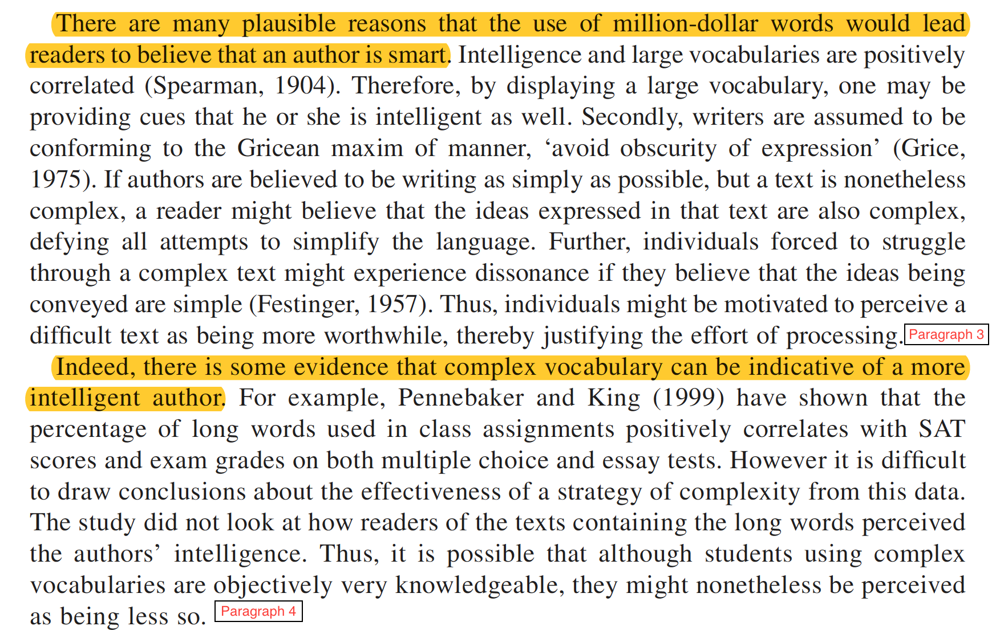

```{r xaringan-themer, include=FALSE, warning=FALSE}
library(xaringanthemer)
style_duo_accent(
  primary_color = "#035AA6", secondary_color = "#03A696",
  inverse_header_color = "#FFFFFF", 
  text_font_size = "36px"
)


```

```{r setup, include=FALSE}
options(htmltools.dir.version = FALSE)
episode_counter <- 0
knitr::opts_chunk$set(
  collapse = TRUE,   
  comment = "#>"
)
```

```{r packages, include=FALSE}
library(countdown)
library(ymlthis)
```


class: title-slide, center, middle

<span class="fa-stack fa-4x">
  <i class="fa fa-circle fa-stack-2x" style="color: #ffffffcc;"></i>
  <strong class="fa-stack-1x" style="color:#e7553c;">`r rmarkdown::metadata$session`</strong>
</span> 

# `r rmarkdown::metadata$title`

## `r rmarkdown::metadata$subtitle`

### `r rmarkdown::metadata$author` &#183; `r rmarkdown::metadata$institution`

### `r params$site_link`

---

name: wall
class: center, middle
background-image: url(img/greywall.jpeg)
background-size: cover
---

template: wall 

class: centre, middle

# 3 things

--

## get started

--

## be your own best critic

--

## keep going

---

class: inverse, center, middle


# 1. get started

---

template: wall 
class: center, middle

# why is it hard to start writing?


---

class: left, middle

.pull-left[

<br>
<br>
<br>

## you are waiting for inspiration

]

.pull-right[

```{r echo=FALSE, out.width= "450px"}

```

]


---

.pull-left[


```{r echo=FALSE, out.width= "380px"}
knitr::include_graphics("img/procrastination2.gif")
```

]

.pull-right[

<br>
<br>
<br>

## the task feels too big... you don't know where to start

]

---


.pull-left[

<br>
<br>
<br>

## everything you write sounds bad


]

.pull-right[

<br>
<br>

```{r echo=FALSE, out.width= "900px"}

```

]

<br>
<br>
watch ira glass talk about [the gap](https://vimeo.com/85040589)
---

## or maybe the words just won't come out...

<br>


```{r echo=FALSE, out.width= "1200px"}

```


---

# Exercise 1a

Jump into the google doc, pick a font colour, write continuously (without stopping) about why you find it hard to get started on a writing project . 

```{r echo=FALSE}
countdown(minutes = 3, seconds = 00, font_size = "2em")
``` 

---
template: wall 
class: center, middle

# Writing is diagnostic 

We can use writing to help us work out what we know and what we don’t know about something.

Write to learn. 


---

# Exercise 1b

Lets do that again... this time about your assignment. Start with....

“I don’t know anything at all about [insert something related to your assignment]…… I need to understand more about it because….”

Write about what you DON’T know, what you DO know, what you need to learn, how you feel about it.  

```{r echo=FALSE}
countdown(minutes = 3, seconds = 00, font_size = "1em")
``` 

---

# Tip 1: write to learn

Kick start your writing session by writing about ...

- what you are feeling stuck on
- what you don't know and need to learn
- how you are feeling about writing 


```{r echo=FALSE, out.width= "300px"}

```


---

class: inverse, center, middle


# 2. be your own best critic

---
template: wall 
class: center, middle

# What do other people say 
# about your writing? 

---

# Exercise 2

Jump in the google doc, pick a font colour, and share the kinds of comments that tutors tend to make on your assignments. 


```{r echo=FALSE}
countdown(minutes = 2, seconds = 00, font_size = "2em")
``` 

---

# Do these comments sound familiar?

.pull-left[

- unclear/vague
- this doesn't flow
- unpack this point
- jargon

<br>
<br>

[Flight of the Conchords](https://www.youtube.com/watch?v=FArZxLj6DLk)

] 

.pull-right[

<iframe src="https://giphy.com/embed/1iTpx5PpzRugcrZK" width="480" height="270" frameBorder="0" class="giphy-embed" allowFullScreen></iframe><p><a href="https://giphy.com/gifs/justin-g-why-1iTpx5PpzRugcrZK">via GIPHY</a></p>

]
---

template: wall 
class: center, middle

# self critique: 
# 6 questions to ask yourself 
# about your writing

---

template: wall
class: center, middle

# 1. Are you trying too hard to sound smart?


---

```{r echo=FALSE}
knitr::include_graphics("img/abstract.png")
```


---

# tips for sounding smart without trying

- write for your mum (aka someone who is smart and interested but not at all familiar with the topic)
- make your vocabulary as concrete and simple as possible
- use concrete examples
- avoid jargon and acronyms
- use the 1:5:25 rule


---

template: wall
class: center, middle

# 2. Are your topic sentences doing their job?


---

# what is the job of a topic sentence 

The first sentence of every paragraph should give the reader the take home message of that paragraph. Each of your topic sentences should be a general statement summarising a particular part of the literature. It should "synthesise" the literature. It should tell the reader what has been found across studies. It should not be about a specific study, and should do more than just tell the reader that some research has been done. 

---
# example 1a - too specific

*A study conducted by Phillips and colleagues (2015) found that participants aged 65-86 performed significantly worse than younger groups on tasks assessing comprehension of sarcastic exchanges.* Interestingly, there was no effect of age on the understanding of sincere exchanges (Phillips et al, 2015). Further, a meta-analysis across 23 theory of mind (TOM) studies showed that older adults performed worse on TOM tasks compared to younger groups (Henry, Phillips, Ruffman, & Bailey, 2013). This impairment in TOM and difficulty understanding sarcasm has been attributed to reduced integrity of frontal white matter pathways.

---

# example 1b - too general

*Research has shown a link between aging and social cognition.* For example, Phillips and colleagues (2015) found that while participants aged 65-86 had no problem understanding sincere exchanges, they found it more difficult  to understand sarcastic exchanges than did young adults (Phillips et al, 2015). This result is consistent with a recent meta-analysis of theory of mind studies, which showed that older adults performed worse on TOM tasks compared to younger groups (Henry, Phillips, Ruffman, & Bailey, 2013). Age-related difficulties with social cognition tasks have been attributed to reduced integrity of frontal white matter pathways.

---

# example 1c - just right

*As we age, our ability to understand how other people are feeling and what other people are thinking declines.* For example, Phillips and colleagues (2015) found that while participants aged 65-86 had no problem understanding sincere exchanges, they found it more difficult  to understand sarcastic exchanges than did young adults (Phillips et al, 2015). This result is consistent with a recent meta-analysis of theory of mind studies, which showed that older adults performed worse on TOM tasks compared to younger groups (Henry, Phillips, Ruffman, & Bailey, 2013). Age-related difficulties with social cognition tasks have been attributed to reduced integrity of frontal white matter pathways.

---
class: center, middle

# Test your topic sentences 


You should be able to paste the topic sentences together into a paragraph and it should read like a summary of your argument. 


---

```{r echo=FALSE}
knitr::include_graphics("img/p1_2.png")
```

---

```{r echo=FALSE}

```

---

# all together now...

*When it comes to writing, most experts agree that clarity, simplicity and parsimony are ideals that authors should strive for. However, most of us can likely recall having read papers, either by colleagues or students, in which the author appears to be deliberately using overly complex words. There are many plausible reasons that the use of million-dollar words would lead readers to believe that an author is smart. Indeed, there is some evidence that complex vocabulary can be indicative of a more intelligent author.* 

---


template: wall
class: center, middle

# 3. Do your paragraphs function as units of argument?


---

template: wall
class: center, middle

# 4. Are you holding your reader's hand? 


---

template: wall
class: center, middle

# 5. Does your writing synthesise or simply describe?


---

template: wall
class: center, middle

# 6. Do you use too many zombie nouns? 


---


# Exercise 3

In the google doc, you will find 3 bad paragraphs. In groups, use questions 1-6 to diagnose what could be improved about these paragraphs.

---

class: inverse, center, middle


# 3. keep going

---

template: wall 
# make yourself focus

---

template: wall 
# make it social


---

template: wall 
# write first, then revise


---


# The End....

<iframe src="https://giphy.com/embed/xIJLgO6rizUJi" width="480" height="367" frameBorder="0" class="giphy-embed" allowFullScreen></iframe><p><a href="https://giphy.com/gifs/alice-in-wonderland-thank-you-xIJLgO6rizUJi">via GIPHY</a></p>

---