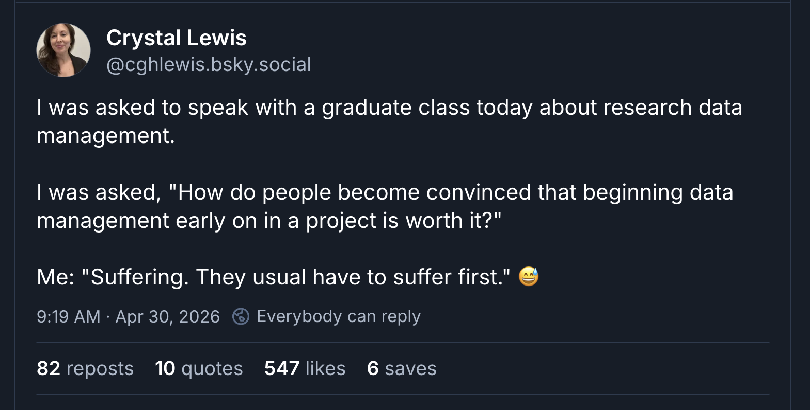
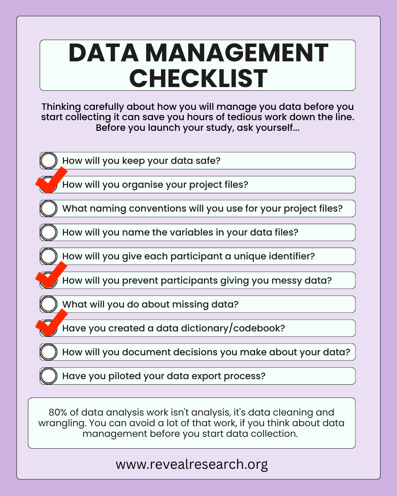
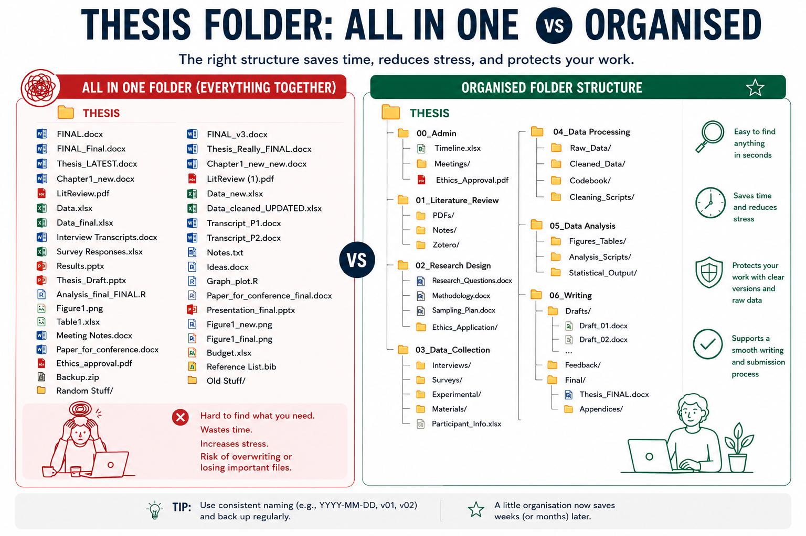
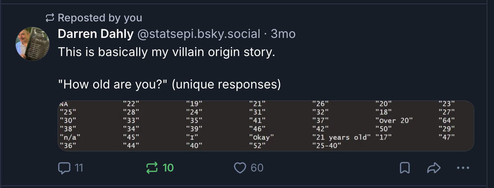
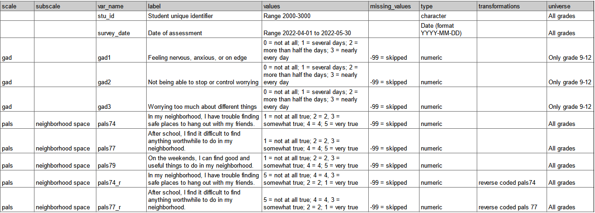
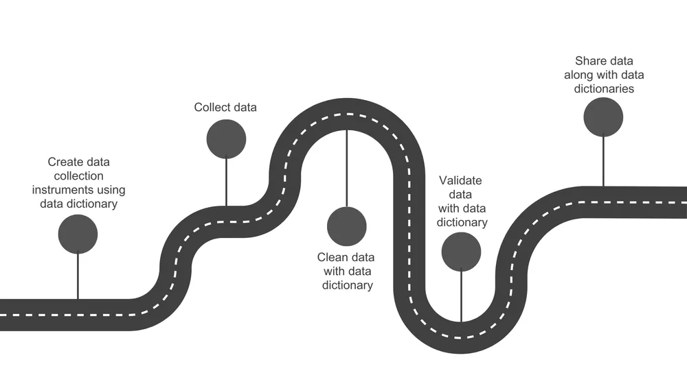
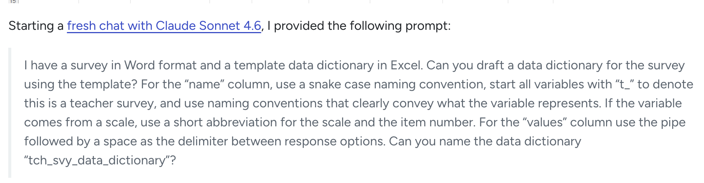

##  {.center}

### These slides are available at...

 

[www.jennyslides.netlify.app/wtf-data/](https://jennyslides.netlify.app/wtf-data/)

------------------------------------------------------------------------

## about me

{fig-align="center"}

------------------------------------------------------------------------

{fig-align="center"}

 

[Book a discovery call](https://calendly.com/jennyrichmond/30min)

------------------------------------------------------------------------

### "Research data management includes a broad range of activities and strategies related to the storage, organization, and description of data and related research materials"

[Borghi & Vangulick 2022](https://hdsr.mitpress.mit.edu/pub/72kcw990/release/1)

------------------------------------------------------------------------

------------------------------------------------------------------------

# lets start with some vicarious suffering

## scenario1

Lena has just finished testing 100 kids for her honours thesis and collected survey data from their parents on hard copy forms. She entered the data from the forms into an Excel sheet that she stored in a "data" folder on her laptop desktop. Then she spilled a glass of wine into her laptop and it refused to turn on. She had no backup so had to spend another 4 hours entering the data again.

-   how will you keep your data safe?

## scenario2 \*\*\*

Tom's thesis folder contains 47 files of all kinds. There are no subfolders, no logic to the naming, just everything dumped in one place. When his supervisor asked him to resend the survey questions, it took Tom 40 minutes to find the file, and he is still not sure he sent the final version.

-   how will you organise your project files?

## scenario3

Maya had five versions of her analysis script saved as analysis.R, analysis2.R, analysis_NEW.R, analysis_FINAL.R, and analysis_FINAL_v2.R. When she came back to her thesis after a holiday, she had no idea which one produces the results she had written about in her draft. She spent a full day re-running each file trying to match the output to her tables.

-   what naming conventions will you use for your project files?

## scenario4

When Qualtrics exported Josh's survey data, every variable came out with a label like Q1, Q2, Q3. He renamed them quickly before analysis but used abbreviations that made sense to him at the time — anx1, strs2, wb_t. Three months later, writing his results section, he couldn't remember whether wb_t was his total wellbeing score or a time-point label. He hadn't gotten around to creating a data dictionary.

-   how will you name the variables in your data files?

## scenario5

Chloe had two data sources, a survey in Qualtrics and a reaction time task in Gorilla. She needed to merge them so used a combination of participants' first names and birth months to identify each participant. Unfortunately there were two participants with the same identifier: "Sarah, March." She had no way of knowing which Sarah's survey matched which Sarah's reaction time data, so she had to drop both participants from her dataset.

-   how will you give each participant a unique identifier?

## scenario6 \*\*\*

Ben used an open-text field when asking participants how old they were. The data came back with responses including "22", "twenty two", "22 years old", "22yrs", and one person who typed "old enough." This was not the only numeric variable that contained text values. What should have been a ten-minute data import turned into many hours of manual cleaning.

-   how will you prevent participants giving you messy data?

## scenario7

Halfway through her analysis, Priya realised that 34 participants had skipped question 8. She hadn't thought about missing data in advance, had no plan for handling it, and wasn't sure whether to exclude those participants entirely, use mean imputation, or run a different analysis. She had to book an emergency meeting with her supervisor.

-   what will you do about missing data?

## scenario8 \*\*\*

After graduating, Amir's supervisor wanted to include his honours dataset in a larger meta-analysis. The supervisor emailed Amir asking which items has been reverse scored and how the composite scores had been calculated. Amir couldn't remember, and there was no codebook. The dataset couldn't be used. Twelve months of Amir's work contributed nothing beyond his own thesis.

-   have you created a data dictionary/codebook?

## scenario9

During data cleaning, Ruby decided to exclude one participant whose response time on every trial was under 200ms — clearly not engaging. She made the call, deleted the row, and moved on. At her thesis examination, her examiner asked her to justify her exclusion criteria. Her methods section said nothing about response time exclusions because she'd made the decision on the fly and forgotten to write it down. She couldn't adequately explain why the sample described in her method differed from her analysis. 

-   how will you document decisions you make about your data?

## scenario 10

The day after Marcus closed his Qualtrics survey, he exported the data for the first time. He discovered that his multi-select question had exported as 12 separate binary columns instead of one variable, his Likert scales had exported as text labels rather than numbers, and his consent question was embedded in the middle of the dataset with all the participant responses. None of this was unfixable, but it took him a full day to sort out — time he hadn't budgeted for, one week before his analysis deadline.

-   have you piloted your data export process?

------------------------------------------------------------------------

::::: columns
::: {.column width="40%"}
### 10 questions to answer now that will save you hours/days of suffering later
:::

::: {.column width="60%"}

:::
:::::

------------------------------------------------------------------------

## 1. how will you organise your project files?

{.center}

------------------------------------------------------------------------

[my_organised_project template](https://github.com/jenrichmond/my_organised_project)

------------------------------------------------------------------------

## how to keep your project files organised

-   do a stocktake now
    -   where is your stuff (laptop, other laptop, desktop computer in the lab, shared drive, google docs, usb stick)?
    -   pull as much as you can into 1 location (that does an automatic backup)
    -   organise files by project stage
-   set a recurring appointment with yourself to do a monthly stocktake

## 2. how will you prevent your participants from giving you messy data?

------------------------------------------------------------------------

### open text responses are dangerous

::: panel-tabset
## age

-   25
-   25 years
-   twenty-five
-   25-40
-   over 20
-   n/a
-   okay

## date

-   01/02/2025
-   1 Feb 2025
-   February 1, 2025
-   2025-02-01

## location

-   Sydney
-   Sydney NSW
-   Sydney, Australia
-   Western Sydney
-   Parramatta
-   NSW

## how far do you travel to work

-   10
-   10 km
-   10 kilometres
-   6 miles
-   About 15 minutes
:::

------------------------------------------------------------------------

### how to prevent messy/noisy data

-   use multiple choice question options when possible
-   if you have to need to use open text response, add validation

::::: columns
::: {.column width="40%"}
-   how old are you?
    -   question type = text entry
    -   content type = number
    -   minimum = 18 maximum = 100
:::

::: {.column width="60%"}
-   when did you begin treatment?
    -   question type = calendar
    -   calendar type = single date
    -   fall within date range
:::
:::::

# 3. have you created a data dictionary?

------------------------------------------------------------------------

### what is a data dictionary

A data dictionary is a reference guide for your dataset. It is a document that explains exactly what each variable means, how it is coded, and how it should be interpreted.

 

::::: columns
::: {.column width="40%"}
{fig-align="left" width="350"}
:::

::: {.column width="60%"}
-   [Blog](https://cghlewis.com/blog/data_dictionary/)
-   [Book](https://datamgmtinedresearch.com/)
-   [Center for Open Science talk](https://www.youtube.com/watch?v=reCRoV94SxI)
:::
:::::

------------------------------------------------------------------------

#### Create a spreadsheet that documents things like

::: panel-tabset
## variables

-   variable name (e.g., age, stress_score_t1)
-   variable label (what is this item)
-   question wording (what did participants see for this item)
-   source (scale/subscale)

## values

-   allowed values / coding scheme
    -   1 = Strongly disagree ; 5 = Strongly agree
-   missing data rules
    -   99 = missing, or blank = missing
-   data type (numeric, categorical, string, date, etc.)

## tasks

-   transformations
    -   reverse coding
-   computed variables
    -   “total stress score = mean of items 1–10”

## other

-   skip logic
-   is this item required
-   variable universe (who completes this measure)
-   which timepoints does this measure appear in
:::

------------------------------------------------------------------------

## example

[OSF data dictionary template](https://osf.io/e5g6t/files/ynqcu)

------------------------------------------------------------------------

## using your data dictionary

[Crystal Lewis: Using a data dictionary as your roadmap to quality data](https://cghlewis.com/blog/data_dictionary/)

------------------------------------------------------------------------

## Jenny this seems tedious... is there a way to shortcut the process?

yes! ask AI to help

[Crystal Lewis: Creating data dictionary drafts using Claude](https://cghlewis.com/blog/claude_dictionary/)

------------------------------------------------------------------------

::::: columns
::: {.column width="40%"}
### Take home message

Ask yourself these 10 questions now to save hours/days of suffering later
:::

::: {.column width="60%"}

:::
:::::

------------------------------------------------------------------------

## questions... 

 
 
 

These slides are available at...

 

[www.jennyslides.netlify.app/wtf-data/](https://jennyslides.netlify.app/wtf-data/)

---

## thanks for coming!

::::: columns

::: {.column width="60%"}
- Interested in 1:1 coaching or writing review? 

    - Book a [free discovery call](https://calendly.com/jennyrichmond/30min)

- Ask Me Anything sessions 
  * 90 min sessions 
  * small group coaching (N=10)
  * practical hands on learning
  * registrations open Monday 
  * [Reveal Research Events](www.revealresearch.org/events)
  
:::

::: {.column width="40%"}

- AMA themes
  * writing your general discussion
  * getting what you need from your supervisor
  * managing your research time well
  * knowing when you have read enough 

:::

:::::

