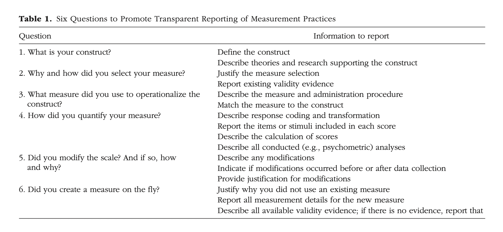

## measurement schemeasurement

 

[Flake, J. K., & Fried, E. I. (2020). Measurement schmeasurement: Questionable measurement practices and how to avoid them. Advances in methods and practices in psychological science, 3(4), 456-465](https://journals.sagepub.com/doi/10.1177/2515245920952393)

## measurement in psychology is hard

- the things we are interested in cannot be directly observed
- the measures we use impact the validity of claims we can make
- researchers are not as transperant about measurement as they should be

## questionable measurement practices

*"decisions that researchers make that raise doubts about the validity of measure use in a study, and ultimately the study's final conclusions"*

 

**QMPs are red flags to your marker.**

 

> It is really difficult to write your way out of a design flaw. 

## solution

- measurement transperancy 
- by carefully documenting the process by which you selected the measures in your study, you can reassure your marker that your design is sound and conclusions are valid. 

## validity

- Internal validity — Whether the study can support a causal claim: that the independent variable actually caused the change in the dependent variable, rather than some confound, selection effect, or other alternative explanation. 

- External validity — Whether the causal relationship generalises beyond the study: to other people, settings, time periods, and variations of the treatment or measure.

- Statistical-conclusion validity — Whether the conclusions drawn from the statistical analysis are justified

- Construct validity — Whether the measures actually capture the constructs they're meant to represent.

## 6 questions

If your thesis doesn't answer these questions, your marker might worry about the validity of your measures and conclusions. 

# 1. what is your construct?

- what are you trying to measure?
- how is it defined in relation to relevant theory? (conceptual definition)
- how do you define it in terms of measurement? (operational definition)

---

::: panel-tabset

## construct

## definition

## operationalised

:::

## sleep quality

::: panel-tabset

### conceptual definition

How restful and restorative sleep is. 
Components include how long it takes to fall asleep, night wakings, time spent in slow wave vs. REM sleep, and how rested you feel.

### operational definition

- Pittsburgh Sleep Quality Index score (self report)
- actigraphy (time spent awake)
- lab polysomnography (sleep stage information)

:::

## test anxiety

::: panel-tabset

### conceptual definition

Theory splits it into *worry* (cognitive) and *arousal* (physiological)

### operational definition

- Scores on Test Anxiety Inventory (self report)
- pre-exam heart rate or cortisol compared to control condition

:::

## executive function

::: panel-tabset

### conceptual definition
Diamond (2013): three core components — inhibition, working memory, cognitive flexibility.

### operational definition

- errors on Stroop task (inhibition)
- backward digit span (working memory)
- accuracy on Wisconsin Card Sort (flexibility)

:::

# your turn

1. what is your construct
2. how do you define it?
3. how will you operationalise it?

# 2. why and how did you select your measure?

## Justify your choice of measure using theoretical, empirical and practical evidence

- How does your measure align with your construct definition?
- Does the measure appear to have content and face validity?
- Is there published evidence of validity? Will it likely generalise?
- Summarise and cite any construct validity and instrument construction studies

# watch out for jingle/jangle fallacy

jingle = two measures tap into the same construct because they have similar names
jangle = two measures tap into different constructs because they have different names

# 3. what measure did you use to operationalise the construct?

# 4. how did you quantify your measure?

# 5. did you modify the scale? If so, how and why?

# 6. did you create a measure on the fly?