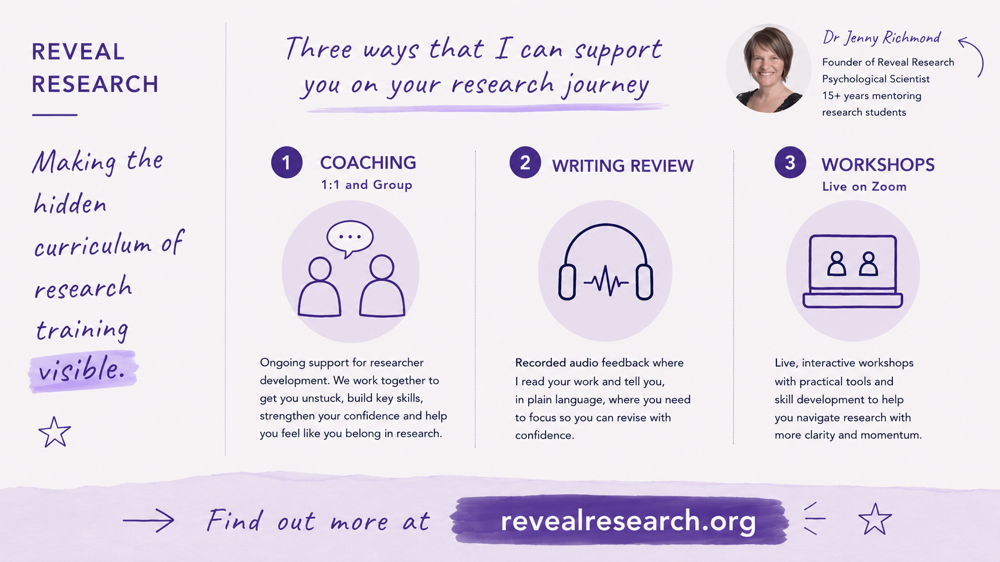
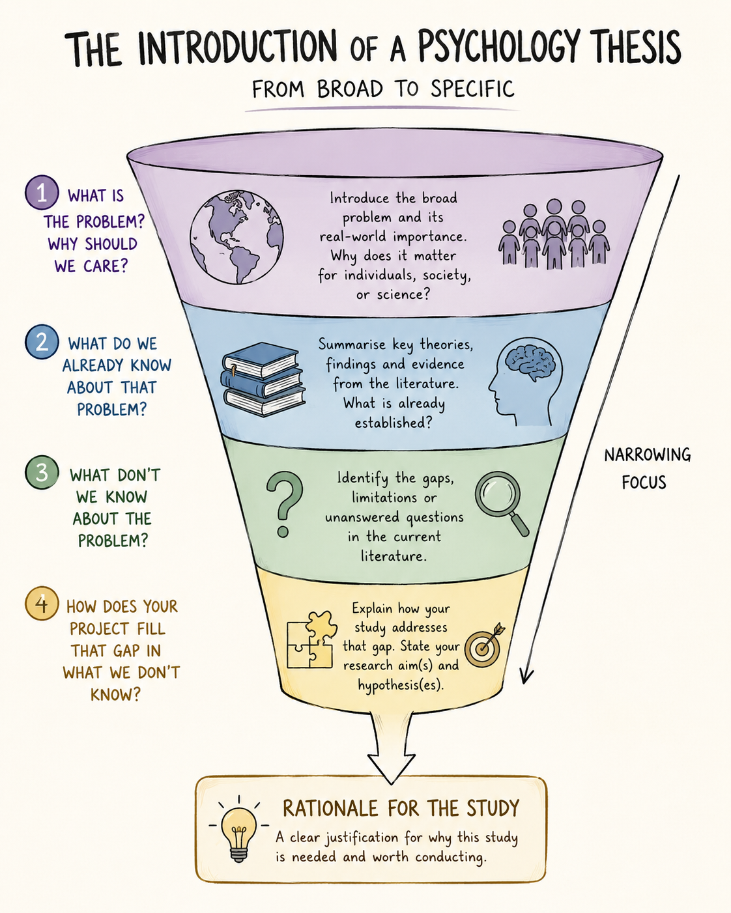
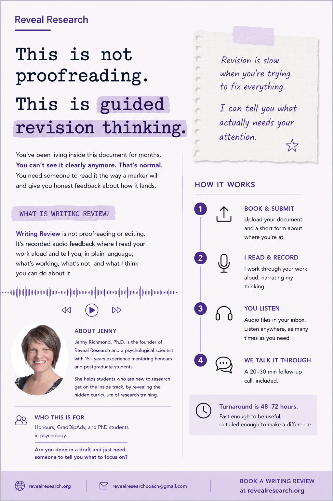

##  {.center}

### These slides are available at...

 

[www.jennyslides.netlify.app/wtf-moves/](https://jennyslides.netlify.app/wtf-moves/)

# Your job as a writer is to make my job as a reader as easy as possible

------------------------------------------------------------------------

{fig-align="center"}

------------------------------------------------------------------------

## about me

{fig-align="center"}

---

{fig-align="center"}

 

[Book a discovery call](https://calendly.com/jennyrichmond/30min)

------------------------------------------------------------------------

## Perceptual fluency

> "the subjective feeling of ease or difficulty while processing perceptual information... more fluent processing results in positive assessments of perceptual stimuli"

---

### "This thesis feels easy" 

---

### "This thesis feels difficult"

::::: columns
::: {.column width="50%"}

:::

::: {.column width="50%"}

 
 
 

Your job as a writer is to make my job as a reader as easy as possible

:::
:::::

---

## You can create perceptual fluency for your reader via...

1. structure
2. words
3. sentences
4. paragraphs

# structure

---

::::: columns
::: {.column width="40%"}

### funnel shaped arguments are easier to follow

:::

::: {.column width="60%"}

{fig-align="right" width="640"}

:::
:::::

---

## to do : structure

- plan your writing
  + use an outline
- pick apart the structure of your writing once you are finished
  + use a reverse outline

# words

---

### simple and concrete words make you sound smarter

---

## word examples 

::: {.panel-tabset}

## complex1

Findings are consistent with theoretical propositions suggesting that passive consumption of idealized social comparison targets via digital media platforms exerts a deleterious influence on affective self-evaluative processes among adolescent populations.

## simple1

Scrolling through social media made teenagers feel worse about themselves.

## complex2

Analyses revealed a statistically significant interaction effect, indicating that the association between chronic occupational stressor exposure and burnout symptomatology was moderated by individual differences in dispositional emotion regulation capacity, with the effect being attenuated among those reporting higher regulatory efficacy.

## simple2

Work stress predicted burnout, but only for people who struggle to manage their emotions.

:::

---

## to do: words

- write for your mum 
  + someone who is smart and interested but is not at all familiar with the topic
- choose simple/concrete words
  + 3 syllables max
- use as few words as possible
  + edit out the "fuzz"
- avoid jargon

# sentences

---

### active voice is easier to read than passive voice

 

> In active voice, researchers conduct studies, collect data, and report findings. In passive voice, studies are conducted, data are collected, and findings are reported.

 

How do you know if your sentence is passive?

- there are no people in it doing the action
- you can add "zombies"

---

## sentence examples 

::: {.panel-tabset}

## passive1

A significant reduction in cortisol levels was demonstrated to have been produced by the mindfulness intervention when pre- and post-treatment measurements were compared across the experimental and control conditions.

## active1

The mindfulness intervention reduced cortisol levels more than the control condition.

## passive2

An examination of the data was conducted and a determination was made that the administration of the intervention had resulted in the facilitation of significant improvement in participants' emotional regulation capacities.

## active2

We examined the data and found the intervention improved emotional regulation.

:::

---

## Helen Sword Zombie nouns 

<iframe width="860" height="600" src="https://www.youtube.com/embed/dNlkHtMgcPQ?si=qVr8371QYfIREhw2" title="YouTube video player" frameborder="0" allow="accelerometer; autoplay; clipboard-write; encrypted-media; gyroscope; picture-in-picture; web-share" referrerpolicy="strict-origin-when-cross-origin" allowfullscreen></iframe>

---

## to do: sentences

Find the passive voice and put the subject back in the sentence. Look for...

- "by"
  + *Informed consent was obtained by the research assistant*
- "was", "were"
  + *A significant relationship was found...*
  + *Participants were recruited...*
- words ending in -tion, -ment
  + *The implementation of the intervention involved the measurement of participant engagement throughout the duration of the investigation.*

# paragraphs

---

### paragraphs are units of argument

Each paragraph contains JUST ONE idea, expressed as...

1.  Topic sentence: gives away the main idea that the paragraph is going to convey

2.  Other sentences
-   empirical evidence and/or
-   examples and/or
-   explanation

> 1 : 5 : 25 rule (1 idea, \~ 5 sentences, no more than 25 words/sentence)

## paragraph examples 

::: {.panel-tabset}

## too specific

***A study conducted by Phillips and colleagues (2015) found that participants aged 65-86 performed significantly worse than younger groups on tasks assessing comprehension of sarcastic exchanges.*** Interestingly, there was no effect of age on the understanding of sincere exchanges (Phillips et al, 2015). Further, a meta-analysis across 23 theory of mind (TOM) studies showed that older adults performed worse on TOM tasks compared to younger groups (Henry, Phillips, Ruffman, & Bailey, 2013).

## too general

***Much research has investigated social cognition in older people.*** For example, Phillips and colleagues (2015) found that while participants aged 65-86 had no problem understanding sincere exchanges, they found it more difficult  to understand sarcastic exchanges than did young adults (Phillips et al, 2015). This result is consistent with a recent meta-analysis of theory of mind studies, which showed that older adults performed worse on TOM tasks compared to younger groups (Henry, Phillips, Ruffman, & Bailey, 2013). 

## just right

***As we age, our ability to understand how other people are feeling and what other people are thinking declines.*** For example, Phillips and colleagues (2015) found that while participants aged 65-86 had no problem understanding sincere exchanges, they found it more difficult  to understand sarcastic exchanges than did young adults (Phillips et al, 2015). This result is consistent with a recent meta-analysis of theory of mind studies, which showed that older adults performed worse on TOM tasks compared to younger groups (Henry, Phillips, Ruffman, & Bailey, 2013). 

:::

## to do : paragraphs

 

Are your topic sentences working hard enough? 

Do they...

- each say something about a portion of the literature?
- hold the readers hand and link to what came before?
- together summarise your argument?

---

## Perceptual fluency comes from...

1. structure
2. words
3. sentences
4. paragraphs

 

**... but the closer you are to your writing, the harder it is to see where it is not working**

# if you need help

---

::::: columns
::: {.column width="40%"}

### Writing Review

- audio feedback
- 48-72 hr turnaround
- $100 / 1000 words
- 25% off sale until June 1
- [FAQs](https://docs.google.com/document/d/1RqOGPRnjNd3VqWx0reccfgHQZ80FkAjB3M27nwIh2zk/edit?tab=t.0#heading=h.fqsxo8ahm6vg)

[revealresearch.org](www.revealresearch.org)

:::

::: {.column width="60%"}

{fig-align="right" width="640"}

:::
:::::

---

## questions... ask me anything

 
 
 

These slides are available at...

 

[www.jennyslides.netlify.app/wtf-tools/](https://jennyslides.netlify.app/wtf-moves/)

---

## thanks for coming!

- Join us for workshops in coming weeks...

    - June 12
        - Data Management for Beginners 

- Interested in coaching or writing review? 

    - Book a [free discovery call](https://calendly.com/jennyrichmond/30min)

