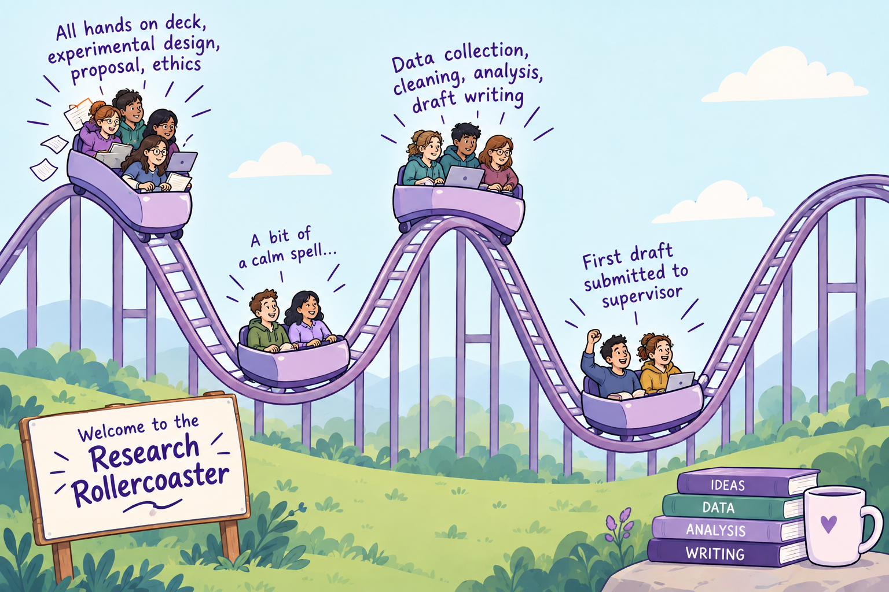
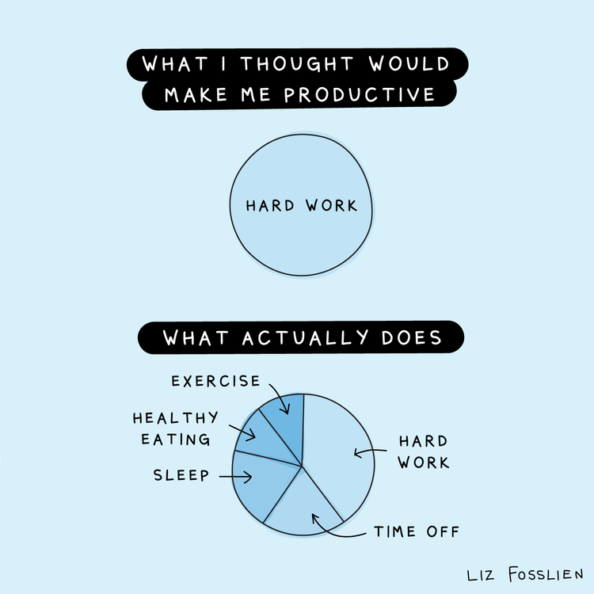

## {.center}

### These slides are available at...

 

<https://jennyslides.netlify.app/wtf-success/>

## about me

{fig-align="center"}

::: notes
-   Ph.D. University of Otago

-   Post-doctoral fellow Harvard Medical School

-   UNSW academic 2008-2025

    -   developmental psychologist
    -   36+ honours and PhD students
    -   Chair UNSW Human Research Ethics Committee
    -   Director of Academic Programs

-   Reveal Research 2026-

    -   Director/Founder
    -   research coach
:::

## revealing the hidden curriculum of research training 

 

> I help new researchers go from feeling like they've missed something everyone else knows, to feeling like they genuinely belong in research, so they can get through their research degree and into the career they actually want.

---

{fig-align="center"}

 

<https://calendly.com/revealresearchcoach/30min>

---

## starting a research project is hard because... 
 

1. there is too much to keep track of
2. the process is long, but short at the same time
2. there is too much to read 
3. the interpersonal stuff is weird

> You will leave today with a toolkit that will save you time, reduce overwhelm, and reclaim headspace for the important stuff

# there is too much to keep track of

------------------------------------------------------------------------

## research is a lot

When you come to write up your thesis, you will not remember...

-   why you made that decision
-   where that measure came from
-   how you decided on that analysis
-   what your supervisor said about X

Unless you have a way of keeping track of everything.

------------------------------------------------------------------------

## the everything notebook

A place to document your project in a way that creates headspace for current you AND a resource for future you.

- At minimum, it is a just record of your research work.

#### Daily log

-   what did you do?
-   how did it go?
-   what's next?

But used most effectively, it is a **metacognitive learning tool**.

[Everything Notebook prompts](https://docs.google.com/document/d/18bE6di4qFSmfhgz3v7G_YqBHfmXu4NgM1iptDdrXAzc/edit?tab=t.0)

------------------------------------------------------------------------

## the everything notebook

 

In addition to a **daily log**, you might also want to create sections for anything else you want to not lose track of.

-   meeting notes
-   reading reactions
-   *general discussion ideas*

------------------------------------------------------------------------

## the everything notebook

::::: columns
::: {.column width="50%"}
Analog

-   Portable
-   No need for wifi
-   Handwriting -\> deep processing
-   What if it gets lost?
:::

::: {.column width="50%"}
Digital

-   Google doc, Notes app, Notion, Obsidian
-   Cloud-based backup
-   Searchable
-   Can include images, links
:::
:::::

> IMPORTANT: make it a habit, write something in your everything notebook every day.

# the process is both long and short

## Research is a Rollercoaster

::::: columns
::: {.column width="40%"}

Research projects are long (more than 1 year). 

 

Sometimes they are broken into super intense prescriptive sections (like GDPA), sometimes you have more autonomy (like Masters. 

:::

::: {.column width="60%"}

:::

:::::

 

Either way, the intensity is a bit like riding a rollercoaster

## Planning with the end in mind

 

You need to play the long game so that you are not surprised by the intense periods. 

 

This [Research Timeline](https://docs.google.com/spreadsheets/d/1dRQhwQ1J_F-kcXUKJ7mP8f_Eww8jz9lwx-2AdrPZdyA/edit?gid=0#gid=0) template can help you see the big picture and plan with the end in mind. 

# there is too much to read

## keep track of what you read

-   Use referencing software
-   Create a database, read pdfs, highlight, keep notes
-   “Cite As You Write”
-   Generate a beautifully formatted reference list automagically

::::: columns
::: {.column width="60%"}
I recommend Zotero (open source, free).

Other options Mendeley (also free), Endnote (institution licence)
:::

::: {.column width="40%"}
<iframe width="560" height="315" src="https://www.youtube.com/embed/JG7Uq_JFDzE?si=xhkgjlrB2F6DRYIu" title="YouTube video player" frameborder="0" allow="accelerometer; autoplay; clipboard-write; encrypted-media; gyroscope; picture-in-picture; web-share" referrerpolicy="strict-origin-when-cross-origin" allowfullscreen>

</iframe>
:::
:::::

------------------------------------------------------------------------

## commonly asked reading questions

-   How do I get my head around the literature?
-   How do I find the "gap" in the literature?
-   How do I know if I have read enough?
-   How can I read in a way that helps me synthesise?
-   What is the best way to keep notes about what I read?

------------------------------------------------------------------------

## the reading matrix

::::: columns
::: {.column width="60%"}
Take notes in a spreadsheet, set up columns to help you see patterns.

[Reading matrix template](https://docs.google.com/spreadsheets/d/1Rh3QWSw5cXLwUWioiUBkURTy9jo51TNtAC4g6i7v9TQ/edit?gid=0#gid=0)
:::

::: {.column width="40%"}

:::
:::::

# the interpersonal stuff is weird 

## managing your research supervisor

The student/supervisor relationship is not the same as...

::::: columns
::: {.column width="60%"}

 

-   employee/boss
-   student/teacher
-   mentee/mentor

:::

::: {.column width="40%"}

 

Start a curious conversation:

> *I just want to make sure that I am making the most of this time, can we have a chat about how you see supervision working best?*

:::
:::::

## make sure you go in prepared 

In advance of the meeting, have a think about...

-   how do you work best when collaborating with others?
-   how do you typically react to feedback in other contexts?
-   are there skills that you are concerned you don't yet have?
-   what are you most worried about in terms of navigating the relationship with your supervisor?

------------------------------------------------------------------------

:::: columns
::: {.column width="50%"}
### Surface stuff

-   Is email the best way for me to contact you between meetings?
-   Is it useful for me to send an outline of what I would like to talk about before our meeting? And/or a summary of what we decided after?
-   What is your approach to feedback? What will it look like? How long will it take?
:::
::::

------------------------------------------------------------------------

::::: columns
::: {.column width="50%"}
### Surface stuff

-   Is email the best way for me to contact you between meetings?
-   Is it useful for me to send an outline of what I would like to talk about before our meeting? And/or a summary of what we decided after?
-   What is your approach to feedback? What will it look like? How long will it take?
:::

::: {.column width="50%"}
### Going deeper

-   What does good supervision feel like to you, when it's working?
-   What do your most successful students tend to do that helps them?
-   Is there anything you wish students asked you earlier in the piece?
-   Is there anything about how you work that would be helpful for me to know?
:::
:::::

------------------------------------------------------------------------

## making the most of time with your supervisor

**Before each meeting**

-   spend some time thinking about what you need to get out of this meeting
-   [Supervision Prep Template](https://docs.google.com/document/d/18bE6di4qFSmfhgz3v7G_YqBHfmXu4NgM1iptDdrXAzc/edit?tab=t.big33qhxq5fz#heading=h.4orukig2d4zl) (maybe in your Everything Notebook?)

::::: columns
::: {.column width="60%"}
**During each meeting**

-   prioritise the important stuff
-   ask for what you need
:::

::: {.column width="40%"}
**After each meeting**

-   send a meeting summary
:::
:::::

------------------------------------------------------------------------

## the overwhelm toolkit

- the Everything Notebook

- the Plan with the End in Mind template

- the Reading Matrix

- the Meeting Prep template

[Download the toolkit](https://docs.google.com/document/d/18bE6di4qFSmfhgz3v7G_YqBHfmXu4NgM1iptDdrXAzc/edit?usp=sharing)

---

::::: columns
::: {.column width="60%"}

:::
::::

---

::::: columns
::: {.column width="60%"}

:::

::: {.column width="40%"}

Extra pie pieces...

-   asking for help when you are stuck
-   bouncing ideas around with someone who knows
-   getting really good feedback

:::
:::::

---

{fig-align="center"}
 

::::: columns
::: {.column width="30%"}

[FAQ coaching](https://docs.google.com/document/d/1naNaA4Lm2h5z1M2WZXyChO7IOVm9bEfwVhg_KB2rVlg/edit?usp=sharing)

:::

::: {.column width="70%"}

[FAQ writing review](https://docs.google.com/document/d/1RqOGPRnjNd3VqWx0reccfgHQZ80FkAjB3M27nwIh2zk/edit?usp=sharing) and [Demo video](https://youtu.be/-9XJruotAH8)

:::
:::::

---

## thanks for coming!

- Join me for small group coaching sessions...

    - Sept 25 Keep calm and write your general discussion
    - Oct 2 Plotting for survey research
    - Oct 9 The Messy Middle
    
 

- Interested in coaching or writing review? 

    - Book a [free discovery call](https://calendly.com/revealresearchcoach/30min)
    
---

## questions... ask me anything

 
 
 

These slides are available at...

 

<https://jennyslides.netlify.app/wtf-success/>

